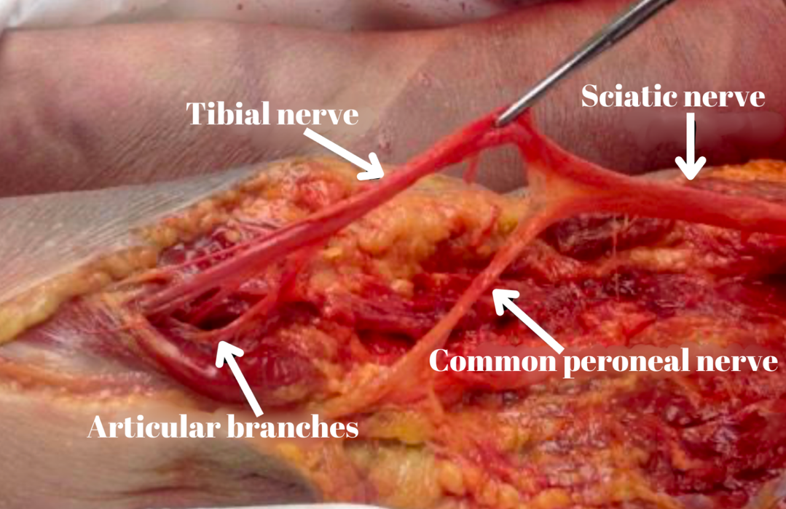

IPACK Block Sensory Supply of the Posterior Knee Capsule    body {font-family: 'Open Sans', sans-serif;}

### IPACK Block Sensory Supply of the Posterior Knee Capsule

**Nerves being blocked with the IPACK:**Smaller articular branches from the common peroneal nerve  
Smaller articular branches of the tibia nerve  
The smaller branches only provide sensory innervation to the posterior knee capsule.  
  
The smaller articular branches near the posterior knee capsule branch off the common perineal and tibial nerve.  
Both the common perineal and tibial nerve branch off the sciatic nerve.

****

_Blocking the articular nerves will alleviate knee posterior knee pain._  
**Other nerves the IPACK block can reach:  
**Posterior branch of the obturator nerves  
The medial genicular nerve  
**  
However, blocking the main trunks of tibial and common peroneal nerves may result in:**  
**Footdrop:** When the common perineal nerve has been blocked  
**Weakness** **of foot muscles:** When the tibial nerve has been blocked  
  

Michael MacKinnon DNP, FNP-C, CRNA, FAANA  
National University Associate Professor Doctor of Anesthesiology Program  
  
Edited by Dr. Michael Kaminsky, Regional Anesthesiologist  
  
IPACK and genicular nerves block: Which nerves are we targeting?  
Regional Anesthesia & Pain Medicine 2021  
Maria Paz Sebastion, Supriya Lynette Dsouza and Olatz Aranburu Uriarte  
  
Motor Sparing Blocks for the Knee  
World Federation of Society of Anesthesiologists (accessed 08/2022)  
Emily Spence1, Vijayaraghavan Ramesh2, Maria Paz Sebastian2†  
**https://tinyurl.com/bbn686wh  
  
**IPACK Block  
Advancing the Science of Ultrasound Guided Regional Anesthesia and Pain Medicine  
(accessed 08/2022)  
Maria Fernanda Rojas G & Vincent Chan  
https://www.youtube.com/watch?v=QwhBIO5cD34