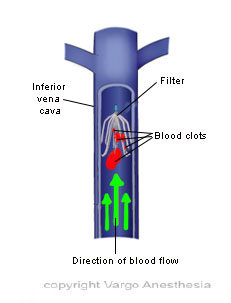

Inferior Vena Cava (IVC) Filter Insertion     body {font-family: 'Open Sans', sans-serif;}

### Inferior Vena Cava (IVC) Filter Insertion

Placing a filter in the inferior vena cava (IVC) is an important way to prevent significant pulmonary embolism (PE) arising from a deep vein thrombosis (DVT).

****

IVC filters are inserted into the vena cava percutaneously via the femoral or jugular approach under fluoroscopy or ultrasound guidance. The filters typically are placed infrarenally, unless there is an indication for a suprarenal filter renal vein thrombosis or IVC thrombus extending above the renal veins. Complete IVC thrombosis is an absolute contraindication to IVC filter placement, and the relative contraindications include significant coagulopathy and bacteremia.

**Anesthesia:** Usually MAC  
**Duration:** 30-60 minutes

**Position:** Supine. Ask ahead of time if the surgeon will be entering the groin or neck. If the neck is chosen, the bed may be rotated almost 180 degrees. So make sure your cables have slack.  
**IV Access:** 20G  
**EBL:** minimal

**Complications:** 4% - 11%

Insertion-site thrombosis  
IVC thrombosis  
Recurrent DVT post phlebitic syndrome  
Filter migration  
Erosion of the filter through the vessel wall  
Vena caval obstruction.  

**More Notes**  
The use of IVC filters was associated with decreased incidence of PE at eight years, offset by higher rates of recurrent DVT and no overall mortality benefit.  
  
Importantly, the indications for IVC filter use in this study differ from the current ACCP guidelines; all patients were given concomitant anticoagulation for at least three months, which might not be possible in patients for whom the ACCP recommends IVC filters.

Due to the long-term complications of permanent IVC filters, it is suggested that a retrievable IVC filter be used for patients with temporary contraindications to anticoagulation.

**Comerata et al** created a clinical decision-making tool for picking the type of filter to employ. If the duration of contraindication to anticoagulation is short or uncertain, a retrievable filter is recommended.

Jaffe, Richard A. _Anesthesiologist's Manual of Surgical Procedures_., 2012.

Kalbande, Manohar B. _Vascular Surgery Made Easy_. 2013.

Macksey, Lynn Fitzgerald. _Surgical Procedures and Anesthetic Implications: A Handbook for Nurse  Anesthesia Practice_. Sudbury, MA: Jones & Bartlett Learning, 2012.

Moore, Wesley S., M.D. _Vascular and Endovascular Surgery: A Comprehensive Review Expert Consult:_2013