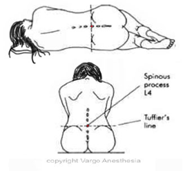
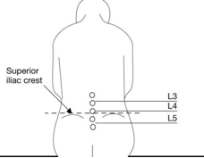

Iliac Crest (Tuffier’s Line)    body {font-family: 'Open Sans', sans-serif;}

### Iliac Crest (Tuffier’s Line)

“Tuffier’s” line is a line drawn across the iliac crest that crosses the body of L4 or L4-L5 interspace. It is defined as a horizontal line connecting the superior aspect of the posterior iliac crests. This is a helpful landmark for the placement of spinal or epidural anesthetics.  

****

  

****

  

****

  
  

Spinal, epidural, and caudal anesthesia. In R.D. Miller Miller’s Anesthesia, 6th edition. Philadelphia: Elsevier Churchill Livingstone.  
  
Dobson M.B. (2000). Conduction Anesthesia. In Anesthesia at the District Hospital. Pages 86-102. World Health Organization.  
  
Kleinman, W. & Mikhail, M. (2006). Spinal, epidural, & caudal blocks. In G.E. Morgan et al Clinical Anesthesiology, 4th edition. New York: Lange Medical Books.