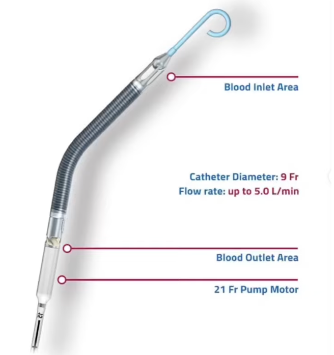
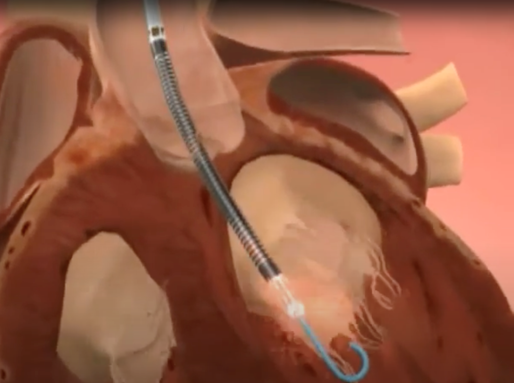
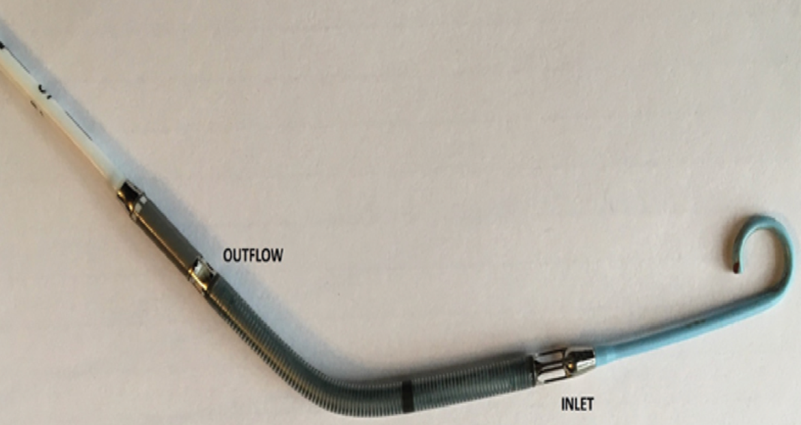
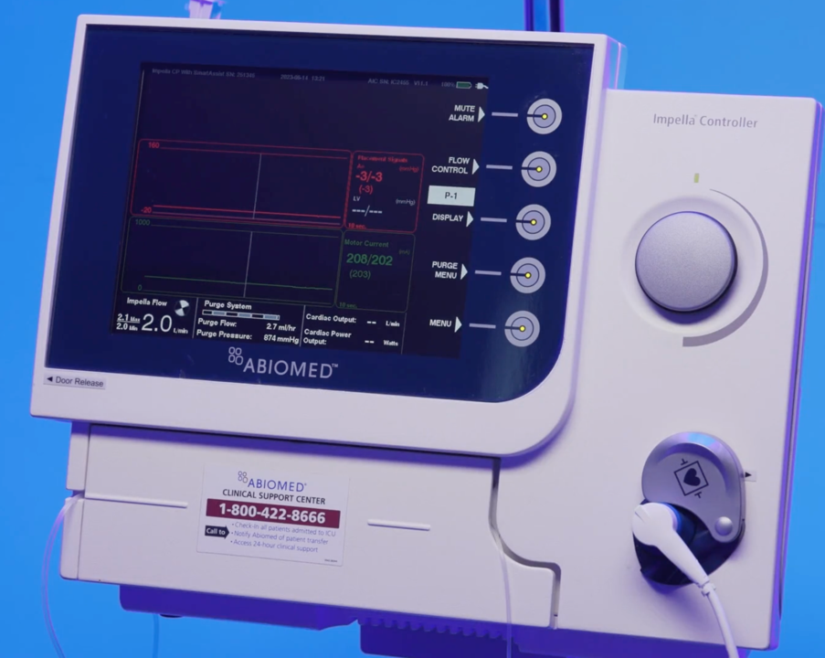

  Impella Left Ventricular Assist Device section { margin-bottom: 20px; } table { border-collapse: collapse; } table, tr, th, td { border: 1px solid black; } h3, p { margin: 0px; padding: 0px; } .text-red { color: red; } img { width: 400px; height: auto; } .mb-10px { margin-bottom: 10px; } .reference-notes { font-size: 11px; }

### Impella Left Ventricular Assist Device

Ventricular Assist Device (VAD)

Left Ventricular Assist Device (LVAD)

Right Ventricular Assist Device (RVAD)

The Impella provides powerful hemodynamic support with minimal invasiveness.

**Indications:**

Cardiogenic shock

High-risk percutaneous coronary intervention

Ventricular tachycardia ablation

Bridge to recovery, transplantation, and/or heart surgery

The Impella device (by Abiomed) is a small mechanical circulatory support (MCS) (pump) that provides temporary mechanical circulatory support (MCS) to patients, thereby reducing the workload of the failing ventricle and improving systemic circulation.

It can be inserted percutaneously via the femoral or axilla.

**It is a catheter inserted into a ventricle and consists of:**

**Pump:** Within the catheter above the outlet, negative pressure is created distal.

**Inlet:** Distal area of the catheter (in the ventricle) that ventricular blood enters.

**Outlet:** Where the ventricular blood exits into the aorta (above the aortic valve).

\-Impella devices (like other ventricular-assist devices) are used during or for the treatment of cardiogenic shock following acute MI or cardiac surgery in the context of cardiomyopathy and in severe myocarditis.

\-The LVAD device is threaded percutaneously across the aortic valve and positioned into the left ventricle (LV).

\-The small pump within it provides continuous antegrade blood flow from the LV into the ascending aorta, reducing the LV's workload and increasing cardiac output.

\-This results in improved systemic perfusion, increased coronary flow, and a reduction in myocardial oxygen demand.

\-When Impella is used as an RVAD:

\-It delivers blood from the inlet area of the inferior vena cava and to the pulmonary artery via the outflow port.

    

A Review of the Impella Devices

Intervention Cardiology Journal. 2022 Apr 8;17

Rami Zein, Chirdeep Patel, Adrian Mercado-Alamo, Theodore Schreiber, Amir Kaki

Safety and feasibility of elective high-risk percutaneous coronary intervention procedures with left ventricular support of the Impella Recover LP 2.5.

American Journal of Cardiology. 2006;97:990–2

Henriques JP, Remmelink M, Baan J Jr et al.

Impella: pumps overview and access site management.

Minerva Cardiology and Angiology. 2018;66((5)):606–11.

Burzotta F, Russo G, Previ L et al.

Official Journal of the Italian Society of Angiology and Vascular Medicine