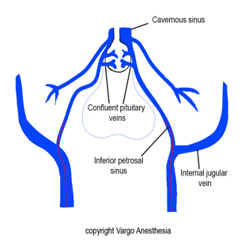

Inferior Petrosal Sinus (IPS) Vein Sampling    body {font-family: 'Open Sans', sans-serif;}

### Inferior Petrosal Sinus (IPS) Vein Sampling

The IPS is the vein most proximal to the pituitary gland that can safely accommodate a microcatheter for venous sampling and measurement of pituitary ACTH secretion.  

****

  
IPS sampling is a vascular invasive procedure that determines whether the origin of a patient’s Cushing syndrome is from an isolated ACTH-secreting tumor or from the anterior pituitary gland itself.  
Through a percutaneous bilateral approach, a 6-French sheath is advanced into the right femoral vein, and a five-French sheath into the left femoral vein. The larger sheath allows for sampling from the common femoral vein, while a 5-French catheter is in place distally.  
  
Subsequently, 3,000–5,000 units of heparin are given to prevent cavernous sinus and other venous thrombosis.  
  
Once catheter positions are confirmed in the IPS via fluoroscopy, two baseline ACTH specimens are collected from the right femoral sheath (peripheral specimen) and both IPSs.  
  
ACTH samples are then obtained 3 minutes, 5 minutes, 10 minutes, and 15 minutes after the injection of corticotropin releasing hormone (CRH).  
  
The ACTH levels from the IPS are compared with the ACTH levels in the peripheral blood to determine the origin of the ACTH.  
  
**How the determination is made:  
**Three minutes prior to the gathering of the ACTH samples, CRH is administered through the catheters. This hormone will increase the release of ACTH from an ACTH-releasing pituitary tumor, but NOT from a normal anterior pituitary gland.  
If both inferior petrosal vein samples are equivocal, this indicates ectopic or paraneoplastic Cushing's Syndrome.  
  
An elevated ACTH level from the left or right inferior petrosal vein will correspond with an ACTH-releasing tumor on the corresponding side of the pituitary gland.  
  
**Anesthesia:** Sedation is permitted if the patient is cooperative and if the radiologist agrees.  
LMA or intubation may alternatively be used. also be applied.  
**IVs:** 20g is acceptable. There are two 4-5-French catheters in the groin if larger cannulas are required.  
**A-line:** Usually, as a precaution due to the presence of catheters sampling blood from within the brain.  
**Duration:** 1-2 hours.  
**Positioning:** Supine with arms to the side  
Systemic anticoagulation is not necessary after vascular access.  
**EBL:** Minimal  
**Post op:** Patient to remain at bedrest in supine position for at least 2 hours.  
  
**Possible Complication**  
Groin hematoma from femoral access  
Brainstem hemorrhages or non-hemorrhagic brainstem infarctions (rare).  
Cavernous sinus thrombosis or deep venous thrombosis potentially leading to pulmonary embolism when patients are in a hypercoagulable state accompanying Cushing syndrome.  
This is rare when patient is heparinized.  
  
**More notes**  
Because CRH is not always available, DDAVP, a synthetic analog of vasopressin, may be used in its place to stimulate the pituitary during bilateral inferior petrosal sinus sampline (BIPSS), given as a dose of 10 μg intravenously.  
  
Upon completion of sampling, both femoral sheaths are removed, and manual compression is used to obtain hemostasis before transferring patients to the recovery room for a rest of approximately 4 hours.  
  
Many corticotrophic adenomas are susceptible to stimulation by exogenously administered CRH.  
  
The purpose of sampling the IPS is to identify a pituitary source of excess ACTH to diagnose Cushing’s syndrome. While CS is most often caused by exogenous glucocorticoid administration, endogenous CS may be due to ACTH- or cortisol-secreting tumors.  
  
Distinguishing pituitary sources from the ectopic sources of ACTH is challenging because of the limited accuracy of noninvasive assays.  
  
Bilateral IPSS is the gold standard diagnostic test with sensitivity and specificity of nearly 100%.  
  
Medscape  
Petrosal Sinus Sampling  

Updated: Sep 22, 2015  
Author: Gauri Mankekar, MBBS, PhD, MS, DNB; Chief Editor: Jonathan P Miller, MD  
https://emedicine.medscape.com/article/2114270-overview