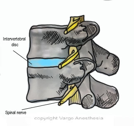
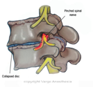
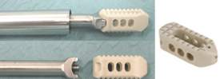
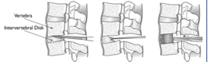
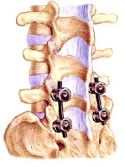

Interbody Fusion    body {font-family: 'Open Sans', sans-serif;}

## **Interbody Fusion - Description and Images**

Whenever you hear spinal fusion, it usually refers to interbody fusion.  
As you already know, the intervertebral disc is a layer of cartilage separating the adjacent vertebrae. The discs are soft, compressible and act as the shock absorbers for the spine, allowing it to flex, bend, and twist.

Unfortunately, there can be changes in the disc that decreases the separation space between the vertebrae allowing the spinal nerves to become compressed (pinched).

**These changes can be from:**  
**Osteoarthritis** \- breakdown of cartilage  
**Herniated disc -** abnormal bulge or breaking open of a disc  
**Spinal Stenosis** \- narrowing of the spinal column

The pinching of the spinal cord and nerves will lead to pain and possibly affecting nerve and motor function.

The goal of a spinal interbody fusion is to INCREASE the disc space between the vertebra to free up the pinched spinal nerve. This should eliminate the pain and permit the normal return of nerve and motor function.

**Easy Surgical Explanation  
**The surgeon will carefully cut away and remove intervertebral disc. The prevent the open disc space from collapsing and re-pinching the spinal nerve(s), the disc space is filled with some type of implant-usually a cage. The cage helps restore more of the normal spacing between the vertebrae alleviating pressure on the nerve roots. A bone graft is placed in the hollow portion of the cage and along the sides of the spine.

A bone graft may be used from the patient’s own iliac crest, the bone that was removed  
from the laminectomy or synthetic bone graft options may be used.

**Interbody Fusion Cage (spinal cage)**  
A spinal cage is a prosthesis used in spinal fusion procedures to restore and maintain intervertebral space. They are cylindrical or square-shaped devices, and usually threaded in place. The cage may be made of Titanium or allograft (bone). A bone graft is placed in the hollow portion of the cage and along the sides of the spine.

_Above (from left to right), the damaged disc is being removed piece by piece, then a cage is inserted from the posterior approach (PLIF)._

After the cage and bone graft is inserted, screws are inserted through the pedicles and rigidly connected to two longitudinal rods to maintain stability. This can be done from an anterior, lateral or posterior approach.

The above image is from a posterior lumbar interbody fusion (PLIF) - meaning the surgical approach was posterior.

After the screws and rods are secured, the incision is closed.