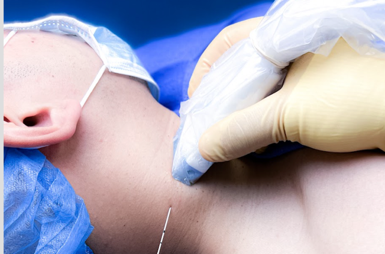
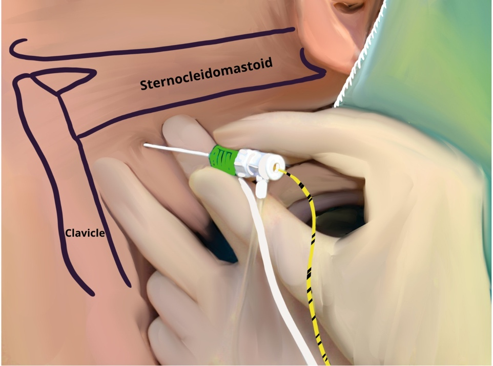
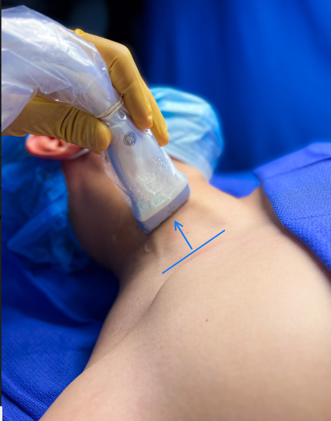
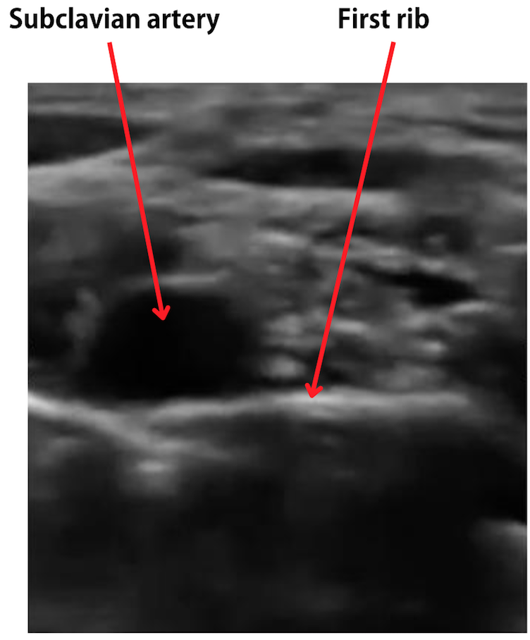

Interscalene Nerve Block (ISB) Technique    body {font-family: 'Open Sans', sans-serif;}

### Interscalene Nerve Block (ISB) Technique

**Rule out the following:**  
Severe COPD  
Contralateral paresis of the phrenic or recurrent laryngeal nerves  
Previous neurologic deficit of the involved arm.  
Infection at the site of injection  
Local anesthetic allergy  
Coagulopathy  
  
**Do not proceed until you have all the necessary equipment.**  
Refer to _“Interscalene Nerve Block Equipment”  
_Ensure the assisting staff knows where to locate resuscitation equipment, including 20% lipid emulsion (Intralipid).  
  
**Be sure to warn the patient about the following:**  
\- Temporary phrenic nerve paralysis- Possible shortness of breath  
\- Recurrent laryngeal nerve blockade (hoarse voice)  
\- Horner’s syndrome on the ipsilateral side of the block  
  
**Classic signs of Horner syndrome:**  
\- Constricted pupil (miosis)  
\- Drooping of the upper eyelid (ptosis)  
\- Absence of sweating of the face (anhidrosis)  
\- Sinking eyeball into the bony cavity that protects the eye (enophthalmos).  
\- Obtain the patient’s verbal/written consent.  
\- Perform a quick neuromuscular exam.  
\- Gather the needed equipment  
\- The patient should be monitored, have supplement O2, and be adequately sedated.  
\- Properly drape the patient and disinfect the neck and clavicular area  
\- Perform a Time Out.

****

****

**Positioning:  
**Place the patient in either supine, semi-recumbent, or lateral decubitus position with the head turned away from the side being blocked.**  
  
Later decubitus position:**  
This position is more ergonomic, especially during an in-plane approach from the lateral side, where the needle enters the skin at the posterolateral aspect of the neck.**  
  
Head elevation decreases the prominence of the neck veins.**  
\- A slight elevation of the head of the bed provides better venous drainage resulting in less neck vein prominence and distention.  
\- Many patients also find it more comfortable.  
\- The patient should be asked to reach for the ipsilateral knee to lower the shoulder and provide more space for the nerve block performance.  
  
**Identify the surface landmarks for locating the interscalene space:**  
\- Sternal head of the sternocleidomastoid muscle  
\- Clavicular head of the sternocleidomastoid muscle  
\- Upper border of the cricoid cartilage  
\- Clavicle  
  
**Ultrasound transducer:  
Probe placement just above the clavicle: (image below)**  
One can start with placing the US probe over the supraclavicular region to allow you to use a vascular structure to locate the nerves.  
Starting with probe placement posterior to the clavicle aiming straight down the body, you will see a pulsating subclavian artery sitting on the first rib.

****

****

Slide the transducer up the neck (cephalad) and slightly lateral until the interscalene view is found.  
It appears as a “Traffic light” sandwiched between the anterior scalene (AS) and middle scalene (MS) muscles.  
  
\- Use the color Doppler to identify the vasculature structures.

****

\- Identify the C5-C7 nerve roots as they are often compared to “traffic lights” vertically oriented between the two muscles.  
\- They are hypoechoic dark spots vertically stacked.  
\- Infiltrate the skin with 1 to 3 mL of local anesthetic (optional)  
  
**Cervical and brachial plexus fascia sheath:**  
**Cervical fascia:** A layers the top of both middle and anterior scalene muscles  
**Brachial plexus fascia:** Surrounds the brachial plexus.  
  
The fascial sheath is more rigid than tissue.  
The needle must penetrate the two fasciae.  
  
**Two things happen when the needle penetrates the fascia sheath:  
**You will feel a “pop.”  
Loss of resistance  

****

**Needle insertion:  
**_The needle should never be advanced beyond 2.5 cm to avoid the risk of mechanical complications (cervical cord injury, pneumothorax, vascular puncture).  
_  
\- Insert the needle in-plane through the skin and middle scalene towards the C5 and C6 roots in the interscalene groove (lateral-to-medial direction).  
A subtle ‘‘pop’’ sensation may be felt when the needle tip penetrates the cervical fascia to pass through the middle scalene muscle.  
\-Another subtle ‘‘pop’’ sensation may be felt when the needle tip advances and penetrates the brachial plexus fascia sheath to where the local anesthetic will be injected.  
\- Aspirate to rule out an intravascular needle position and inject 1 mL of saline or 5% dextrose to confirm deposition between the fascial layers.  
To avoid intraneural injection, only inject with low pressures.  
Observe the expansion between the nerve roots to rule out intraneural injection and communicate with the patient to rule out paresthesias during needle advancement.  
\- If the injectate spreads posteriorly along the needle tract within the middle scalene, advance another 1 to 2 mm, carefully avoiding piercing the nerve roots with the needle.  
**Goal:** Inject local anesthetic around the upper roots (C5, C6).  
  
**If using a nerve stimulator:  
**\- Used 0.5 mA, 0.1 msec  
\- For confirmation, when entering the interscalene groove, there should be a motor response in the shoulder, arm or forearm.  
\- An aggressive muscle twitch indicates you are near (or too close) to one of the nerves.  
  
**Aspiration check prior to administrating the local anesthetic:**  
\- After a careful aspiration to rule out intravascular needle placement, administer 1–2 mL of a local anesthetic to verify proper needle placement.  
\- Injecting about 10-15 mL of local anesthetic.  
\- Injection of the LA should displace the brachial plexus away from the tip of the needle.  
\- When injection of the local anesthetic does not appear to result in a spread around the brachial plexus, additional needle repositioning and injections may be necessary.  
  
**Absence of high resistance:  
**Ensure that there is an absence of high resistance with an injection to decrease the risk of interfascicular injection.  
  
**Injection of local anesthetic:  
**With the injection of local anesthetic, you should visualize nerve separation.  
  

Edited by Michael MacKinnon DNP, FNP-C, CRNA, FAANA  
National University Associate Professor Doctor of Anesthesiology Program  
Edited by Dr. Michael Kaminsky, Regional Anesthesiologist  
  
Interscalene Nerve Block-Knockout That Upper Extremity  
SINIEM.org (accessed 01/2023)  
  
The Role of Fascia in Interscalene Plexus & other NB Complications - Crash course with Dr. Hadzic  
NYSORA Education (accessed 01/1023)  
  
Ultrasound-Guided Interscalene Brachial Plexus Nerve Block  
NYSORA (accessed 12/2022)Philippe E. Gautier, Catherine Vandepitte, and Jeff Gadsdenhttps://tinyurl.com/4b9j5xsd  
  
Interscalene Block  
The Defense and Veterans Center for Integrative Pain Management (DVCIPM) accessed 12/2022  
https://tinyurl.com/bdp5b7ds  
  
Ultrasound -Guided Interscalene Brachial Plexus Block  
London Society of Regional Anesthesia (accessed 12/2022)  
https://tinyurl.com/ykybkfxd  
  
Brachial Plexus Block Made Easy  
EPOMEDICNE (accessed 01/2023)  
PGMEE, MBBS,MD/MS  
https://tinyurl.com/yc3uvr5c  
  
Ultrasound Guided Interscalene Block  
World Federations of Societies of Anaesthesiologists (access3d 01/2023)  
Dr. Matthieu Vierula, Dr. Joshua Robert, D.r Patrick Wong, Dr. Jason McVicar  
https://tinyurl.com/4wwbyxx5  
  
How To: Ultrasound-Guided Interscalene Block Scanning  
Sonosite (accessed 01/2023)  
https://tinyurl.com/yckw5af8  
  
Interscalene block procedure guide  
UpToDate (accessed 01/2023)  
Authors: Elizabeth H Wilson, MD and Lisa L Klesius, MD  
https://tinyurl.com/2p8mmxeu  
  
Interscalene Brachial Plexus Block – Landmarks and Nerve Stimulator TechniqueNYSORA (accessed 01/2023)  
https://tinyurl.com/bddnxhrr