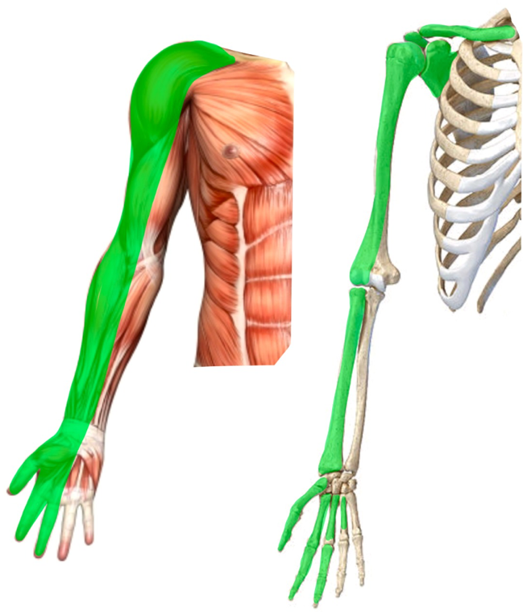
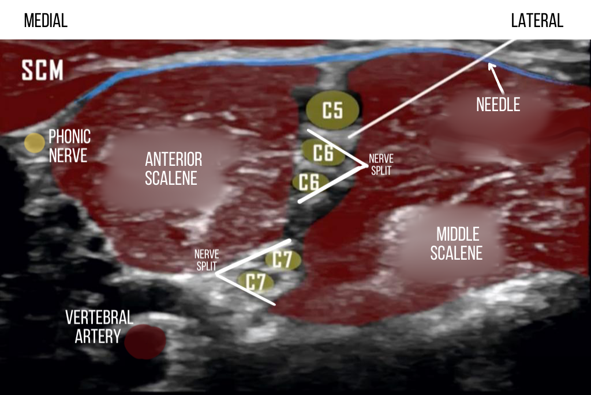

Interscalene Nerve Block (ISNB)    body {font-family: 'Open Sans', sans-serif;}

### Interscalene Nerve Block (ISNB)

Also called Interscalene Brachial Plexus Block  
During an ISNB, the nerves roots or trunk level of the brachial plexus are anesthetized.This provides anesthesia to the proximal arm and shoulder.

****

This ISNB refers to the administration of local anesthetic around the upper roots or trunks of the brachial plexus (ventral rami of C5 and C6 nerve roots) at the level of the C5 vertebral body between the anterior and middle scalene muscles.  
The local anesthetic usually spreads to C7.  
  
Simply said, the ISNB usually anesthetizes the C5 to C7 nerve roots (superior and middle trunks of the brachial plexus) and the supraclavicular branches of the cervical plexus (C1 to C3).  
**Target:** C5-7 (upper and middle trunks)

****

**The most common indications:** Shoulder surgeries (arthroscopic or open including)  
Total shoulder replacement  
Hemiarthroplasty  
Rotator cuff repair  
Labral repair  
Acromioplasty  
  
**Other:  
**Distal clavicle fracture repair  
Other arm surgeries that do not involve the medial aspect of the forearm or hand.  
  
**Arthroscopic should procedures:** Possible response to pain to incision.**Warning.** With shoulder arthroscopy procedures, arthroscopic portals are occasionally inserted outside the cutaneous distribution of the interscalene block.  
The insertion points should still be localized by the surgeon.  
  
**Brachial plexus:** _Refer to “Interscalene Nerve Block Anatomy for details”_**The Brachial Plexus:** Formed by the anterior rami of nerve roots C5-C8 and T1.  
  
**Note:** The ISB DOES NOT reliably block C8-T1 (elbow to hand), sparing the ulnar (C8-T1) nerve.   
  
**Pre-op:  
****Warn your patient about the following side effects:  
**Horner’s syndrome  
Temporary phrenic nerve paralysis  
Recurrent laryngeal nerve blockade  
  
**Warning:** Occasionally, there may be proximal spread to the cervical plexus (C3, C4) and cervical sympathetic chain, which can result in Horner’s syndrome and hoarseness post-block.  
  
**Hemidiaphragm paresis with ISNB:**  
The ISNB always results in hemidiaphragm paresis because of the close proximity of the phrenic nerve (C3–C5) to the interscalene groove.  
This reduces pulmonary function by 25-30%  
Patients who cannot tolerate a reduction in pulmonary function should not receive this block.  
Even healthy patients may need reassurance that their feeling of dyspnea is transient.  
  
**Position:** Supine, patient’s head turned to the opposite side.  
The patient may also be lateral.  
Request the patient to adduct the blocking arm and reach for the ipsilateral knee to increase the exposure of the block area.   
**Needle:** 50 mm short beveled regional block needle  
**Needle insertion:** Interscalene groove (between anterior and medial scalene muscles  
**Needle insertion direction:** Lateral to medial  
**Ultrasound probe:** High-frequency linear  
**Ultrasound depth setting:** around 3 cm, depending on the size of the patient.  
  
**Depth of nerves:**  
The brachial plexus nerves are usually shallow beneath the skin (around 2 cm in depth) in normal-sized people.  
Advance the needle tip to a position between the C5 and C6 nerve roots.  
  
**Needle insertion:** Around 2 cm mark.  
Inject local anesthetic around the upper roots (C5, C6).  
After careful aspiration, inject 1-2 ml of your desired local anesthetic to verify the correct needle placement.  
Inject in increments of 5 cc followed by needle aspiration.  
If you see spread with ultrasound, you don’t need to aspirate every 5ml, just the initial.  
The local anesthetics should spread and displace the brachial plexus away from the needle.

****

**Local anesthetic and dose:  
**0.5% ropivacaine  
0.25-0.5% bupivacaine  
1.5% mepivacaine (less common)  
Administer 3-5ml incremental doses up to a total volume of 15-20 ml.  
  
**Block duration:** 12–24 hours  
  
**Volume of local anesthetic for ISNB:  
****For ultrasound-guided block:** A minimum of 10 mL is required to avoid a high block failure rate.  
**For nerve stimulator-guided:** 15-30 mL  
  
The use of lower volumes (5 mL) is associated with a lower incidence of phrenic nerve block.  
  
**Warning:** Larger volumes of local anesthetic increase the spread of local anesthetic within the neck, leading to hoarseness (recurrent laryngeal nerve blockade) or **Horner’s syndrome** (blockade of stellate ganglion).  
**Horner’s syndrome (stellate ganglion block):  
**There is usually proximal spread to the cervical plexus (C3, C4) and cervical sympathetic chain, which can result in Horner syndrome and hoarseness post-block.  
This can also occur in patients with supraclavicular blocks.  
  
**Equipment:** Standard physiologic monitors (ECG, pulse oximeter, noninvasive blood pressure)  
Resuscitation equipment, including 20% lipid emulsion (Intralipid)  
Skin antiseptic, preferably chlorhexidine/alcohol based  
Midazolam and fentanyl for sedation (if not contraindicated)  
Ultrasound machine with a linear transducer (8–14 MHz)  
Sterile sleeve and gel  
Lidocaine for local injection  
Standard nerve block tray  
10-15 ml containing a LA   
A 20-mL syringe containing the local anesthetic  
A 5-cm, 22-gauge, short-bevel, insulated stimulating needle  
Sterile gloves  
Normal saline or 5% dextrose solution (if using nerve stimulation in addition to ultrasound guidance)  
Peripheral nerve stimulator (optional)  
**ISNB for continuous infusion (catheter placement technique):**  
A 19 or 20-gauge Tuohy needle is placed rather than a block needle.  
Nerve-stimulating Tuohy needles are available.  
Refer to _“Interscalene Nerve Block Continuous Infusion”_  
  
A single- or multi-orifice catheter is inserted through the needle and advanced far enough to allow the catheter perforations to bathe the nerves, typically with 4 to 6 cm of catheter left in place.   
  
**The On-Q Ball (pump):  
**The On-Q is a ball between 300-500ml of 0.2% ropivacaine  
**Setting:** Usually 5ml per hour with a 5 ml bolus once an hour.  
There are many opinions and variations on dosing.  
  
**Local anesthetic options for ISNB (15-20 mL):** table.tableizer-table { font-size: 12px; border: 1px solid #CCC; font-family: Arial, Helvetica, sans-serif; } .tableizer-table td { padding: 4px; margin: 3px; border: 1px solid #CCC; } .tableizer-table th { background-color: #104E8B; color: #FFF; font-weight: bold; }

| Local anesthetic | Onset (minutes) | Anesthesia (hours) | Analgesia (hours) |
| --- | --- | --- | --- |
| 0.5% Ropivacaine | 15-20 | 6-8 | 8-12 |
| 0.75% Ropivacaine | 5-15 | 8-10 | 12-18 |
| 0.5% Bupivacaine  
(+ epi) | 20-30 | 8-10 | 16-18 |

**Note:** 0.25-1 mcg/kg of Clonidine can prolong the duration of both anesthesia and analgesia with intermediate-acting local anesthetics.  
**For rapid onset:**  
Equal volumes of a short-acting local anesthetic (2% lidocaine or 1.5% mepivacaine) plus a  
long-acting local anesthetic (0.5% bupivacaine or 1% ropivacaine).   
  
**Absolute contraindications:** (as with other regional blocks)  
Patient refusal  
Inflammation or infection over the injection site.  
Allergy to local anesthetics  
Contralateral phrenic nerve dysfunction  
Severe chronic obstructive pulmonary disease  
Lack of skilled assistance  
Lack of resuscitation equipment, including 20% lipid emulsion (Intralipid).  
  
**The most common side effects of ISNB:**  
**Hoarseness (10%–20%):** From blocking the recurrent laryngeal nerve, which occurs more frequently on the right side.  
**Horner syndrome:** Ptosis, myosis, and enophthalmos  
  
**Relative contraindications:** (as with other regional blocks)  
Anticoagulation or bleeding disorders  
Patient uncooperativeness (Pediatric or elderly patients may need sedation).  
Pre-existing peripheral neuropathies  
Concern for compartment syndrome  
Anticoagulation and antithrombotic medication  
Severe lung disease   
Phrenic nerve dysfunction or paralysis  
Diaphragmatic dysfunction  
Hypoxemia and hypercapnia form phrenic nerve dysfunction or paralysis.**  
  
Possible complications:**  
Pneumothorax  
Respiratory failure  
Local anesthetic toxicity  
Epidural or subarachnoid injection  
**Note:** The dura can extend up to 3 cm from the transverse foramen - there is a theoretical possibility of entering the dura.  
Accidental vertebral artery injection  
**Paradoxical Bezold-Jarisch Reflex** (Severe hypotension/bradycardia)  
This reflex can be prevented by avoiding hypovolemia.  
It is easily treated by atropine and ephedrine administration.  
  
**Bezold-Jarisch Reflex while in the sitting position:**  
Severe hypotension/bradycardia in the sitting position may occur during shoulder procedure in the sitting position post ISNB due to the Bezold-Jarisch reflex.  
This reflex is triggered by noxious ventricular stimuli (reduced cardiac venous return, pain, fear) sensed by chemoreceptors and mechanoreceptors within the left ventricular wall by inducing the triad of hypotension, bradycardia, and coronary artery dilatation.  
The activated receptors communicate along unmyelinated vagal afferent type C fibers.  
These fibers reflexively increase parasympathetic tone.  
  

Edited by Michael MacKinnon DNP, FNP-C, CRNA, FAANA  
National University Associate Professor Doctor of Anesthesiology Program  
Edited by Dr. Michael Kaminsky, Regional Anesthesiologist  
  
Ultrasound-Guided Interscalene Brachial Plexus Nerve Block  
NYSORA (accessed 12/2022)Philippe E. Gautier, Catherine Vandepitte, and Jeff Gadsdenhttps://tinyurl.com/4b9j5xsd  
  
Interscalene Brachial Plexus Block – Landmarks and Nerve Stimulator Technique  
NYSORA (accessed 01/2023)  
Alain Borgeat, Matthew Levine, Malikah Latmore, Sam Van Boxstael, and Stephan Blumenthal  
https://tinyurl.com/bddnxhrr  
  
Interscalene Block  
The Defense and Veterans Center for Integrative Pain Management (DVCIPM) accessed 12/2022  
https://www.dvcipm.org/site/assets/files/1083/chapt7.pdf  
  
Ultrasound -Guided Interscalene Brachial Plexus Block  
London Society of Regional Anesthesia (accessed 12/2022)  
http://lsora.org/education/view/25/interscalene-block  
  
Interscalene Block Procedure Guide  
UpToDate (accessed 12/2022)  
Elizabeth H Wilson, MD, and Lisa L Klesius, MD  
https://www.uptodate.com/contents/interscalene-block-procedure-guide  
  
Interscalene Nerve Block  
Medscape (accessed 12/2022)  
Gregory Applegate, DO  
**https://emedicine.medscape.com/article/2000151-overview**  
  
Brachial Plexus Block Made Easy  
EPOMEDICNE (accessed 01/2023)  
PGMEE, MBBS,MD/MS  
https://tinyurl.com/yc3uvr5c