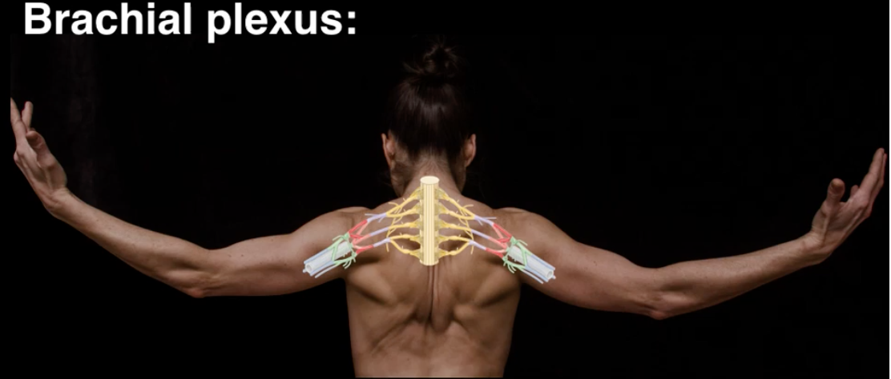
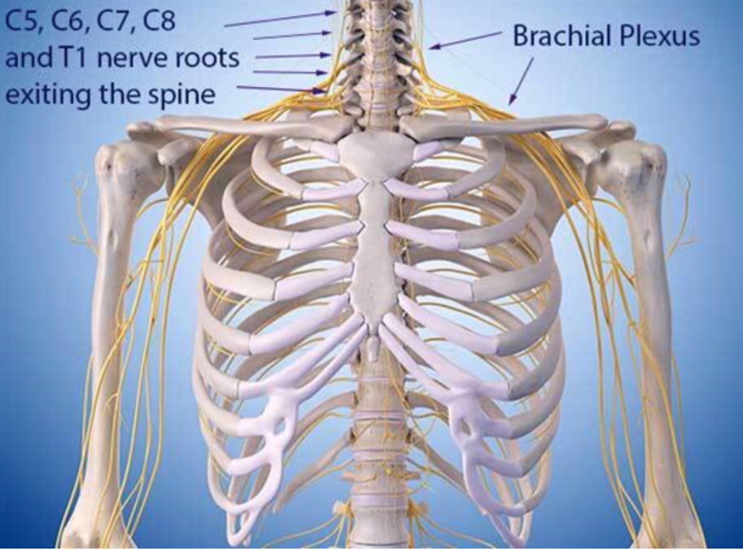
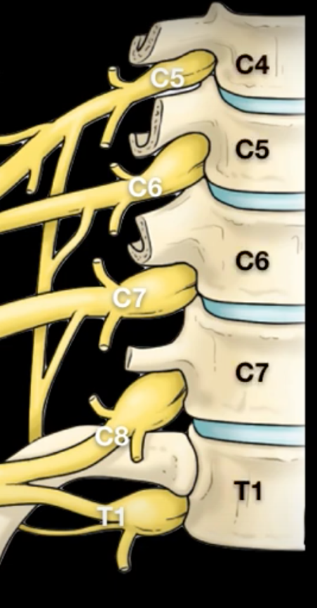
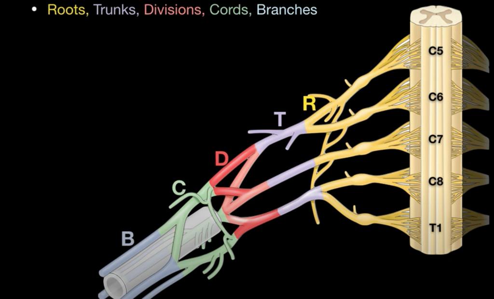
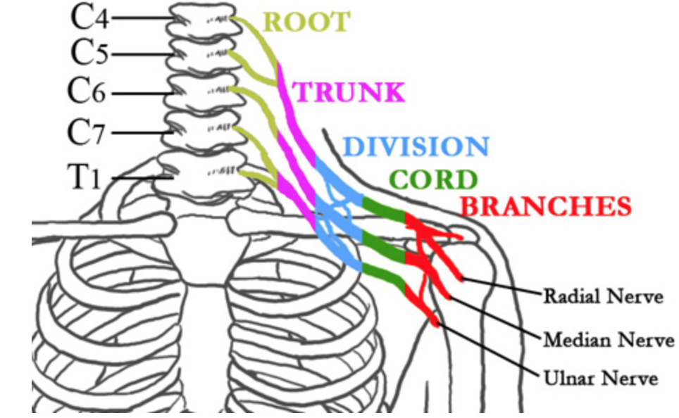
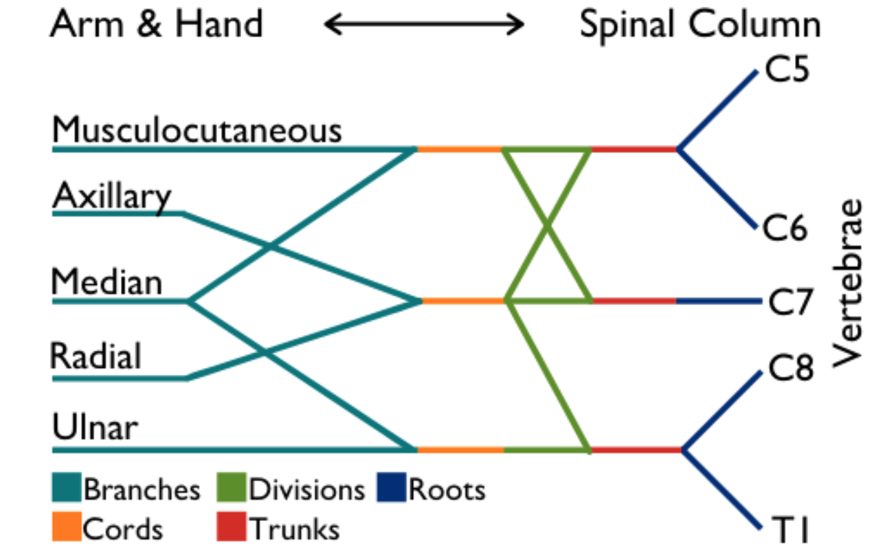
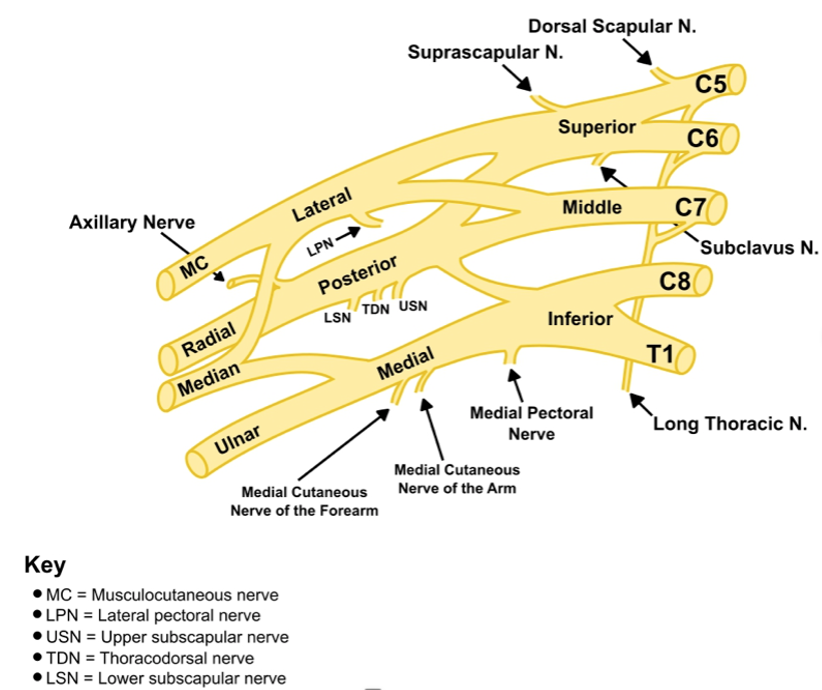

Interscalene Nerve Block (ISB) Brachial Plexus Anatomy    body {font-family: 'Open Sans', sans-serif;}

### Interscalene Nerve Block (ISB) Brachial Plexus Anatomy

**

****

**During an interscalene block, the nerves roots or trunk level of the brachial plexus are anesthetized.  
The brachial plexus provides somatic motor and sensory innervation to the upper extremity, including the scapular region.

****

  
There are two brachial plexuses, one on each side of the body.  
They both terminate beneath the clavicle, where their branches give rise to the five major nerves of the arm.

****

**Brachial Plexus:**  
The brachial plexus is a group of separate nerves originating from the cervical nerve roots 5, 6, 7, 8, and thoracic nerve 1 as they exit the spinal cord.  
  
**A fascial sheath contains the upper region of the brachial plexus.**  
The roots of the brachial plexus and blood vessels lie within a fascial sheath as they pass between the clavicle and first rib into the axilla.  
  
**Thoracic Outlet Syndrome:** (trivia)  
TOS refers to a variety of symptoms, from the compression of the brachial plexus in the thoracic outlet as the nerve and vascular structures pass between the first rib and clavicle en route to the axilla.  
Symptoms depend on what structure (s) is being impinged.

****

  
**These five nerve roots merge to form the following three trunks:  
**Upper Trunk (C5-C6)Middle Trunk (C7)Lower Trunk (C8, T1)  
  
**The three trunks above then split into anterior and posterior divisions to form the following six divisions:  
Anterior divisions of the:** upper, middle, and lower trunks  
**Posterior divisions of the:** upper, middle, and lower trunks  
The anterior and posterior divisions innervate flexor groups versus extensor groups.  
  
**Roots, Trunks, Divisions, Cords, and Branches:  
**The brachial plexus is divided into Roots, Trunks, Divisions, Cords, and Branches.  
There are five "terminal" branches and numerous other "pre-terminal" or "collateral" branches that leave the plexus at various points along its length.  
From there, they provide motor and sensory down to the rest of the arm.  
**  
A mnemonic to remember the sections of the brachial plexus:**  
**“Randy Travis Drinks Cold Beer.”  
R**oots, **T**runks, **D**ivisions, **C**ords, and terminal **B**ranches

****

****

****

**Typically, the brachial plexus is composed of the following:**  
5 roots  
3 trunks  
6 divisions  
3 cords  
Multiple terminal branches  

****

**Note:** Anatomically, various cross-functions of nerves within the brachial plexus exist.  
  
**The six divisions regroup to become the three cords named by their position relative to the axillary artery.**  
**Posterior cord:** From the three posterior divisions of the trunks (C5-C8, T1)  
**Lateral cord:** From the anterior divisions from the upper and middle trunks (C5-C7).  
**Medial cord:** A continuation of the anterior division of the lower trunk (C8, T1).  
**The brachial plexus terminates where it gives rise to five major nerve branches that extend down the arm:  
**Musculocutaneous nerve  
Axillary  
Median  
Radial  
Ulnar  
  
The five major nerves from the brachial plexus eventually divide as they travel down the arms.  
They branch into specific nerves, which provide distinct functions in the arm, hand, and fingers.  
  
**The brachial plexus ends where it gives rise to five major nerve branches that extend down the arm:  
**Musculocutaneous nerve  
Axillary  
Median  
Radial  
Ulnar  
  
table.tableizer-table { font-size: 12px; border: 1px solid #CCC; font-family: Arial, Helvetica, sans-serif; } .tableizer-table td { padding: 4px; margin: 3px; border: 1px solid #CCC; } .tableizer-table th { background-color: #104E8B; color: #FFF; font-weight: bold; }

| Nerve | Origin and Action |
| --- | --- |
| Musculocutaneous | From nerve roots C5-C7  
Flexes muscles in the upper arm, at both the shoulder and elbow. |
| Axillary | From nerve roots C5 and C6  
Shoulder rotation and enables the arm to lift away from the body. |
| Median | From nerve roots C6-T1  
Movement in the forearm and parts of the hand. |
| Radial | From nerve roots C5-T1  
Controls various muscles in the upper arm, elbow, forearm and hand. |
| Ulnar | From nerve roots C8-T1  
Fine motor control of the fingers. |

**  
Blood supply of the brachial plexus:  
**The subclavian artery and its branches provide the majority of blood supply to the brachial plexus.  
The trunks are supplied from muscular branches of the ascending and deep cervical arteries and sometimes muscular branches of the subclavian.  
Cords receive blood supply from the subclavian, axillary, and subscapular arteries.

****

**Anatomy notes at the level of the interscalene plexus:  
**The C6 and C7 roots often split into two structures as it may look like a “double bubble.”  
Nerve roots can be traced back to their intervertebral foramen to aid identification.  
  
**Vertebral transverse processes:**  
C5 transverse processes is bifid with a large posterior tubercle  
C6 transverse processes has a large anterior tubercle (Chassaignac’s)  
C7 transverse processes has no anterior tubercle.  
  

Edited by Dr. Michael Kaminsky, Regional Anesthesiologist  
  
Brachial Plexus  
The Noted Anatomist (special permission from Dr Morton)  
Accessed 01/2023  
https://www.youtube.com/watch?v=RLJ8aUw468M&t=1s  
  
Neuroanatomy of the brachial plexus: normal and variant anatomy of its formation.   
Surgical and Radiologic Anatomy. 2010 Mar;32(3):291-7.  
Johnson EO, Vekris M, Demesticha T, Soucacos PN.  
  
Anatomy, Head and Neck, Brachial Plexus  
StatPearls (accessed 01/2023)  
Lauren Polcaro; Matthew Charlick; Daniel T. Daly.  
https://www.ncbi.nlm.nih.gov/books/NBK531473/  
  
The Brachial Plexus  
The Noted Anatomist (accessed 01/2023)  
https://www.youtube.com/watch?v=RLJ8aUw468M  
  
Thoracic outlet syndrome: a 50-year experience at Baylor University Medical Center.  
Proc (Bayl Univ Med Cent) 2007;20:125–35.  
Urschel HC, Kourlis H.