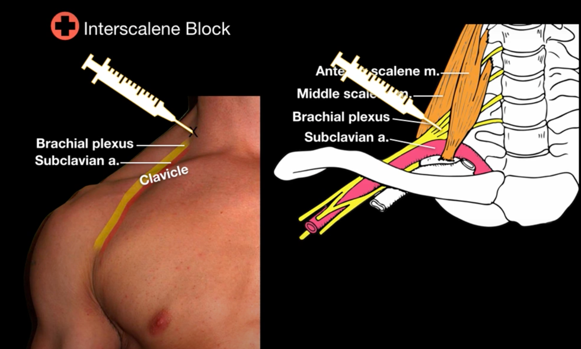
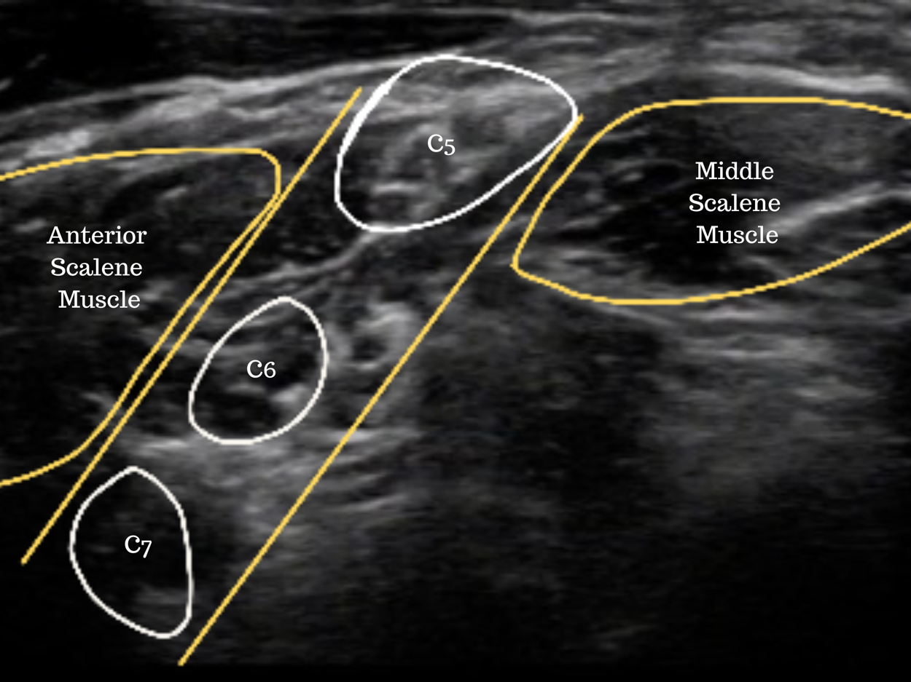
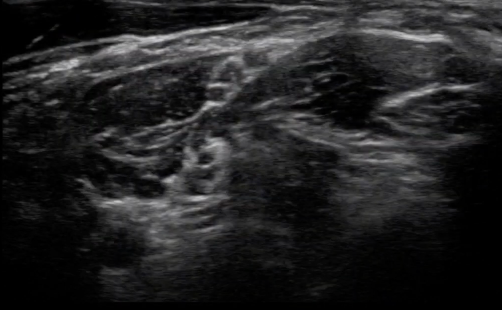
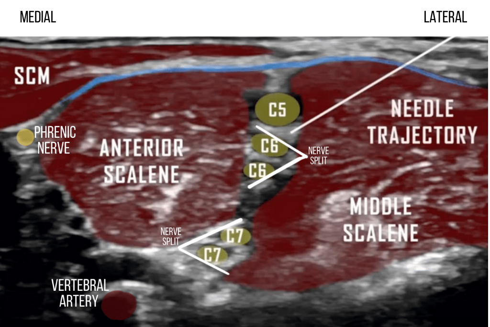
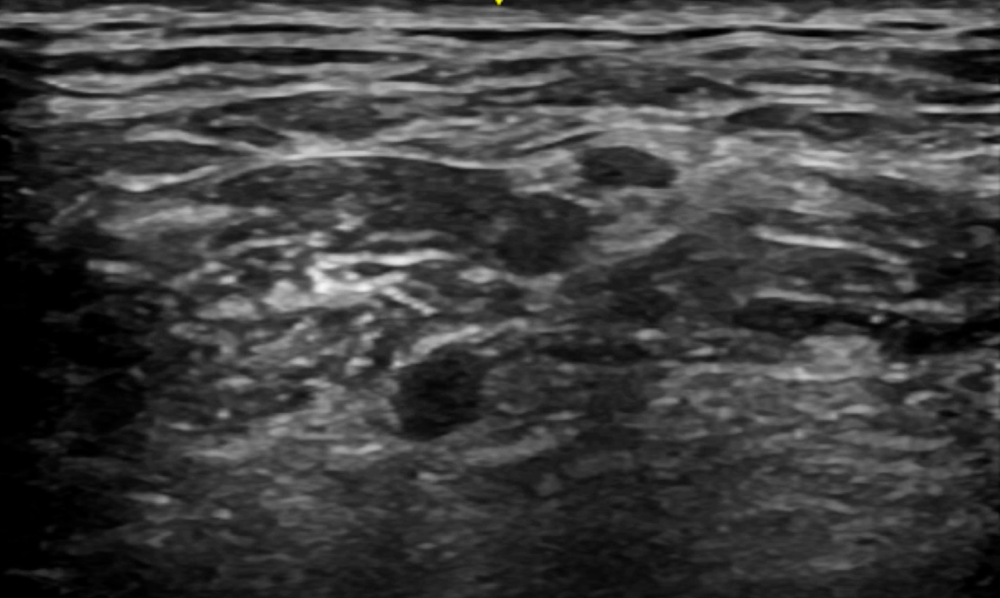
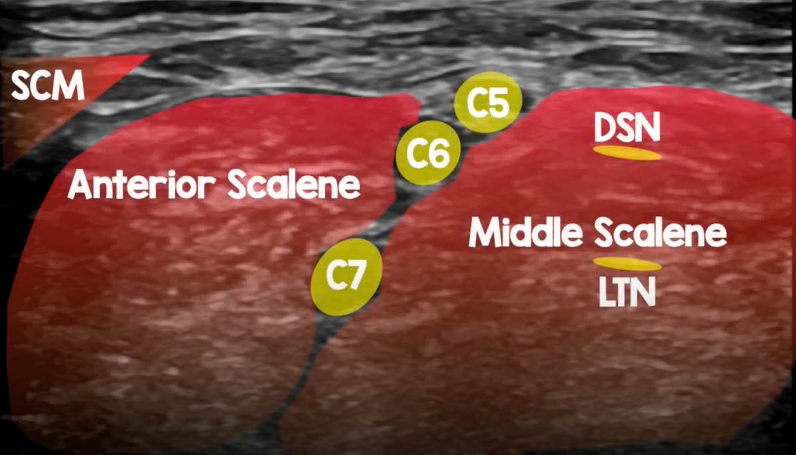

Interscalene Nerve Block Ultrasound Images    body {font-family: 'Open Sans', sans-serif;}

### Interscalene Nerve Block Ultrasound Images

****

  
Ultrasound probe just superior to the clavicle pointing down.

****

  
Ultrasound view below after sliding the US probe cephalad optimally review the interscalene nerves.

****

****

****

****

****

****

  
  

Edited by Dr. Michael Kaminsky, Regional Anesthesiologis