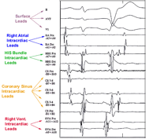

Intracardiac electrograms (e-grams)     body {font-family: 'Open Sans', sans-serif;}

### Intracardiac electrograms (e-grams)

You don’t need to know this. It will give you an understanding of what the EP cardiologist is staring at during some EP procedures.

Below is a typical 15-lead ECG trace displayed in the cardiac catheter laboratory. The first six leads are the conventional external ECG leads: I, II, III, aVL, V1, and V6. Following that are the intracardiac e-grams: HRA, His bundle proximal (HISp), and His bundle distal (HISd). Following those are the four CS e-grams (CS 1–2, CS 3–4, CS 5–6, and CS 7–8) and finally the RVA e-grams, RVA proximal and RVA distal.

An electrophysiology catheter is used to measure electrical activity in the heart. Information on timing, position, voltage of the arrhythmia, and relation to other structures is collected in order to establish a diagnosis and perform successful treatment.

E-grams are recorded to understand the arrhythmia. They guide the ablation catheter to the correct position for ablation and are then used to check the success or failure of the treatment, that is, the termination of the arrhythmia at the end of the procedure.

Below is a typical 15-lead ECG trace displayed in the cardiac catheter laboratory. The first six leads are the conventional external ECG leads: I, II, III, aVL, V1, and V6. Following that are the intracardiac e-grams: HRA, His bundle proximal (HISp), and His bundle distal (HISd). Following those are the four CS e-grams (CS 1–2, CS 3–4, CS 5–6, and CS 7–8) and finally the RVA e-grams, RVA proximal and RVA distal.

Zimetbaum, Peter J., and Mark E. Josephson. _Practical Clinical Electrophysiology_. Philadelphia: Wolters Kluwer Health/Lippincott Williams & Wilkins, 2009.