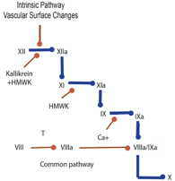
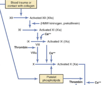
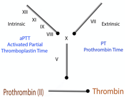

Intrinsic Pathway    body {font-family: 'Open Sans', sans-serif;}

### Intrinsic Pathway

**Quick Notes  
**12 > 11 > 9 > 8, then Common Pathway starts when it has reached factor X.  
**Clotting factors required for the intrinsic pathway:** XII, XI, IX, VIII.  
**Mnemonics for factors involved:** (go from $12 down to $11.98–or TENE – twelve, eleven, nine, eight).  
  
**Note:** Each of the 13 clotting factors have an inactivated form (roman numeral) that is converted into an activated form (roman numeral with a lower-case “a” at the end).

****

  
**Other required substances:  
**Prekallikrein  
HMWK (High Molecular Weight Kininogen)  
Calcium  
Phospholipids  
  

****  
Guyton and Hall Medical Physiology; 2011

  
**Lab tests related to Intrinsic factor  
  
****Intrinsic pathway involves:** Heparin, ACT and aPTT.  
**Mnemonic:** Katharine Hepburn (heparin) went into (intrinsic) Pittsburgh (PTT) to take her acting (ACT) lessons. (Valley Anesthesia)  
  
DVTs and PEs also involve the intrinsic pathway.  

****

  
**Activation of Intrinsic Pathway**  
The intrinsic pathway is activated by trauma inside the vascular system, and is activated by platelets, exposed endothelium, chemicals, or collagen. This pathway is slower than the extrinsic pathway, but more important.  
  
**Blood trauma causes:**  
(a) activation of Factor XII.  
(b) release of platelet phospholipids (containing platelet factor 3.)  
  
Activated Factor XII (XIIa) enzymatically activates Factor XI (XIa).  
  
Factor XIa enzymatically activates Factor IX to IXa.  
  
Factor IXa + Factor VIIIa + platelet phospholipids and factor 3 activates Factor X to Xa.  
(In order for factor IX to activate factor X, there needs to be factor VIII present).  
  
**Once the clotting cascade reaches Factor X, it is now the common pathway**  
Factor Xa activates the common pathway of coagulation.

****

  

[https://www.ahajournals.org/doi/10.1161/ATVBAHA.118.312130](https://www.ahajournals.org/doi/10.1161/ATVBAHA.118.312130)  
Intrinsic Pathway of Coagulation and Thrombosis: Insights From Animal Models  
AHA/ASA Journals  
Jan, 2019  
  

Hematology Made Easy, 2013, pp. 62  
By Erhabor, Adias  
Guyton and Hall Medical Physiology; 2013.