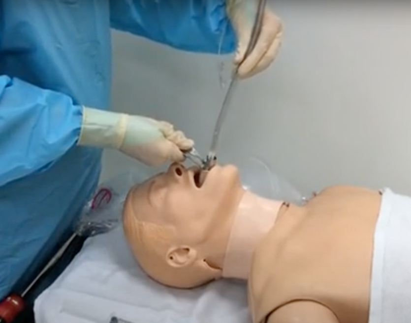
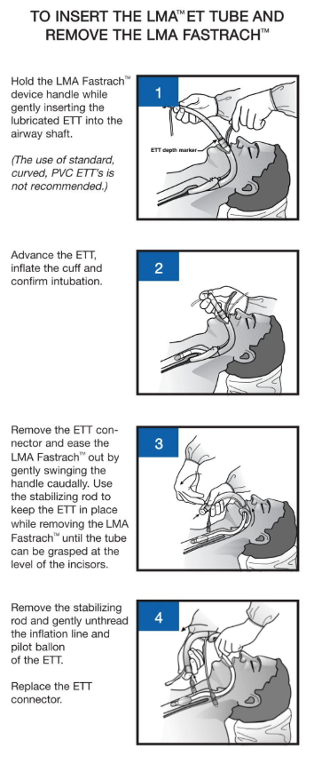

Intubation with ETT through the Fastrach LMA    body {font-family: 'Open Sans', sans-serif;}

### Intubation with ETT through the Fastrach LMA

Position the longitudinal line of the ETT to face the handle of the LMA Fastrach.  
Gently insert the ETT into the device airway tube.

****

****

Grip the handle firmly and lift the device using the handle as needed to draw the larynx forward by a few millimeters to increase seal pressure and optimize the alignment of the trachea and ETT axes.  
  
The ETT should not pass beyond the 15 cm transverse depth marker.  
Ensure that the tip of the ETT does not enter the mask aperture.  
**Warning:** NEVER OVER INFLATE THE CUFF.  
**Warning:** There are reports of pharyngeal edema and increased mucosal pressure attributed to the rigidity of the airway tube.  
  
\- It is recommended to remove LMA Fastrach once intubation has been accomplished.  
\- High pressures may develop against the pharyngeal wall if the head or neck is moved from the neutral position due to the rigidity of the curved airway tube.  
\- The risk of maintaining the LMA Fastrach in place must be weighed against the potential risks associated with the maneuver of removal of the device.  
  
**Warning:** If the LMA Fastrach is retained in the patient after ETT intubation, the cuff should be deflated to 20‐30 cm H20 pressure.  
\- This low cuff pressure stabilizes the airway in the pharynx.  
\- Avoid unnecessary movement of the device and maintain the head or neck in a neutral position.  
  
**Remove the LMA Fastrach while leaving the ETT in place.  
Stabilizing Rod:** It keeps the ETT in place while removing the LMA.  
  
**Warning:** Displacement of the LMA Fastrach ETT (esophageal intubation, accidental extubation) may occur if the LMA Fastrach removal procedure is not performed correctly.  
\- In these cases, a correctly deflated LMA Fastrach should be reinserted without delay to ensure patient oxygenation.\- Following pre‐oxygenation of the patient, disconnect the circuit, leaving the ETT connector attached.  
\- Fully deflate the LMA Fastrach cuff, ensuring the ETT cuff remains inflated.**\-** Gently tap or swing the device handle caudally around the chin.  
\- Using the curvature of the airway tube, slide the device out of the pharynx into the oral cavity, applying counter pressure to the ETT with the finger.  
**Below:** The Stabilizer Rod is inserted just enough until it touches the proximal end of the ETT tube.

****

The Fastrach is removed as the stabilizer Rod PREVENTS the ETT from sliding out with it.

****

****

**1\.** When the proximal end of the ETT is level with the proximal end of the LMA proximal port, port, remove the ETT connector and insert the Stabilizer Rod to keep the ETT in place. Holding the Stabilizer Rod, slide out the LMA Fastrach over the ETT and LMA Stabilizer Rod until it clears the mouth.  
**2\.** Remove the LMA Stabilizer Rod when the LMA Fastrach cuff clears the mouth while holding the ETT in place to prevent accidental dislodgment. Grasp the ETT firmly while gently unthreading the inflation line and pilot balloon from the LMA Fastrach tube.  
**Caution:** Failure to remove the LMATM Stabilizer Rod from the airway tube before completely removing the LMA Fastrach may result in the ETT being accidentally pulled out or the pilot balloon or inflation line tubing being damaged.  
**3\.** Using the LMA Stabilizer Rod, check the ETT's position by measuring the distance of the proximal end from the teeth.  
If any displacement of the ETT has occurred during the removal of the LMA Fastrach, an appropriate adjustment will need to be made.  
**4\.** Replace the ETT connector and ventilate the patient.  
**Caution:** Verify correct tube placement and patient oxygenation immediately after LMA Fastrach removal or if the patient’s position is altered after intubation.  
**5\.** ETT should be securely anchored using a bite block to avoid unnecessary movement or damage.  
In elective cases, after removal, LMA Fastrach may be re‐inserted behind the ETT to provide an immediate airway if deep extubation is planned or extubation is clinically determined to be hazardous.  
  
**Intubation with LMA Fastrach and with Fiberoptic bronchoscope (FOB):  
1\.** Pass a self‐sealing connector with a suitable sidearm through the ETT to permit continued ventilation.  
**2\.** Select an appropriate diameter and length of FOB to pass within the ETT.  
When fully inserted, the FOB should not protrude through the end of the assembled ETT and sealing port.  
It should only pass the EEB of LMA Fastrach if protected by the ETT.  
Otherwise, its tip may be deviated or damaged by the EEB.  
**3\.** Insert the ETT up to 15 cm depth and verify with the FOB that the ETT tip contacts the EBB of the device.  
**4\.** At 16.5cm depth, verify with the FOB that the ETT lifts the EEB, showing the glottis.  
**5\.** Advance the ETT into the trachea; avoid pushing on the EEB with the FOB.  
**6\.** Inflate the cuff of the ETT.  

INSTRUCTIONS FOR USE – LMA FastrachTM  
Teleflex (accessed 02/2024)  
https://tinyurl.com/ms3dzw65  
  
LMA Fastrach Insertion Technique  
Accessed 02/2024  
Yumpo.com.  
https://tinyurl.com/muewjm9d