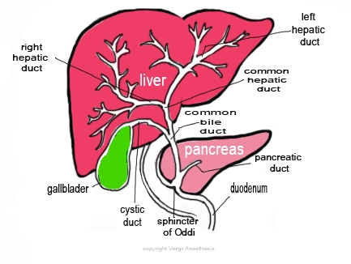

Kasai Procedure- Hepatoportoenterostomy   

### Kasai Procedure - Hepatoportoenterostomy or Kasai Portoenterostomy

#### – a Biliary Atresia Correction procedure.

_Edited by Lauren Freedman, CRNA St Petersburg, FL_

The procedure is a surgical treatment performed on infants with biliary atresia to allow for bile drainage. This is a longer duration open abdominal case requiring an A-line & multiple IV’s.

**Knowledge base:** With biliary atresia, bile ducts are damaged, missing, and/or not shaped correctly. Hence, the bile flow from the liver to the gallbladder is blocked. This blockage causes the bile to be trapped inside the liver resulting in damage and scarring of the liver cells (cirrhosis) and ultimately liver failure.

Concurrently, an inadequate amount of bile reaches the intestine to aid with the digestion of fats in the diet. Protein deficiencies may occur due to liver damage. Vitamin deficiencies may also occur. Children with liver disease require more calories than a normal child because as they do not absorb the same amount or ration of calories and nutrition.

**Symptoms:**  
Clinically, biliary atresia presents in infants from 1-6 weeks of age with jaundice, pale stools, dark urine, coagulopathy, failure to thrive, hepatosplenomegaly and ascites.

There is a rise in conjugated bilirubin, alkaline phosphatase and gamma glutamyl transferase. Prothrombin and albumin are normal in the early phase. Liver function is usually well preserved in the first few months of life.

Treatment must be done as soon as possible. Biliary atresia is treated with surgery. Even if this surgery goes well, the child will likely need a liver transplant sometime in the future.

****

**The Surgical Procedure**  
The surgeon removes the blocked bile ducts and gallbladder, and then replaces them with a segment of the small intestine. This segment of intestine is sewn into the liver and functions as a new extrahepatic bile duct system.  
This provides a direct pathway for bile from the liver to travel to the intestines in turn allowing bile to drain from the liver. There a variety of surgical methods that achieve the above.

**Pre-op considerations:  
Are there any associated anomalies?** 10-15 percent of infants with biliary atresia may be born with other problems: Heart, Spleen (polysplenia),

Vascular (inferior vena caval anomalies, a preduodenal portal vein) and

Intestinal (situs inversus or malrotation).  
Any cardiac issues will need cardiac clearance.

**Labs:** CBC, T & C, Coags (PT, PTT), BUN, Cr, LFTs.**Is blood available?** PRBCs, FFP, parent donor?

Is hepatic function compromised? Elimination of drugs may be delayed.  
Try to correct any coagulation issues before surgery.

**Heat the room up:** This is an open belly case and a large surface of the liver is often exposed to the cold operating room. A Fluid warmer and underbody warming blanket is recommended to preserve core temps.

**Anesthesia:** General/ETT  
Epidural to supplement if coags are normal.  
**Induction:** Mask inhalation if no IV access.  
**Nitrous:** Avoid due to bowel distention.  
**Inhalation Agent:** Isoflurane is the gas of choice with a compromised liver.  
**Position:** Supine  
**Duration:** 4-6 hours.  
**IV Access:** 22g x 2. May be a difficult IV stick due to previous attempts. 2 saphenous IVs or a central line is common.  
**Hydration: 4:2:1** **(below is just a common reference)**Albumin dose for mild hypotension: 10cc/kg is recommended (<10kg wt)  
Albumin-more effective with its oncotic pull than crystalloids (<10kg wt)  
Crystalloid Bolus dose for mild hypotension: 5-10cc/kg (<10kg wt)  
Crystalloid Bolus dose for mild hypotension: 20cc/kg (>10kg wt)  
Crystalloid Bolus (emergency) for severe hypotension (20-50cc/kg)

**Replacement of Insensible Fluid Loss (reference)**  
Minimally invasive (inguinal, laparoscopic) 0-2 cc/kg/hr  
Mildly invasive (ureteral reimplantation) 2-4 cc/kg/hr  
Moderately invasive (simple bowel cases) 4-8 cc/kg/hr  
Significantly invasive (NEC) >10 cc/kg/hr  
3rd Spacing: 10mL/kg/h is standard for 3rd space fluid loss  
with an open belly case.

**EBV (reference)  
Premature:** 90-100cc/kg**Newborn:** 80-90cc/kg**3mo-1 year:** 70-80cc/kg**1-4 years:** 70cc/kg  
**Adult:** 55-60cc/kg  
3rd Spacing: 10mL/kg/h is standard for

3rd space fluid loss with an open belly case.

**Age range:** 1-4 months.  
**EBL:** Minimal, but we usually have blood available.  
**Blood sugar levels:** Check every hour. Some literature states these patients should be on a dextrose containing fluid.

**NG Tube:** Usually.  
**Foley:** Yes  
**A-line: +/-** Only if there is associated sepsis, pneumonia, cholangitis or severe cirrhosis.

**Emergence:** Attempt to extubate unless contraindicated, extended duration of procedure, excess blood loss or fluid shift issues.

**Complications of surgical repair and underlying disease states include:  
**Cholangitis  
Portal hypertension  
Fat soluble vitamin deficiency  
Bleeding  
Infection

Post-operatively, cholangitis and malabsorption are common; tissue rejection is possible.

**More Notes:**  
Diagnosis of biliary atresia is:  
By abdominal ultrasound, usually showing an enlarged liver and an absent or contracted gall bladder after 4 hours fasting.

Later confirmed by liver biopsy or an intraoperative cholangiogram with visual assessment of the biliary tree.

**The surgical procedure involves three stages:**  
1\. Mobilization of the liver, dissection of the atretic or closed bile ducts and removing all of the bile tracts up to the liver.  
2\. Preparation of a Roux-en-Y loop of jejunum.  
3\. Anastomosis of the end of the Roux-en-Y loop to the area prepared . This anastamosis is then used as the conduit for bile drainage between the liver and intestine.

**Predictive factor:** With a direct bilirubin less than 2.0 and the absence of liver fibrosis, a good prognosis is possible.

With biliary atresia, the biliary structures gradually disappear by 2-4 months of age and are replaced by fibrous tissue.

There is usually no need for invasive arterial or venous monitoring unless the baby has associated sepsis, pneumonia, cholangitis or severe cirrhosis.

Hypothermia is a very real problem for these patients. In addition to the large surface-to-area ratio in infants and their lack of insulation; the large surface of the liver is exposed to the cold operating room for prolonged periods of time. OR temperatures should be kept higher than normal, all IV fluids warmed, all rinsing or irrigating solutions warmed and hot air blowers used to maintain surface warmth. You as the anesthesia provider are ultimately responsible for monitoring and ensuring adequate patient thermoregulation. Openly communicate this with staff, if possible/appropriate.

Biliary atresia is a rare disorder. About one in 15,000 to 20,000 babies do not have complete bile ducts.

Biliary atresia seems to affect girls more than boys. Within the same family, it is common for only one child in a pair of twins or only one child within the same family to have it. Asians and African-Americans are affected more frequently than Caucasians.

Ten to 15 percent of infants with biliary atresia may be born with other problems in the:  
Heart  
Spleen (polysplenia)  
Blood vessels (inferior vena caval anomalies, preduodenal portal vein)  
Intestine (situs inversus or malrotation).

Current literature suggests that survival rates are better if the infant is operated on before 60 days of age. Some studies suggest 30 days of age. However, others believe that survival is more closely related to the severity of intrahepatic cholangiopathy.

This surgery is not a cure for biliary atresia. It won’t work if the bile ducts INSIDE the child’s liver are damaged or missing. But, in many cases, it does help the liver work better for many years.

Normal restoration of bile flow and recovery of liver function occurs in approximately 1/3 of children who undergo the Kasai procedure.

These children may not require liver transplantation.  
  
The remaining 2/3 will not have adequate bile flow and liver function, and will eventually require liver transplantation. Of this group, half will need transplantation soon after the Kasai procedure and half will need transplantation at a later time.

**Quick Basic Drug References  
****Propofol:** 2.5-3.5mg/kg IV  
**SCh** (<1 year: 3mg/kg) (>1 year: 0.1mg/kg)  
**Neostigmine:** 0.05-0.07mg/kg  
**Robinul:** 0.01mg/kg  
**Fentanyl:** 1-2mcg/kg  
**Morphine:** 0.7-1.4mg/kg**Ofirmev:** (>2 years: 15mg/kg)  
**Not FDA approved for < 2 years, but many still administer at 15mg/kg  
Toradol:** (>2 years: 0.5mg/kg)  
**Precedex** (Emergence)**:** Slow push 0.5mcg/kg  
**Zofran:** 100mcg/kg (max 4mg)  
**Decadron:** 0.2-0.5mg/kg  
**Ancef:** 25mg/kg  
**Ampicillin:** 25-100mg/kg (max per day 100-400mg/kg)  
**Gentamycin:** 2.5mg/kg  
**Ceftriaxone (rocephin):** 50-75mg/kg  
**Clindamycin (cleocin):** 15-25mg/kg  
**Invanz** (ertapenem): (3 month -12 years): 15mg/kg  
**Vancomycin:** 10mg/kg

**References**

http://www.hindawi.com/journals/isrn/2012/132089/#B2  
Indian J Anaesth. 2012 Sep-Oct; 56(5): 479–484.  
doi:  
**Anaesthesia for biliary atresia and hepatectomy in paediatrics  
**http://www.ncbi.nlm.nih.gov/pmc/articles/PMC3531003/  
Jaffe, Richard A. _Anesthesiologist's Manual of Surgical Procedures_. Philadelphia, Pa.: Lippincott  
Williams & Wilkins, 2009.  
Green DW, Howard ER, Davenport M. Anesthesia, perioperative management and outcome of correction  
of extrahepatic biliary atresia in the infant: A review of 50 cases in the King's College Hospital  
series. Paediatr Anaesth. 2000;10:581–9  
  
Macksey, Lynn Fitzgerald. _Surgical Procedures and Anesthetic Implications: A Handbook for Nursing  
Practice_ . Sudbury, MA: Jones & Bartlett Learning, 2011.  
Tan CE, Davenport M, Driver M, Howard ER. Does the morphology of the extrahepatic remnants in biliary  
atresia influence survival? A review of 205 cases. J Pediatr Surg. 1994;29:1459–64.