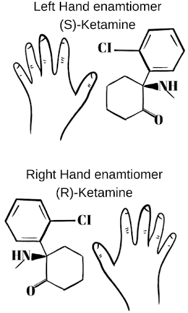

Ketamine Enantiomers (S and R-Ketamine)    body {font-family: 'Open Sans', sans-serif;}

### Ketamine Enantiomers (S and R-Ketamine)

**It has several commercial trade names, including:**  
Ketalar®  
Ketaject®  
Ketaset®  
Vetalar®  
  
A bottle of generic ketamine (racemic ketamine) used in medical facilities is a racemic mixture composed of equal amounts of two enantiomers (isomers), S and R.

****

**The two enantiomers of racemic ketamine:**  
S-ketamine (eskatamine) is the left-handed orientation of the molecule.  
R-ketamine (arketamine) is the right-handed version.  
  
When these two enantiomers are separated, they have similar pharmacokinetics but different potencies.  
  
**S-ketamine is more potent than R-ketamine:  
**S ketamine has a fourfold greater affinity for the NMDA receptor and greater anesthetic potency than R-ketamine.  
\- S-ketamine binds more potently to the N-methyl-D-aspartate receptor than R-ketamine.  
\- S-ketamine induces less drowsiness, less lethargy, and impairment in clustered subjective cognitive capacity than equianalgesic small-dose of racemic ketamine.  
\- In humans, intravenous S-ketamine (0.15 mg/kg) is more potent than R-ketamine (0.5 mg/kg) as an analgesic.  
\- S-ketamine also produces 1.6 times greater altered body image and changes in hearing.  
\- It has 2.5 times greater feelings of unreality and four times more reduced visual acuity.  
\- S-ketamine also has a more reduction in pain scores than patients given R-ketamine.  
\- S-ketamine appears to have greater unwanted psychic side effects than the R-enantiomers).  
\- S ketamine causes fewer psychotic emergent reactions, less agitated behavior, and better intraoperative amnesia and analgesia than its R (–) enantiomer  
\- S (+)-Ketamine is available (Ketanesth ® ) in some European countries (Germany, Austria, Italy, and the Netherlands).  
\- The S (+)-ketamine (“S”) spatial structure, light diverged to the right), is two times stronger than the racemic form and four times than the R (−)-ketamine isomer.  
  
**R-ketamine is a more potent antidepressant.  
**In animal studies, R ketamine was a potent, long-lasting, and safe antidepressant free of psychotomimetic side effects.  
R-ketamine is superior in inducing synaptogenesis, which is the formation of new connections between brain cells.  
_Despite the literature above concerning the superiority of R-ketamine for depression, it is an S-ketamine spray currently used for depression.  
  
_Jansen pharmaceutical (a subsidiary of Johnson and Johnson) found a way to isolate just S-ketamine by filtering the racemic molecule and discarding the R-enantiomer.  
The left-handed solution (S-ketamine) is the only ketamine formulation currently approved by the FDA to treat treatment-resistant depression.  
**Nasal spray for MDD:**  
SPRAVATO® (esketamine) is the first and only NMDA receptor antagonist approved for two subtypes of MMDD in adult patients.  
It was FDA approved on May 5. 2019.  
  
**Indications for SPRAVATO ® (esketamine) CIII Nasal Spray:**  
In conjunction with an oral antidepressant, treatment of resistant depression (TRD) in adults and depressive symptoms in adults with MDD with acute suicidal ideation or behavior.  
  

Taming the ketamine tiger.  
Anesthesiology, 2010, 113: 678–686.   
Domino, E.  
  
Ketamine: A tale of two enantiomersJournal of  **Psychopharmacology** 2021 Feb;35(2):109-123  
Luke A Jelen ,  Allan H Young, James M Stone  
  
Molecular and cellular mechanisms underlying the antidepressant effects of ketamine enantiomers and its metabolites  
Translational Psychiatry; 2019, volume 9, Article number: 280  
Chun Yang, Jianjun Yang, Ailin Luo & Kenji Hashimoto   
  
Ketamine enantiomers in the rapid and sustained antidepressant effects  
Therapeutic Advances in Psychopharmacology (accessed 06/2022)  
John Muller, Sahana Pentyala, James Dilger, and Srinivas Pentyala  
https://journals.sagepub.com/doi/10.1177/2045125316631267  
  
Ketamine and rapid-acting antidepressants: a new era in the battle against depression and suicide  
\[version 1; peer review: 3 approved\]  
F1000research.com (accessed -6/2022)  
Robert S. Duman  
https://f1000research.com/articles/7-659/v1  
  
Ketamine  
Stoelting’s Pharmacology and Physiology in Anesthetic Practice, 6 th Ed. 2022, pp. 176-179  
Wolters Kluwer  
Robert K, Soeltting, Pamela Flood, and James Rathmell