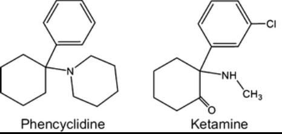
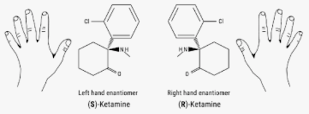

Ketamine (Ketalar) Pharmacokinetics    body {font-family: 'Open Sans', sans-serif;}

### Ketamine (Ketalar) Pharmacokinetics

**It has several commercial trade names, including:**  
Ketalar®  
Ketaject®  
Ketaset®  
Vetalar®  
  
A Phencyclidine derivative.\[2-( _O_\-chloro-phenyl)-2-methyl-amino cyclohexanone\]  
A Hydrosoluble aryl-cyclo-alkylamine  
  
**Molecular mass:** 238 g/mol  
**Chemical formula:** C13H16CINO

****

\- The second carbon of the cyclohexanone radical is asymmetrical.  
\- Ketalar® is the racemic mixture (optically inactive) of 2 enantiomers of equal quantity (isomers that diverge light in opposite ways).

****

\- The active enantiomer is S (+)-ketamine (“S”) spatial structure, light diverged to the right), two times stronger than the racemic form and four times than the R (−)-ketamine isomer.  
\- S (+)-Ketamine is available (Ketanesth®) in some European countries (Germany, Austria, Italy, and the Netherlands).  
  
**Quick facts:**  
**\- Vial concentrations:** 10 mg/mL,50 mg/mL and 100 mg/mL  
\- Ketamine is a member of the class of cyclohexanones in which one of the hydrogens at position 2 is substituted by a 2-chlorophenyl group, while a methylamino group substitutes the other.  
\- Ketamine is a derivative of Phencyclidine (PCP).  
\- Ketamine we use today is a racemic mixture composed of equal amounts of (S)-ketamine and (R)-ketamine.  
**\- Preservatives:** Benzoethonium chloride 1% or chlorobutanol  
  
**Water and lipid solubility:  
**\- Ketamine is a water-soluble molecule that structurally resembles phencyclidine.  
\- However, the literature states that it has high lipid solubility properties.  
\- Ketamine’s lipid solubility is 5–10 times that of thiopental and crosses the blood-brain barrier faster, although the onset time is slower than thiopental.  
\- Ketamine has advantages over propofol and etomidate in not requiring a lipid emulsion vehicle.  
  
**Routes of administration:**  
**\- Intravenous:** Ketamine reaches its receptors very quickly with a transfer half-life of less than 1 min.**\- IM:** Has a high bioavailability (93%), with a plasma peak in 5 minutes.  
**\- Oral:** Bioavailability is limited (20%) because of the hepatic metabolism.  
\- Oral concentration peak occurs in 20–30 minutes.  
**\- Rectal** has conflicting information on hepatic metabolism  
**\- Intranasal:** 50% bioavailability  
**\- Neuraxial:** Controversial  
Epidural injection rapidly goes to the systemic circulation.  
Intrathecal and epidural injections may frequently result in psychodysleptic effects.  
  
**Ketamine blood levels after administration:  
9,000–25,000 ng/ml:** Peak anesthetic induction blood levels  
**2,000–3,000 ng/ml:** Needed to produce or maintain anesthesia**500–1,000 ng/ml:** When the patient awakes  
**50–100 ng/ml:** Dissociated psychic states  
  
**pH:** 7.35-7.55**pKa:** 7.5 at physiologic pH  
**Protein-bound:** 10–30% (low binding)  
\- At physiological pH of 7.4, it is 44.3% un-ionized.  
\- Since its pKa is close to physiological pH, small changes in pH result in a wide variation in the ionized and non-ionized fractions.  
  
**Volume distribution:** 3 L/kg (this is large)  
Initially, ketamine is distributed to highly perfused tissues such as the brain & extreme lipid solubility ensures its rapid transfer across the blood-brain barrier.  
  
**Metabolites of ketamine:  
**Norketamine  
Hydroxynorketamine  
Dehydronorketamine  
  
**Metabolism of ketamine:  
Metabolism:** By various cytochrome P450 enzymes (CYP2B6 and CYP3A4) to form norketamine.  
  
**ketamine → norketamine (active) → hydroxynorketamine → dehydronorketamine  
**\- The metabolite norketamine demonstrates activity at the NMDA receptor with less affinity.  
\- Norketamine undergoes hydroxylation in one of several locations on the cyclohexane ring to form **hydroxynorketamine.**  
**\- Hydroxynorketamine** can further metabolize by shedding a water molecule non-enzymatically, creating **dehydronorketamine.**  
  
**The active metabolite norketamine:  
**\- The metabolite norketamine is an analgesic molecule whose power is about 20–30% compared with ketamine.  
\- It appears in blood 2–3 minutes after a ketamine IV bolus and reaches a peak about 30 minutes later.  
\- It persists in the blood more than 5 hours after administration.  
\- Ketamine elimination half-time is inferior to that of norketamine.  
  
**Enzyme induction** may occur from repeated doses resulting in an accelerated metabolism of ketamine tolerance development.  
**  
Three days after a single dose of ketamine, it is eliminated in the urine as**  
\- 2-3% unchanged  
\- 1.6% as norketamine  
\- 16.2% as dehydronorketamine  
\- 80% excreted in bile and urine after glucuronoconjugation.  
**\- Fecal excretion unchanged:** Less than 5%  
  
**Hepatic clearance:** 1 L per minute (this is high)**Elimination half-time:** 2 to 3 hours  
Its clearance maybe 20% higher in women than in men.  
  
**Kinetics and metabolism's modification due to other drugs:**  
An enzyme inducer, Rifampicin, increases metabolism and clearance for ketamine (13%) and **essentially for norketamine (200%).  
  
Enzyme inhibitors:** Clarithromycin has the opposite effect.  
**Benzodiazepines seem capable of inhibiting ketamine N-demethylation.  
Relationship with Renal and Liver Functions:  
**\- For patients with kidney dysfunction: ketamine concentrations (obtained after the same dose) are 20% higher than those with normal kidney function.  
\- The metabolite dehydronorketamine concentrations are statistically higher in patients with kidney dysfunction.  
\- Ketamine has very little influence on the arterial or portal liver blood flow.  
  
**Pharmacokinetics of ketamine with Peds:  
IM absorption:** Faster in children than adults, probably from muscle weakness in children and the differences in regional flows.  
**Distribution volume:** Slightly lower (1.9 l/kg), but older children are comparable to adults.  
**Plasma clearance:** 16.8 ml/kg/min**Elimination half-life is also shorter in children:** 100 minutes.  
**Norketamine plasma concentrations:** Norketamine plasma concentrations are higher in children.  
**  
In children from 4 to 10 years old:  
**After an 2 mg/kg IV or 6 mg/kg IM injection, ketamine plasma concentrations are similar to those observed in adults.  
**  
First 3 months of life:  
**Ketamine plasma clearance is shorter, probably due to a diminution of liver transformation and kidney excretion.  
There is an increase in half-life elimination in newborns and infants in this case.  
  

PubChem (accessed 05/2022)  
https://pubchem.ncbi.nlm.nih.gov/compound/Ketamine  
  
Ketamine: 50 Years of Modulating the Mind  
Frontiers in Human Neuroscience, 2016; 10: 612.  
Linda Li and Phillip E. Vlisides  
https://www.ncbi.nlm.nih.gov/pmc/articles/PMC5126726/Ketamine Pharmacology: An Update ( _Pharmacodynamics and Molecular Aspects, Recent Findings_ )  
CNS Neuroscience (accessed 06/2022)  
Georges Mion, Thierry Villevieille  
https://onlinelibrary.wiley.com/doi/10.1111/cns.12099  
  
Stoelting’s Pharmacology and Physiology in Anesthetic Practice, 6 th Ed. 2022, pp. 176-179  
Wolters Kluwer  
Robert K, Soeltting, Pamela Flood, and James Rathmell  
  
Ketamine  
Highlights of prescribing information  
AssessDataFDA.Gov (accessed 05/2022)  
https://www.accessdata.fda.gov/drugsatfda\_docs/label/2020/016812s046lbl.pdf  
  
Ketamine: Current applications in anesthesia, pain, and critical careAnesthesia Essays and Researchers 2014 Sep-Dec; 8(3): 283–290.  
Madhuri S. Kurdi, Kaushic A. Theerth, and Radhika S. Deva  
  
Smith’s Anesthesia for Infants and Children 8 th Ed. 2021  
Peter J. Davis, Franklin P Cladis and Etsuro K. Motoyama  
  
Colte and Lerman’s A Practice of Anesthesia for Infants and Children _5 th Ed. 2018,  
_Charles J. Cote’, Jarrold Lerman and Brian J. Anderson