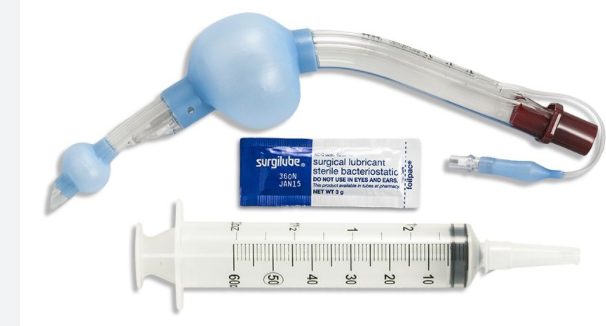
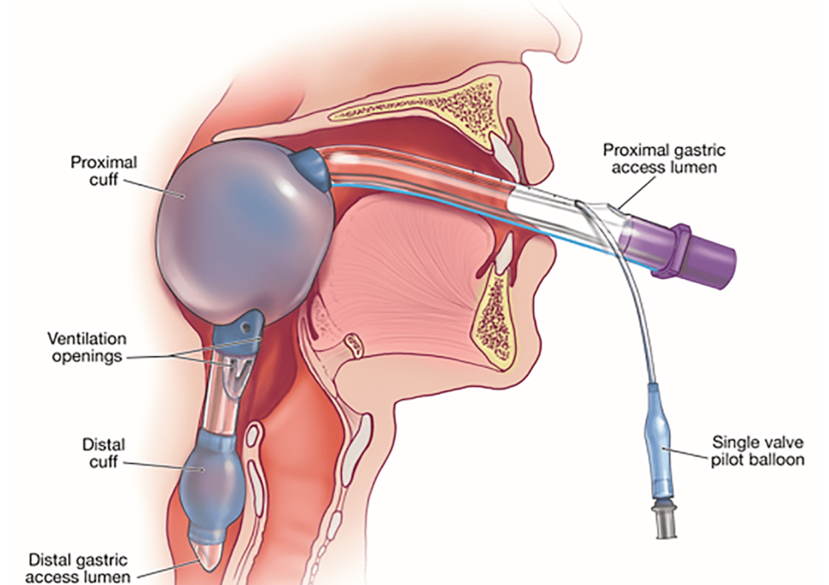

King Laryngeal Tube (LT) - Airway    body {font-family: 'Open Sans', sans-serif;}

### King Laryngeal Tube (LT) - Airway

One of the three supraglottic airway devices  
A blind insertion airway device (BIAD)  
FDA approval in 2003

****

The device has primarily been used in the field by paramedics.  
It is rarely available in hospital settings due to the availability of advanced airway devices.  
  
**The three main supraglottic airways on the market:**  
King Laryngeal Tube  
Laryngeal Mask Airway  
Combitube  
  
The King LT device is similar to a Combitube, except the King Airway only has a single lumen and a larger proximal cuff.

****

The device is a latex-free tube with a distal and proximal balloon that occludes the esophagus and oropharynx, creating a direct route for ventilation through the larynx and trachea.  
  
**Gastric port:** Large enough to pass an 18g gastric tube  
  
**Positioning of cuffs:  
Distal cuff:** In the esophagus  
**Proximal cuff:** In hypopharynx  
  
Not only does this create a patent airway to ventilate through, but it also occludes the esophagus, preventing gastric inflation and aspiration.  
  
**Insertion: Blind esophageal intubation  
**It can be inserted via blind technique or with a laryngeal scope in the esophagus.  
It should be inserted until the connecter is just outside the mouth.  
Inflate the single-valve pilot balloon with 60 cc of air to inflate both balloons.  
When properly placed, the ventilatory outlets should be right over the glottis.  
Pull the device back if you have difficulty bagging (ventilating) the patients.  
  
**For removal of the Kink LT device:**  
Remove all 60 cc of air before removing the device.  
  
**Most common indication:**  
As a failed or backup airway after attempts at intubation have failed.  

The King Laryngeal Tube: Failed Airway or Airway of Choice?  
Cath Lab Digest, Dec. 2011  
Travis Mackey, RN, CCRN, RCIS, EMT-P  
  
King LT Supraglottic Airway  
Accessed 02/2024  
Jess Mason, MD.  
https://www.youtube.com/watch?v=yJGuxDny\_fo