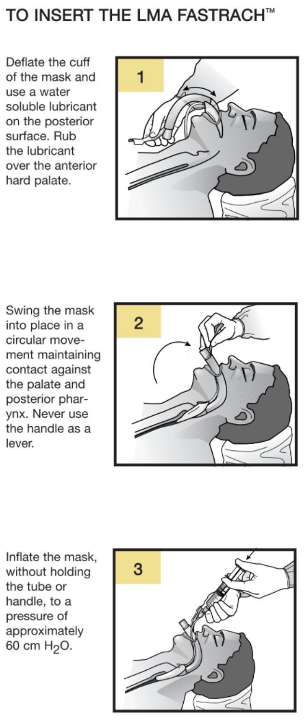
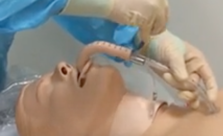
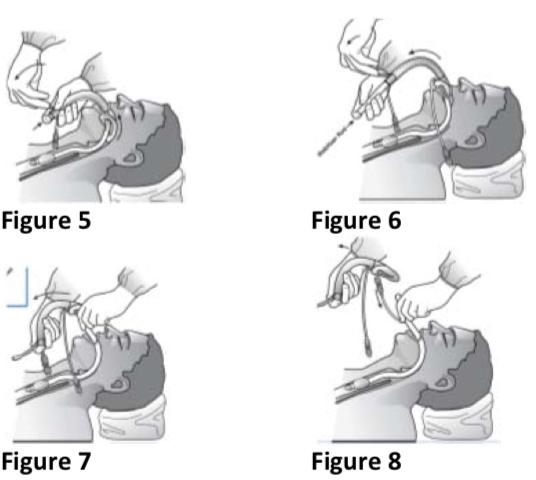

LMA Fast Trach Insertion and Removal    body {font-family: 'Open Sans', sans-serif;}

### LMA Fastrach Insertion and Removal

**Before using:  
1\.** Check the cuff seal and deflate the ETT cuff completely before inserting ETT into the airway tube of LMA FastrachTM.  
**2\.** Pass the ETT into the airway tube of LMA FastrachTM and distribute the lubricant within the shaft by moving the ETT up and down until it travels freely through the entire airway tube.  
**Warning:** Avoid rapid up and down movements with the ETT, which could damage the cuff.

****

****

**Insertion of Fastrach:  
Warning:** Do not use force under any circumstances  
**1\.** Anaesthesia must be deep enough or with adequate pharyngeal topicalization to permit insertion.  
**2\.** Position the head in a neutral position, with a pillow under the head.  
Do not extend the head.  
**3\.** Hold the LMA Fastrach by its handle, approximately parallel to the patient’s chest.  
Position the mask tip against the hard palate and slide the tip briefly back and forth to distribute the lubricant and prevent folding of the tip before sliding the mask further backward following the curve of the rigid airway tube.  
Do not use the device handle as a lever to force the mouth open.  
**4\.** Advance (without rotation) the curved airway tube until the straight part of the airway tube is in contact with the chin.  
Rotate the mask into place in a circular movement, ensuring pressure is maintained against the soft palate and posterior pharynx.  
**Warning:** Never use the handle to lever upwards during insertion, as this will cause the mask to press into the tongue, making insertion more difficult.  
**5\.** After insertion, check the tube emerging from the mouth is parallel to the plane of the inner surface of the upper incisors.  
**6\.** Inflate the cuff to a pressure of approximately 60 cmH20, not exceeding the maximum inflation volume.**  
  
Intubation through the Fastrach LMA:**  
Position the longitudinal line of the ETT to face the handle of the LMA Fastrach.  
Gently insert the ETT into the device airway tube.  
Grip the handle firmly and lift the device using the handle as needed to draw the larynx forward by a few millimeters to increase seal pressure and optimize the alignment of the trachea and ETT axes.  
  
The ETT should only pass up to the 15 cm transverse depth marker.  
Ensure that the tip of the ETT does not enter the mask aperture.  
**Warning:** NEVER OVER INFLATE THE CUFF.  
  
**Removal of the Fastrach LMA after ETT intubation:  
Warning:** There are reports of pharyngeal edema and increased mucosal pressure attributed to the rigidity of the airway tube.  
\- It is recommended to remove LMA Fastrach once intubation has been accomplished.  
\- High pressures may develop against the pharyngeal wall if the head or neck is moved from the neutral position due to the rigidity of the curved airway tube.  
\- The risk of maintaining the LMA Fastrach in place must be weighed against the potential risks associated with the maneuver of removal of the device.  
  
**Warning:** If the LMA Fastrach is retained in the patient after intubation, the cuff should be deflated to 20‐30 cm H20 pressure.  
\- This low cuff pressure stabilizes the airway in the pharynx.  
\- Avoid unnecessary movement of the device and maintain the head or neck in a neutral position.  
  
**Warning:** Displacement of the LMA Fastrach ETT (esophageal intubation, accidental extubation) may occur if the LMA Fastrach removal procedure is not performed correctly.  
\- A correctly deflated LMA Fastrach should be reinserted without delay to ensure patient oxygenation.  
  
**Removing the Fastrach:**  
When removing the Fastrach, you want to avoid also removing the ETT.  
  
Below: The Stabilizer Rod is inserted just enough until it touches the proximal end of the ETT tube.

****

The Fastrach is removed as the stabilizer Rod PREVENTS the ETT from sliding out with it.

****

****

**REMOVAL OF THE LMA FASTRACH ETT:**  
Clinical judgment should be used to determine how long LMA Fastrach ETT is to remain in the patient.  
Immediately prior to extubation or repositioning of the LMA Fastrach ETT, completely deflate the cuff using a syringe.  
Extubate using currently accepted medical techniques.  

INSTRUCTIONS FOR USE – LMA FastrachTM  
Teleflex (accessed 02/2024)  
https://tinyurl.com/ms3dzw65  
  
LMA Fastrach Insertion Technique  
Accessed 02/2024  
Yumpo.com.  
https://tinyurl.com/muewjm9d