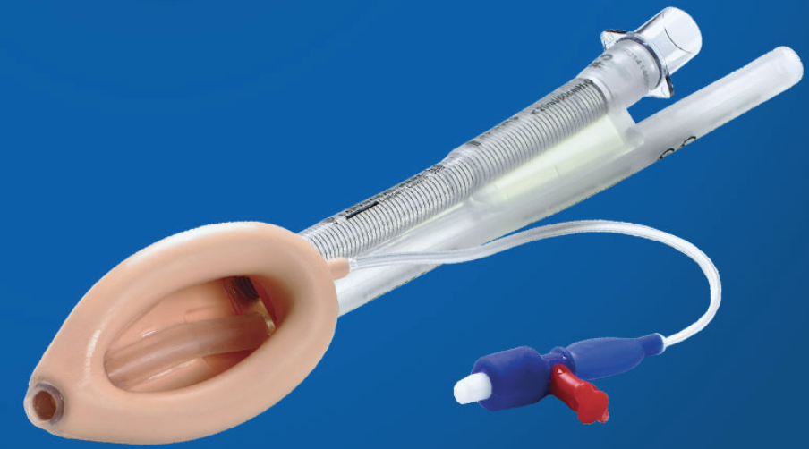

LMA Proseal    body {font-family: 'Open Sans', sans-serif;}

### LMA Proseal

**Brand:** LMA Proseal  
**Manufacturer:** Teleflex  
  
\- Second-generation LMA device  
\- Dual seal  
\- Versatile reusable LMA® Airway  
\- Double cuff design enables seal pressures of up to 32 cm H2O.  
\- Integrated drain tube reduces the risk of aspiration by enabling the regurgitated fluid to pass up the drainage tube without leaking into the glottis.

****

  

Aspiration prevented by the ProSealTM laryngeal mask airway: a case report  
Canadian Journal of Anesthesia 2002; 49: 413-416.  
Niall R. Evans MBCHB DA(SA), Richard L. Llewellyn MBCHB FCA(SA), Susan V. Gardner MB CHB FCA(SA), Michael F.M. James FRCA FCA(SA)  
  
Teleflex LMA  
https://www.lmaco.com/products/lma-proseal/references