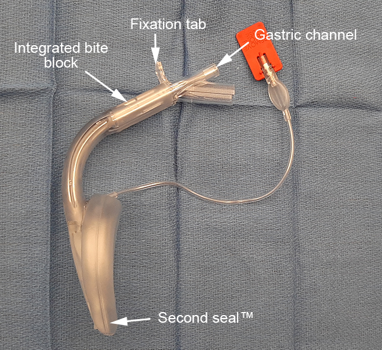

LMA Supreme    body {font-family: 'Open Sans', sans-serif;}

### LMA Supreme®

The LMA Supreme is a **second-generation supraglottic airway that** was introduced in 2007.  
It has a “Second Seal” near the tip.  
It has a gastric port for gastric tube insertion.  
The importance of the Second Seal (esophageal seal) is significant as it can minimize gastric insufflation and reduce the risk of aspiration.

****

It is a single-use, second-generation, gastric access device that forms an effective First Seal™ with the oropharynx (oropharyngeal seal) and an innovative Second Seal™ with the upper esophageal sphincter (the esophageal seal).  
  
**Material:** Polyvinyl chloride  
  
**Supreme LMA features include:**  
**Integrated bite block  
The cuff** **is tapered** proximal to distal.  
**Gastric channel** **for gastric tube insertion**  
**Elliptical rigid tube part** which prevents rotation and twisting  
**Fixation tab** at the proximal end to help with positioning  
**The anatomical bend of the tube part** aids insertion.  
**  
Advantages of LMA Supreme:  
**A disposable version of the **Proseal LMA.  
  
Disadvantages of LMA Supreme:  
**Bulky  
Folding the mask can obstruct the gastric port.  

The Laryngeal Mask Airway: Expanding Use Beyond Routine Spontaneous Ventilation for SurgeryAPSF Newsletter Volume 36, No. 3, October 2021   
_Shauna Schwartz, DO; Yong G. Peng, MD, PhD, FASE, FASA_  
https://tinyurl.com/yscy5r53  
Supraglottic devices (including laryngeal mask airways) for airway management for anesthesia in adults  
UpToDate (accessed 01/2024)  
D John Doyle, MD, PhD and Carin A Hagberg, MD, FASA  
https://tinyurl.com/4d6fmfnv