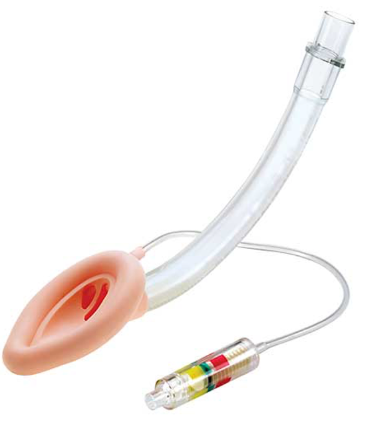
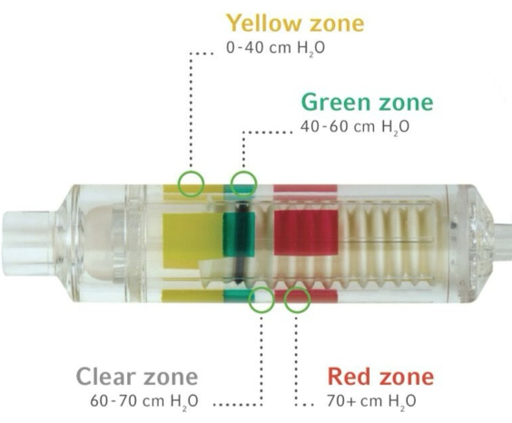

LMA Unique    body {font-family: 'Open Sans', sans-serif;}

### LMA Unique

A supraglottic airway.A first-generation LMA (no gastric port) by Teleflex.  
It can be single-use or reusable.  
The newer LMA Unique has integrated cuff pressure monitoring and a silicone cuff.  
Though not recommended, some anesthesia providers will remove the aperture bars with scissors for bronchoscopies so a bronchoscope can pass through it distally.

****

****

  

Teleflex.com  
Accessed 2/2024  
https://tinyurl.com/27p9p56v