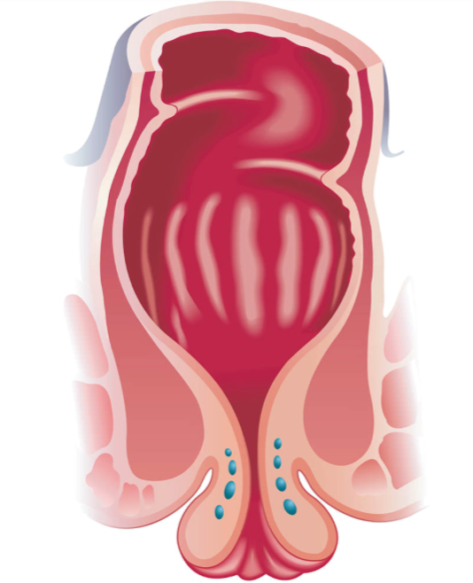

  Laparoscopic or Robotic Rectopexy section { margin-bottom: 20px; } h3, p { margin: 0px; padding: 0px; } img { width: 200px; height: auto; }

### Laparoscopic or Robotic Rectopexy

A rectopexy is a surgical procedure that repairs rectal prolapse, a condition where the rectum slips into the anus.

The surgeon will carefully free the rectum from its surrounding support structures and lift it into the proper position.

In most cases, stitches and mesh will be used to secure the rectum.

**Rectal prolapse:** A protrusion of the rectum through the anus, often caused by a weakness or total loss of the normal support structures of the rectum.

**Possible presentations:** Bleeding, acute pain, mucus drainage, and fecal incontinence.

**Anesthesia:** General/ETT

**TAP block:** optional

**Position:** Trendelenburg and Lithotomy.

Lithotomy is needed to manipulate the rectum to push in and out to place the mesh and suture it in place.

The patient’s arms will be tightly tucked with minimal access once the patient is positioned and secured.

**Due to minimal access to the patient’s arms, anesthesia providers often do the following:**

2 IVs (in case one fails)

2 BP cuffs (one on each arm) in case one fails.

**Eye and facial protection:** Yes, goggles and a foam cradle over the face

**Foley catheter:** Yes, Bladder needs to be decompressed

**Duration:** 1-2 hours

**EBL:** Minimal

**Prolonged procedures may result in temporary conjunctival swelling via gravity.**

Inform the PACU nurses of possible corneal abrasions caused by the increased urge of patients to scratch their eyes for conjunctival irritation.

**Possible complications:**

Postoperative constipation

Mesh failure and/or reoccurrence

Mesh erosion-later

Mechanical ileus

Bowel obstruction

Wound infection

Bleed

**Extra notes:**

**The most common presentation of rectal prolapse is:**

A large prolapsing rectal mass from the anus

Defecation with walking

**Less common presenting symptoms of rectal prolapse include:**

Soiling of the undergarments

Mucus discharge

The feeling of incomplete evacuation

Constipation

Fecal urgency

Change in bowel habits

Poor anal control

There are numerous rectal prolapse procedures categorized into trans-abdominal and perineal approaches.

The perineal approach has a higher reoccurrence rate.

Trans-abdominal operations can be performed with open, laparoscopic, and robotic techniques.

Robot-assisted or conventional laparoscoic rectopexy for rectal prolapse? Systematic review and meta-analysis

International Journal of Surgery; 2014:12 Suppl 2:S153-S159

F Rondelli, W Bugiantelli, F Villa , A Sanguinetti , M Boni , E Mariani , N Avenia

  

Ninety‐day morbidity of robot‐assisted redo surgery for recurrent rectal prolapse, mesh erosion and pelvic pain: lessons learned from 9 years’ experience in a tertiary referral centre

Colorectal Disease; 2021 Nov 16;23(12):3205–3212

Emma M van der Schans, Paul M Verheijen, Ivo A M J Broeders, Esther C J Consten

  

Surgical management of rectal prolapse: The role of robotic surgery.

World Journal of Surgical Procedures 2015; 5(1): 99-105

Moghadamyeghaneh Z, Hanna MH, Hwang G, Carmichael JC, Mills SD, Pigazzi A, Stamos MJ.