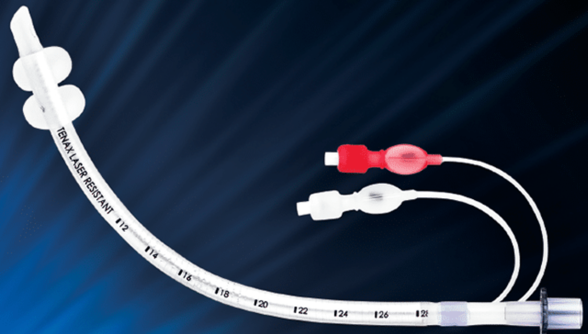
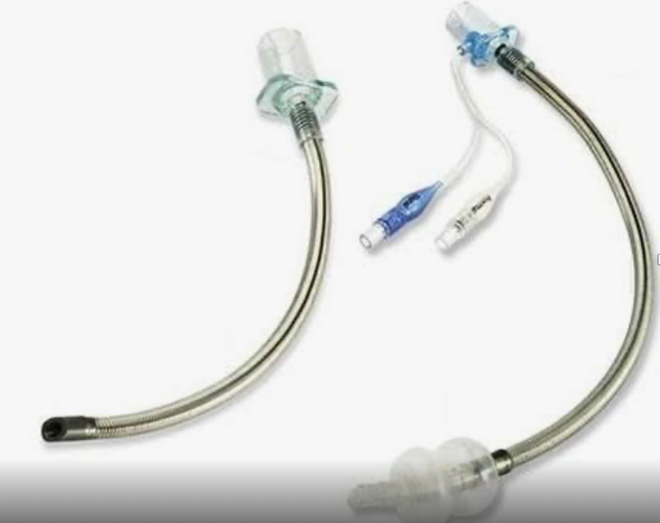

  Laser Endotracheal Tubes section { margin-bottom: 20px; } h3, p { margin: 0px; padding: 0px; } img { width: 200px; height: auto; }

### Laser Endotracheal Tubes

Also known as Laser-resistant tubes.

  

Laser surgery of the airway, oral cavity, and oropharynx remains one of the highest risks for surgical fire formation, as the laser is a potent ignition source.

  

Laser-resistant tubes have provided a risk reduction for laser fires by utilizing a metal composition or metal wrapping and the use of double-cuffed tubes.

 

**Some Laser tubes have double cuffs.**

Double cuffs enable a second distal protective cuff to stay inflated and in place if the conditions require it.

A proximal cuff is inadvertently violated, reducing the risk of ignition of a distal column of oxygen in the trachea below the tip of the endotracheal tube.

**Laser tubes are made of silicon.**

The standard PVC ETT is much more flammable than silicon.

Endotubes made of PVC are not recommended for use in the presence of any oxidizer and laser ignition source.

Previous testing of PVC ETTs confirmed easy laser penetration within 1 second, while penetration of silicon material takes at least 5 seconds.

Cuffs made of silicone decrease the likelihood of ignition from an inadvertent hit from the laser.

PVC ignites at less than 149 C, while silicone rubber ignition temperatures are over 315 C.

**Metal-reinforced silicon ETTs:**

Silicon ETTs are much more collapsible than PVC ETTs and can obstruct.

These ETTs are reinforced with metal to prevent from collapsing

**Some Laser ETTs are wrapped with aluminum.**

The metal wrapping prevents any gap through which a laser could penetrate the tube regardless of any angle, bending or twisting of the tube.

The thickness of the aluminum metal wrap is 0.001 cm.

**Sometimes, dye (methylene blue) is used to fill the ETT cuff (rather than air).**

Methylene blue (mixed with normal saline), is injected through the pilot balloon line to fill the cuff (rather than air).

This will alert the surgeon if the balloon is accidentally punctured.

  

The American Society of Anesthesiologists recommends using laser-resistant ETTs as the standard airway during laser surgery of the respiratory tract.

**Airway Fire Notes:**

Surgical fires, particularly within Otolaryngology, remain a surprisingly frequent and devastating complication of laser-related surgery in the oropharynx and airway.

  

Initially, fires are located on the surface of ETT and cause thermal injury to tissues.

If the fire burns through to the interior of ETT, O2, and positive pressure ventilation create a blow torch effect, blowing heat and toxic products down into the lungs.

Cuff puncture allowing O2 enriched atmosphere can also increase chance of fire after laser burst.

Development of an Improved LASER-Resistant Endotracheal Tube

The Laryngoscope 2024

The American Laryngological, Rhinological and Otological Society, Inc.

Soham Roy, MD, MMM, FACS, FAAP