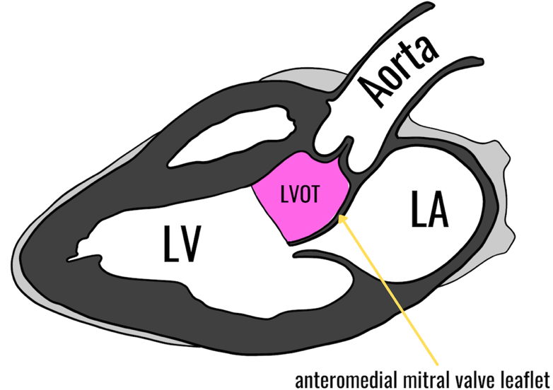

Left Ventricular Outflow Tract Obstruction Cheat Sheet    body {font-family: 'Open Sans', sans-serif;}

### Left Ventricular Outflow Tract Obstruction Cheat Sheet

For more details, refer to _“Left Ventricular Outflow Obstruction (LVOTO) with Hypertrophic Cardiomyopathy”_ in the Vargo Anesthesia Coexisting Diseases and Surgery App  
The LVOT is the open space between the intraventricular septum and the anterior cusp of the mitral valve, just below the aortic valve. 

****

**Mitral valve leaflets:** (or "cusps"),  
Anteromedial leaflet (also called anterior leaflet)  
Posterolateral leaflet**Causes of ↑ LVOTO:** ↓ Preload or   
↓ Afterload   
↑ Contractility    
**Factors that INCREASE LVOTO**  **(avoid):** table.tableizer-table { font-size: 12px; border: 1px solid #CCC; font-family: Arial, Helvetica, sans-serif; } .tableizer-table td { padding: 4px; margin: 3px; border: 1px solid #CCC; } .tableizer-table th { background-color: #104E8B; color: #FFF; font-weight: bold; }

|  |  |
| --- | --- |
| Increased myocardial contraction | Inotropes  
Beta adrenergic stimulation-catecholamines  
Digitalis  
Ephedrine |
| Decreased preload | Hypovolemia  
Vasodilators  
Tachycardia  
Positive pressure ventilation |
| Decreased afterload | Hypotension  
Vasodilators |
| Other factors | Isoproterenol (Isuprel®)  
Valsalva maneuver  
Abrupt standing |

**Factors that DECREASE LVOTO**  **(goal):** table.tableizer-table { font-size: 12px; border: 1px solid #CCC; font-family: Arial, Helvetica, sans-serif; } .tableizer-table td { padding: 4px; margin: 3px; border: 1px solid #CCC; } .tableizer-table th { background-color: #104E8B; color: #FFF; font-weight: bold; }

|  |  |
| --- | --- |
| Decreased myocardial contraction | Beta blockers  
Calcium-channel blockers  
Volatile anesthetics |
| Increased preload | Hypervolemia  
Bradycardia |
| Increased afterload | Hypertension  
Alpha-adrenergic stimulation as with phenylephrine |
| Other factors | Hand grip |

  
**Notes:**  
**↓ Preload, ↑ LVOTO:   
The degree of obstruction depends on preload.**   
An under-filled LV causes less separation between the anterior mitral valve leaflet and interventricular septum, resulting in a greater degree of obstruction since the LVOT orifice is already narrowed before the onset of systole.   
  
**↓ Afterload, ↑ LVOTO:** \- A decrease in afterload (resistance) to the LV permits an increase in SV and a decrease in ESV.   
\- The less ESV, the less separation between the hypertrophied septum and mitral valve. \- It will be more likely to cause contact with the septum and mitral leaflets resulting in LVOTO during systole.   
**↑Contractility, ↑ LVOTO, ↓ CO**   
\- A vigorous contraction will be  **↑SV and ↓ ESV.** \- The less ESV, the less separation between the hypertrophied septum and mitral valve. \- It will more likely cause contact with the septum and mitral leaflets and result in LVOTO with systole.   
\- Cardiac inotropes and stress should be avoided.  
  
**HCM vs HOCM:**   
\- When hypertrophic cardiomyopathy is diagnosed, the biggest concern is whether it is an obstructive type (HCOM) involving the LVOT or the unobstructed type (HCM).   
\- LVOTO is more common with HOCM and more severe than HCM.   
\- However, LVOTO with HCM may still occur from a provocative maneuver.   
  
**HCM can be classified as Obstructive (HOCM) or Nonobstructive (HCM)   
\- Nonobstructive:**  Peak pressure gradients across the LVOT < 30 mm Hg.   
**\- Obstructive:**  Peak pressure gradients across the LVOT > 30 mm Hg.   
**\- Latent exercise-induced:**  Peak pressure gradients across the LVOT > 30 mm Hg.   
  
**Associated abbreviations:  
ESV:** End-systolic volume  
**HCM:**  Hypertrophic cardiomyopathy   
**HOCM:**  Hypertrophic obstructive cardiomyopathy (has an LVOTO)   
**HOCM**  is often pronounced as “Hocum” by many medical professionals   
**LVOT:**  Left ventricular outflow tract   
**LVOTO:**  Left ventricular outflow tract obstruction   
**SAM:**  Systolic anterior movement   
SAM refers to the systolic anterior movement of the anterior mitral valve against the interventricular septum obstructing the LVOT.   
**SCD:**  Sudden cardiac death   
  

Hypertrophic Cardiomyopathy; Genetics, Pathogenesis, Clinical Manifestations, Diagnosis, and Therapy  
Circulation Research Vol. 121, 2017  
Ali Jane Marian and Eugene Braunwald  
  
Hypertrophic Cardiomyopathy  
Life in the Fastlane (accessed 02/2022)  
https://litfl.com/hypertrophic-cardiomyopathy/  
  
An integrated mechanism for systolic anterior motion of the mitral valve in hypertrophic cardiomyopathy based on echocardiographic observations  
American Heart Journal 1987 Mar;113(3):633-44.  
L Jiang, R A Levine, M E King, A E Weyman  
  
Hypertrophic Cariomyopathy  
AMBOSS (accessed 02/2022)  
https://next.amboss.com/us/article/qr0CRh?q=hypertrophic+cardiomyopathy  
  
Hypertrophic Obstructive Cardiomyopathy  
StatPearls (accessed 02/2022)  
Marc A. Raj; Sagar Ranka; Amandeep Goyal.  
https://www.ncbi.nlm.nih.gov/books/NBK430820/  
  
Cardiomyopathies - CRASH! Medical Review Series  
Patreon.com (accessed 02/2022)  
Dr. Bolin, MB  
https://www.youtube.com/watch?v=eQ5BBBpMeo8  
  
Hypertrophic Cardiomyopathy: Advanced Treatment Options  
Yale Cardiovascular Medicine Grand Rounds (accessed 02/2022)  
Daniel L. Jacoby, MD, Arnar Geirsson, MD, and Rachel Lampert, MD  
https://www.youtube.com/watch?v=ySnFQeOaR94  
  
Hypertrophic Cardiomyopathy  
NinjaNerd (accessed 02/2022)  
https://www.youtube.com/watch?v=uOjPp4LIxVU  
  
Hypertrophic Cardiomyopathy  
The 5-Minute Clinical Consult 26 th ed. 2018; pp.152-34  
F. Domino, R. Baldor, J. Golding and M Stephens  
  
Cleveland Clinic Center of Education  
Hypertrophic Cardiomyopathy; April, 2014  
Parag R. Patel, MD and Harry Lever, MD  
  
Stoelting’s Anesthesia and Coexisting Disease 7 th ed. 2018; pp. 215-217  
  
Nurse Anesthesia 6th Ed. 2018 ; pp. 505-507  
J. Nagelhout and S. Elisha  
  
Hypertrophic Cardiomyopathy  
Hypertrophic Cardiomyopathy Association (Accessed 02/2022)  
https://4hcm.org  
2014 ESC Guidelines on diagnosis and management of hypertrophic cardiomyopathy: The Task Force for the Diagnosis and Management of Hypertrophic Cardiomyopathy of the European Society of Cardiology (ESC)  
_European Heart Journal_ , Volume 35, Issue 39, 14 October 2014, Pages 2733–2779  
Perry M. Elliott, Aris Anastasakis, Michael A. Borger, Martin Borggrefe, Franco Cecchi, Philippe Charron, Albert Alain Hagege, Antoine Lafont, Giuseppe Limongelli et al.  
  
The outcome of patients with hypertrophic cardiomyopathy and a normal electrocardiogram.  
Journal of American College of Cardiology 2009;54:229–33.  
McLeod CJ, Ackerman MJ, Nishimura RA, et al  
  
Spectrum and prognostic significance of arrhythmias on ambulatory Holter electrocardiogram in hypertrophic cardiomyopathy.  
Journal of American College of Cardiology 2005;45:697–704.  
Adabag AS, Casey SA, Kuskowski MA, et al.  
  
Syncope and risk of sudden death in hypertrophic cardiomyopathy.  
Circulation 2009;119:1703–10.  
Spirito P, Autore C, Rapezzi C, et al.  
  
Prognostic significance of left atrial size in patients with hypertrophic cardiomyopathy (from the Italian Registry for Hypertrophic Cardiomyopathy).  
Amercan Journal of Cardioliology 2006;98:960–5.  
Nistri S, Olivotto I, Betocchi S, et al.  
  
Risk assessment in hypertrophic cardiomyopathy: current guidelines hampered by insufficient evidence.  
Heart 2013;99:511–3.  
McKeown PP, Muir AR.  
  
The long-term survival and the risks and benefits of implantable cardioverter-defibrillators in patients with hypertrophic cardiomyopathy.  
Heart 2012;98:116–25.  
O’Mahony C, Lambiase PD, Quarta G, et al.  
  
Exercise-induced ventricular arrhythmias and risk of sudden cardiac death in patients with hypertrophic cardiomyopathy.  
European Heart Journal 2009;30:2599–605.  
Gimeno JR, Tomé-Esteban M, Lofiego C, et al.  
  
Journal of American Society of Echocardiography, 2011;24:473-98.  
The American Society of Echocardiography Clinical Recommendations for Multimodality Cardiovascular Imaging of Patients with Hypertrophic Cardiomyopathy.  
Endorsed by the American Society of Nuclear Cardiology, Society for Cardiovascular Magnetic Resonance, and Society of Cardiovascular  
  
Computed Tomography  
Journal of the American Society of Echocardiography 2018 Apr;31(4):381-404.  
Sherif F Nagueh, S Michelle Bierig, Matthew J Budoff, Milind Desai, Vasken Dilsizian, Benjamin Eidem, Steven A Goldstein, Judy  
Hung, Martin S Maron, Steve R Ommen, Anna Woo  
  
On systolic murmurs and cardiovascular physiological maneuvers  
Advances in Physiology Education (accessed 02/2022)  
Sergio A. Salazar, Jose L. Borrero, and David M. Harris  
https://journals.physiology.org/doi/full/10.1152/advan.00128.2011  
  
Understanding Hypertrophic Cardiomyopathy (HCM) Webinar - Part 1  
John Hopkins Medicine (accessed 02/2022)  
https://www.youtube.com/watch?v=BmhDPDCxn3A  
  
Patient education: Hypertrophic cardiomyopathy (Beyond the Basics)  
UpToDate (accessed 02/2022)  
Martin S Maron, MD