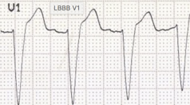
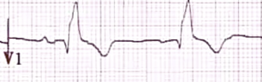

Left vs Right Bundle Branch Block Cheat Sheet    body {font-family: 'Open Sans', sans-serif;}

### Left vs Right Bundle Branch Block Cheat Sheet

****

  
**LBBB  
**Widened QRS complex (> 120 ms) in lead V1 is deflecting DOWNWARD.” (see below)

****  
Typical appearance of LBBB in V1 with rS complex (tiny R wave, deep S wave) and appropriate discordance (ST elevation and upright T wave).

  
**RBBB  
**In V1, widened QRS complex is deflecting “UPWARD.” (see below)

****