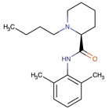

Levobupivacaine    body {font-family: 'Open Sans', sans-serif;}

### Levobupivacaine

**Levobupivacaine (Chirocaine, Levo) -** _not approved in the US_  
**Amide** \-type local anesthetic  
**pKa:** 8.1  
**Nonionized:** 17% at pH 7.4 (83% ionized)  
  
S-enantiomer of bupivacaine  
Considered a safer alternative for regional anesthesia than its racemic parent bupivacaine.  
  
Reports of toxicity with levobupivacaine are scarce and occasional toxic symptoms are usually reversible with minimal treatment with no fatal outcome.  
  
Mnemonics for distinguishing a local anesthetic as an amide.  
Two “I”s in the drug name. (“I” before “caine”)  
Presence of the NH group next to the aromatic ring.  
  
**Epi and levobupivacaine**  
Epinephrine has no/little effect on duration or systemic absorption.Causes less myocardia depression than bupivacaine and ropivacaine.Compared to bupivacaine, it has less vasodilation and has a longer duration of action.  
  
**Protein binding:** 97%|  
**Half-life:** 3.3 hours  
**Metabolized:** liver and kidneys  
Extensively metabolized with no unchanged levobupivacaine detected in urine or feces.  
  
**In vitro:** studies using levobupivacaine showed that CYP3A4 isoform and CYP1A2 isoform mediate the metabolism of levobupivacaine to desbutyl levobupivacaine and 3-hydroxy levobupivacaine, respectively.  
  
**In vivo:** the 3-hydroxy levobupivacaine appears to undergo further transformation to glucuronide and sulfate conjugates. Metabolic inversion of levobupivacaine to R(+)-bupivacaine was not evident either in vitro or in vivo.  
  
**Elimination:** 95% being recovered in urine and feces in 48 hours. Of this 95%, about 71% was in urine while 24% was in feces  
  
**Contraindications of levobupivacaine and other “amide” local anesthetics:  
**Patient allergic to amide local anesthetics  
Patients taking antidepressants  
Liver failure - Levobupivacaine is an amide. Amide local anesthetics are metabolized by liver microsomal enzymes in the liver (cytochrome P450), through N-dealkylation & subsequent hydrolysis, and excreted in the urine.  
  
Patients taking MAO inhibitors-possible fatal drug interactions.  
  
**MAO Inhibitors:  
**Isocarboxazid  
Linezolid  
Methylene Blue  
Moclobemide  
Phenelzine  
Procarbazine  
Rasagiline  
Selegiline  
Tranylcypromine  
  
**Levobupivacaine** **is an amide, NOT an ester.** Amides are NOT broken down to PABA and rarely cause an allergic reaction. Thus, PABA allergy is not relevant in the use of levobupivacaine.  

****

  
**Origin of levobupivacaine**  
After the cardiovascular toxic effects after regional anesthesia with bupivacaine in the late 1970s, research was emphasized the modify the drug, so a levo-or S enantiomer was created and appeared to be safer.  
  
Selective behavior exhibited by the two enantiomers of racemic bupivacaine, ie, levo- or S (−)-bupivacaine and dextro- or R (+)-bupivacaine once in contact with biological receptors in the body. Levo-enatiomer appeared to have a safer pharmacological profile than its dextro-counterpart. Efforts were intensified to synthesize a pure S (−)-bupivacaine enantiomer, and Chirocaine (the proprietary name of levobupivacaine where it is available) was developed. The “Chiro” in the name refers to the chirality of the molecule.  

Drugbank.ca  
https://www.drugbank.ca/drugs/DB01002  
  
**Update on local anesthetics: focus on levobupivacaine  
**https://www.ncbi.nlm.nih.gov/pmc/journals/370/Crina L Burlacu and Donal J Buggy