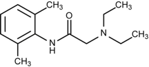

Lidocaine    body {font-family: 'Open Sans', sans-serif;}

### Lidocaine

**Lidocaine (Xylocaine)**  
**_Class:_** _Amide-type local anesthetic, intermediate._ _acting_  
**pKa:** 7.9  
**Nonionized:** 24% at pH 7.4 (76% ionized)  
**Relative Potency (CNS toxicity):** 1 out of 4  
  
The standard local anesthetic used as a reference. Very versatile and can be administered in many routes.  
Subarachnoid transient neurologic symptoms (TNS) have been reported with higher concentrations, limiting its use spinals for subarachnoid administration._  
  
NOTE: Recent literature has reported cases of TNS with concentrations as low as 2% after subarachnoid administration._  
  
A 5% lidocaine patch has recently been FDA approved for chronic back pain.  
  
**Most common use:**  
IV administration just prior to propofol during induction to attenuate sympathetic response to direct laryngoscopy or intubation.  
  
Not commonly used for initiation or maintenance of epidural labor analgesia due to its shorter duration compared to ropivacaine and bupivacaine.  
  
**Lidocaine**

table.tableizer-table { font-size: 12px; border: 1px solid #CCC; font-family: Arial, Helvetica, sans-serif; } .tableizer-table td { padding: 4px; margin: 3px; border: 1px solid #CCC; } .tableizer-table th { background-color: #104E8B; color: #FFF; font-weight: bold; }

| Route | Conc | Onset | Duration | Max Doses |
| --- | --- | --- | --- | --- |
| Antiarrhythmic | 1-2% | Fast |  | 3mg/kg/hour |
| Infiltration | 0.5-1% | Fast | 1-4 hours | Plain: 4-5 mg/kg, never more than 300 mg with epi: 7 mg/kg, never more than 500 mg |
| Epidural | 1-2% | Fast | 1-2 hours | 300 mg, 500 mg with epi |
| Spinal | 1.5-2.5% | Fast | 0.5-1 hour | 100 mg (5% concentration no longer recommended due to risk of TNS). |
| Caudal | 1.5-2% | Fast | 1-2 hours | 600 mg with epi |
| Peripheral Block | 1-1.5% | Fast | 1-3 hours | 300 mg, 500 mg with epi |
| IV Regional | 0.25-0.5% 0.5% = (Bier) | Fast | 0.5-1 hour | 3mg/kg, never more than 300 mg |
| Topical Spray | 4% | Fast | 0.5-1 hour | 400 mg (10 mLs) |
| Viscous Oral | 2% | Fast | 30 minutes | 15 milliliters per dose and no more than 8 doses in 24 hours. May impair swallowing. Instruct patient not to ingest for 60 minutes |
| Jelly or Ointment | 2% Jelly or 5% Ointment | Fast | Short | No more than 600 mg or 30 mL of lidocaine 2% jelly should be given in any 12-hour period |

Pocket Anesthesia ; 3 rd ed. 2017. Pp 2D-22. R. Urman, J. EhrenfeldNYSORA; 2013-Caudal Anesthesia, Kenneth D. Candido, MD and Alon Winnie, MD  
Drugs.com; https://www.drugs.com/pro/lidocaine-jelly.html**  
  
Common Adult Lidocaine Doses**

table.tableizer-table { font-size: 12px; border: 1px solid #CCC; font-family: Arial, Helvetica, sans-serif; } .tableizer-table td { padding: 4px; margin: 3px; border: 1px solid #CCC; } .tableizer-table th { background-color: #104E8B; color: #FFF; font-weight: bold; }

| Procedure | Conc | Doses |
| --- | --- | --- |
| Antiarrhythmic | 1-2% | 1mg/kg followed by 0.5mg/kg  
every 2 to 5 minutes |
| Infiltration | 0.5-2% | 0.5-5 mg/kg |
| Peripheral  
Nerve Block | 0.5-2% | 0.5-5 mg/kg |
| Epidural | 1%-2% | 4.5mg/kg,  
20-30 mL (200-300 mg) |
| Spinal | 2.5% | 1.5 mg/kg (5% concentration no longer recommended)  
due to risk of TNS).  
(See NOTE above.) |
| Caudal | 1.5-2% | 4.5mg/kg,  
20-30 ml (200-300 mg) |
| Transtracheal | 4% | 80-120 mg  
(2-3 ml) |
| Sup. Laryngeal  
Nerve | 4% | 40-60 mg  
(2-3 ml each side) |
| Stellate  
Ganglion | 1% | 50 mg (5 mls) |
| Bier Block | 0.5% | 250 mg (40-50 ml) |
| Infusion | 0.4% | 1-4 mg/minute  
(2,000 mg in 500mL 0.9% sodium chloride |

_Nurse Anesthesia_ _;_ 5 th ed; 2014. Pp 659. J. Nagelhout, Sass Elisha, Karen Plaus**Cardiac dose for ventricular arrhythmias:** 1-1.5mg/kg  
**Infusion:** 1-4 mg/min  
**Peripheral nerve block:** 4mg/kg, 7mg/kg with epinephrine  
**Epidural dose:** 4mg/kg  
**Spinal: 1.5mg/kg****Bier Block:** 200mg in 10-40ml (0.5%, 1% or 2%)  
  
**Onset/duration**  
**IV:** 1 min  
**Peripheral nerve block:** 5 minutes/1-3 hours  
**Epidural:** 5 minutes/1-2 hours  
**Spinal:** <5 minutes/ 30-60 minutes  

****

  
**Mechanism of action:** Like other local anesthetics, it binds to the intracellular portion of sodium channels and blocks sodium influx into nerve cells, which prevents depolarization.  
  
**Lidocaine is presently used in OB regional for the following reasons:**  
Testing epidural catheters for appropriate placement  
Rapid establishment of anesthesia using an epidural catheter that had been used during labor for a failed vaginal delivery converted to C-section **Common epidural test dose:** 3 mL of 1.5% lidocaine (45mg) with 15mcg of 1:200,000  
epinephrine.  
  
**Common C-section epidural dose:** 15-20 ml of 2% plain lidocaine.  
  
**Lidocaine and epidurals:**

table.tableizer-table { font-size: 12px; border: 1px solid #CCC; font-family: Arial, Helvetica, sans-serif; } .tableizer-table td { padding: 4px; margin: 3px; border: 1px solid #CCC; } .tableizer-table th { background-color: #104E8B; color: #FFF; font-weight: bold; }

| Agent | Conc. | Onset | Sensory Block | Motor Block | Plain Solution | 1:200,000  
Epi |
| --- | --- | --- | --- | --- | --- | --- |
| Lidocaine | 1.5 % | Intermediate  
15 mins | Dense | Mild | 80-120 mins | 120-180  
mins |
| Lidocaine | 2.0 % | Same | Dense | Dense |   |  |

_For epidural anesthesia, epinephrine is not commonly added; incremental redosing is preferred._  
  
5% lidocaine concentrations are no longer recommended due to risk of TNS. Less concentrated solutions have been used in hopes of reducing the incidence of TNS. _NOTE: Recent literature has reported cases of TNS after subarachnoid administration of concentrations as low as 2%._  
  
Two properties distinguish amides from of esters.  
Two “I” s in the generic name.  
The “NH” next to the aromatic ring on the left = characterizes an amide.  
  
Despite 3% 2-chloroprocaine being the fastest acting local anesthetic mentioned in textbooks for urgent C-sections, epidural lidocaine is still more commonly administered for urgent C-sections.  
  
**Protein Bound:** Predominantly bound to alpha 1 \-acid glycoprotein (AAG) in plasma.  
  
Teratogenic: None  
  
**Metabolized (hepatic)-in liver  
  
Metabolized by hepatic P450, CYP3A4/5** **to 2 active compounds:**  
Monoethyglycine Xylidide  
Glycinexylidide Xylidide  
  
1st pass lung (lipophilic drugs taken quickly into lungs which are the first vascular bed after the heart).  
  
**Elimination:** Around 75% of the xylidide is excreted in the urine as the further metabolite 4-hydroxy-2, 6-dimethylaniline.  
  
**Excretion:** Approximately 90% is excreted in the form of various metabolites, and less than 10% is excreted unchanged.  
  
**Elimination half-life IV bolus:** 1.5-2 hours.  
Except for intravascular administration, the highest blood levels are obtained following intercostal nerve block and the lowest is after subcutaneous administration.  
  
**Predominantly bound to alpha 1 acid glycoprotein (AAG) in plasma**  
Pregnancy tends to decrease concentration of AAG, so the free plasma fraction of lidocaine is higher in term pregnant women  
  
**Spinal doses for epidurals  
**Lidocaine is NOT administered for spinals for C-sections in OB. Higher concentrations would be needed, and that imposes a risk of transient neurological symptoms (TNS).  
**Onset:** 3-5 minutes  
**Duration:** 60-75 minutes  
0.75% bupivacaine is commonly administered for pinal for C-sections.  
  
**Contraindications of lidocaine and other “amide” local anesthetics:**  
Patient allergy to amide local anesthetics  
Patients taking antidepressants  
Liver failure- bupivacaine is an amide. Amide local anesthetics are metabolized by liver microsomal enzymes in the liver (cytochrome P450), through N-dealkylation & subsequent hydrolysis, and excreted in the urine.  
Patients taking MAO inhibitors-possible fatal drug interactions.  
  
**MAO Inhibitors:  
**Isocarboxazid  
Linezolid  
Methylene Blue  
Moclobemide  
phenelzine  
Procarbazine  
Rasagiline  
Selegiline  
Tranylcypromine  
  
**Lidocaine** **is an amide, NOT an ester.** Amides are NOT broken down to PABA and rarely cause an allergic reaction. **Thus, PABA allergy is not a concern with lidocaine administration.  
**  
**More Notes:**  
Lidocaine is less protein bound than are other amide local anesthetics.  
At delivery, lidocaine has twice the fetal-to-maternal concentration ratio as bupivacaine.  
  
In the past, epidural lidocaine was associated with abnormal neonatal behavior and epidural administration during labor was discouraged. Later studies showed the other local anesthetics had similar behavior results, which are considered subtle.  
  
Its strong point is it's fast onset, but it does not last long. Epinephrine 1:200,000 to 1:100,000 added to Lidocaine slows the vascular absorption and prolongs its effects.  

Chestnut, David.(2014) Chestnut’s Obstetric Anesthesia Principles and Practice.  
  
IFNA / International Federation of Nurse Anesthetists  
Developing Countries Regional Anesthesia Lecture Series  
Daniel D. Moos CRNA, Ed.D. U.S.A.  
  
Ch. 9 Local Anesthetics and Regional Flashcards  
https://quizlet.com/33160247/chapter-9-local-anesthetics-and-regional-flash-cards/  
  
DrugBank  
http://www.drugbank.ca/drugs/DB00813.  
Pocket Anesthesia ; 3 rd ed. 2017. Pp 2D-22. R. Urman, J. EhrenfeldNYSORA; 2013-Caudal Anesthesia, Kenneth D. Candido, MD and Alon Winnie, MD  
  
Drugs.com;  
https://www.drugs.com/pro/lidocaine-jelly.html_Nurse Anesthesia_ _;_ 5 th ed; 2014. Pp 659. J. Nagelhout, Sass Elisha, Karen PlausA Guidance on the Use of Topical Anesthetics for Naso/Oropharyngeal and Laryngotracheal Procedures.  
VHA Pharmacy Benefits Management Strategic Healthcare Group and the Medical Advisory Panel and the National Center for Patient Safety.