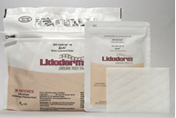

Lidocaine Patch    body {font-family: 'Open Sans', sans-serif;}

### Lidocaine Patch

LIDODERM (lidocaine patch 5%)  
**Other brand names besides Lidoderm:** AneCream, AneCream with Tegaderm, Anestacon, Bactine, LidaMantle, Lidocream, Lidoderm, Lidosense5, LMX 4, LMX 4 with Tegaderm, LMX 5, Medi-Quik Spray, Senatec, Xylocaine Jelly, Xylocaine Topical, Zilactin-L  
  
**Size:** The patch is 10 cm x 14 cm  
Even a _used_ LIDODERM patch contains a large amount of lidocaine (at least 665 mg). The potential exists for a small child or a pet to suffer serious adverse effects from chewing or ingesting a new or used LIDODERM patch.  

****

  
With LIDODERM, the average peak blood concentration is about 0.13 mcg/mL, but concentrations higher than 0.25 mcg/mL have been observed in some individuals.  
  
Lidocaine toxicity could be expected at lidocaine blood concentrations above 5 μg/mL  
  
**Indication:** To relieve nerve pain after shingles (infection with the herpes zoster virus).  
This type of pain is called post-herpetic neuralgia.  
Lidocaine helps to reduce sharp/burning/aching pain as well as discomfort caused by skin areas that are overly sensitive to touch.  
  
**MOA:** Lidoderm penetrates directly into the skin to reach the damaged nerves (caused by shingles) and to help provide relief at the site of the pain.  
  
**How to administer:** Apply only to healthy, normal skin. Do not apply to skin that is broken or irritated.  
  
**Dose:** Usually only once a day for up to 12 hours or as directed. Do not apply more than 3 patches once a day or leave any patch on for longer than 12 hours in any 24-hour period.  
If a smaller patch is needed, it may be cut with scissors before the liner is removed.  
  
Avoid getting the patch wet since it may not stick to the skin.Avoid getting this medication in your eyes or mucous membranes (e.g., nose, mouth).  
  
**Max Dose:** A maximum of 3 patches can be worn at a time for 12 hours on, followed by 12 hours off. There is evidence that Lidoderm patches, along with several other analgesics (i.e., gabapentin, opioids, tramadol, tricyclic antidepressants \[TCAs\]), can be effective as first-line therapy in the management of neuropathic pain  
  
**Avoid Heat** While wearing your patch, avoid exposing it to direct heat sources such as heating pads, electric blankets, heat lamps, saunas, hot tubs, heated waterbeds, or prolonged direct sunlight. Heat may cause more drug to be released into your body, increasing the chance of side effects.  
  
**Possible application site reactions**

-   Blisters
-   Bruising
-   Burning sensation
-   Depigmentation
-   Dermatitis
-   Discoloration
-   Edema
-   Erythema
-   Exfoliation
-   Irritation
-   Papules
-   Petechi
-   Pruritus
-   Vesicles

These reactions are generally mild and transient, resolving spontaneously within a few minutes to hours.  
  
**_Absorption_**  
The amount of lidocaine systemically absorbed from Lidoderm is directly related to both the duration of application and the surface area over which it is applied.  
  
**_Distribution_**  
When lidocaine is administered intravenously to healthy volunteers, the volume of distribution is 0.7 to 2.7 L/kg (mean 1.5 ± 0.6 SD, n=15).  
  
**_Metabolism_**  
It is not known if lidocaine is metabolized in the skin.  
Lidocaine is metabolized rapidly by the liver to several metabolites, including monoethylglycinexylidide (MEGX) and glycinexylidide (GX), both of which have pharmacologic activity similar to but less potent than that of lidocaine.  
  
**_Excretion_**  
Lidocaine and its metabolites are excreted by the kidneys  
Less than 10% of lidocaine is excreted unchanged.  

Drugs.com https://www.drugs.com/lidoderm.html RxList http://www.rxlist.com/lidoderm-drug/side-effects-interactions.htm MedicineNet.com http://www.medicinenet.com/lidocaine\_patch-topical/article.htm Lidoderm patches \[package insert\]. Chadds Ford, PA: Endo Pharmaceuticals, Inc. January 2015. Dworkin RH, O’Connor AB, Audette J, et al. Recommendations for the pharmacological management of neuropathic pain: an overview and literature update. Mayo Clin Proc. 2010;85:S3-S14.