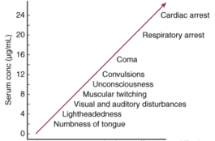

Lidocaine Toxicity    body {font-family: 'Open Sans', sans-serif;}

### Lidocaine Toxicity

Lidocaine levels > 5 mcg/mL are associated with serious toxicity. As can be seen in the table below, as blood plasma levels rise, the clinical effects get worse.  
****  
With so many concentrations (1%, 2%, 4%) and routes of administration available, the total dose of lidocaine is always a concern. Therefore, there are recommended maximum doses for local anesthetics. Serum lidocaine levels with clinical effects.  
**See “Local Anesthetic Toxicity and Intralipid” link for treatment.**  

Schwartz DR, Kaufman B. Chapter 66. Local Anesthetics. In: Schwartz DR, Kaufman B, eds. _Goldfrank’s Toxicologic Emergencies_ . 9th ed. New York: McGraw-Hill; 2011.  
  
Chinn WM, Zavala DC, Ambre J. Plasma levels of lidocaine following nebulized aerosol administration. Chest 1977;71(3):346-8