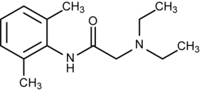

Lidocaine and OB    body {font-family: 'Open Sans', sans-serif;}

### Lidocaine and OB

**_Class:_** _Amide type local anesthetic, intermediate acting__The standard local anesthetic used as a reference  
_  
Not commonly used for initiation or maintenance for epidural labor analgesia due to its shorter duration compared to Ropivacaine and Bupivacaine.  
  
**MOA:** Like other local anesthetics, it binds to the intracellular portion of sodium channels  
and blocks sodium influx into nerve cells, which prevents depolarization.  
  
**Lidocaine is presently used for 2 main reasons in OB Regional today:**  
Testing epidural dose  
Epidural for a failed vaginal delivery converted to C-section  
  
**Common epidural test dose:** 3 mL of 1.5% lidocaine (45mg) with 15mcg of 1:200,000  
epinephrine.  
**Common C-section epidural dose:** 15-20 mLs of 0.2% plain lidocaine.  
**Cerclage dose:** 1 mL of 5% plain lidocaine (Bupivacaine is more popular)

table.tableizer-table { font-size: 12px; border: 1px solid #CCC; font-family: Arial, Helvetica, sans-serif; } .tableizer-table td { padding: 4px; margin: 3px; border: 1px solid #CCC; } .tableizer-table th { background-color: #104E8B; color: #FFF; font-weight: bold; }

| Agent | Conc. | Onset | Sensory Block | Motor Block | Plain Solution | 1:200,000 Epi |
| --- | --- | --- | --- | --- | --- | --- |
| Lidocaine | 1.50% | Intermediate - 15 mins | Dense | Mild | 80-120 mins | 120-180 mins |
| Lidocaine | 2.00% | Same | Dense | Dense |   |  |

_With epidurals, we usually do not add epinephrine to a local anesthetic to increase duration because we can just redose it._5% Lidocaine concentrations are no longer recommended due to risk of TNS. Less concentrated solutions have been used in hopes of reducing the incidence of TNS.

****

**Remember the 2 ways you can tell the local anesthetic is an amide?  
**2 “I”s in the word.  
Note the “NH” next the aromatic ring on the left = amide.  
  
Despite 3% Chloroprocaine being the fastest acting local anesthetic and mentioned in our textbooks for urgent C-sections, epidural Lidocaine is still more commonly administered for urgent C-sections.  
  
**Metabolized (hepatic)-in Liver  
Metabolized by Hepatic P450, CYP3A4/5** **to 2 active compounds:**  
monoethyglycin exylidide  
glycinexylidide xylidide  
  
**pKa:** 7.9 and 75% ionized at pH 7.4  
  
1st pass lung (lipophilic drugs taken quickly into lungs which are the 1st vascular bed after heart).
  
  
**Elimination:** Around 75% of the xylidide is excreted in the urine as the further metabolite 4-hydroxy-2, 6-dimethylaniline.  
  
**Predominately bound to AAG in plasma**  
Pregnancy tends to decrease concentration in AAG, so the free plasma fraction of lidocaine is higher in term pregnant women  
  
**Spinal Doses for Epidurals  
**Lidocaine is NOT administered per spinals for C-sections in OB. Higher concentrations would be needed and that imposes a risk of TNS**Onset:** 3-5 minutes  
**Duration:** 60-75 minutes  
0.75% Bupivacaine is commonly administered per spinal for C-sections.  
  
**Max Doses:  
**5mg/kg plain  
7mg/kg with Epi  
  
**More Notes:**  
Lidocaine is less protein bound than other amide local anesthetics.  
At delivery, lidocaine has twice the vein-to-maternal concentration ratio as bupivacaine.  
  
In the past, epidural lidocaine was associated with abnormal neonatal behavior and discouraged administered per epidural. Later studies showed the other local anesthetics had similar behavior results and considered subtle.  
Adding Epinephrine - 5 mcg/mL (1-200,000) with lidocaine nearly doubles the duration of lidocaine. However, we usually do not add epinephrine to epidural lidocaine because we could just redose it.  
  
8 to 10 cc of 2.0% plain lidocaine that is pH adjusted (1 cc of HCO3) will provide rapid analgesia for a parturient in tumultuous labor.  
  
Addition of fentanyl will accelerate the onset of analgesia and create a more potent/complete block.  
  
**Cardiac dose for Arrhythmias:** 1-1.5mg/kg
  
**Infusion:** 1-4mg/min
  
**Peripheral Nerve Block:** 4mg/kg, 7mg/kg with Epinephrine
  
Epidural dose: 4mg/kg
  
**Spinal: 1.5mg/kg
  
Bier Block:** 200mg in 10-40ml (0.5%, 1% or 2%)  
  
**Onset/Duration**  
**IV** : 1 min  
**Peripheral Nerve Block:** 5 minutes/1-3 hours
  
**Epidural** : 5 minutes/1-2 hours  
**Spinal:** <5 minutes/ 30-60 minutes

Chestnut, David.(2014) Chestnut’s Obstetric Anesthesia Principles and Practice.  
  
IFNA / International Federation of Nurse Anesthetists  
Developing Countries Regional Anesthesia Lecture Series  
  
Daniel D. Moos CRNA, Ed.D. U.S.A.