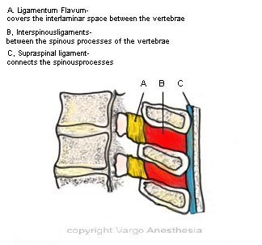

Ligamentum flavum (yellow ligament)    body {font-family: 'Open Sans', sans-serif;}

### Ligamentum Flavum (yellow ligament)

Anatomically relevant to regional anesthesia, it is the thick tough ligament that must be penetrated to enter the epidural space.  
Some have described the ligamentum flavum as a single ligament, but it is really composed of two curvilinear ligaments that join in the middle and form an acute angle with a ventral opening.  

****

  

****

  
**Facts about the ligamentum flavum  
**The ligamentum flavum is not one continuous ligament.  
  
It is the strongest ligament in the spine  
It is short and thick  
Consists of 80% elastin and 20% collagen.  
It is yellow due to the presence of elastin  
Is not uniform from the skull to the sacrum.  
The thickness varies with vertebral level, BMI and age.  
Responsible for connecting the vertebrae from C2-S1  
Protects and stabilizes the spine.  
  
Over time, the ligamentum flavum can lose strength and elasticity, causing it to thicken and buckle towards the spinal column. When this happens, a patient can develop spinal stenosis (narrowing of the spinal canal).  
  
**_NOTE: Relaxin,_** _a hormone secreted during pregnancy to increase the laxity of the ligaments supporting the birth canal, also affects the ligamentum flavum. This may make tactile feedback less reliable as a marker of the ligament’s location._  

_Nikolai Bogduk. Chapter 4: Ligaments of the lumbar spine In: Clinical Anatomy of the Lumbar Spine and Sacrum. ElsevierJ Bone Joint Surg Am. 2005 Dec;87(12):2750-7.fckLRHypertrophy of ligamentum flavum in lumbar spinal stenosis associated with increased proteinase inhibitor concentration.  
  
Chestnut, David.(2014) Chestnut’s Obstetric Anesthesia Principles and Practice ; pp 230-231.  
  
**Gray's Anatomy for Students  
**By Richard Drake, A. Wayne Vogl, Adam W. M. Mitchell_