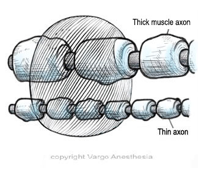
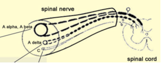
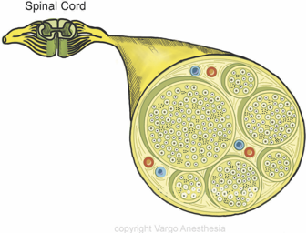

Local Anesthetic Effects on Specific Nerve Fibers    body {font-family: 'Open Sans', sans-serif;}

### Local Anesthetic Effects on Specific Nerve Fibers

A nerve comprises a variety of nerve fibers bundled within membranes.  
  
With spinal and epidurals, our target is the nerve roots exiting the spinal cord.  
  
**There are three classes of nerve fibers based upon diameter, function and degree of myelination:  
**A Fibers – (Myelinated somatic nerves)A-alpha – motor neurons; efferent to skeletal muscle  
A-beta – touch, pressure, proprioception neurons; afferent from skin  
A-gamma – motor neurons; efferent to muscle spindles  
A-delta – pain (sharp and fast) and temperature; afferent from skin  
**B Fibers** (Myelinated preganglionic autonomic nerves and efferent to vascular smooth muscle)  
Cause vasodilation and increased skin temperature in the affected area  
  
**C Fibers** (Lightly myelinated postganglionic autonomic nerves)Responsible for pain (dull and slow) and temperature; afferent from skin**_Note:_** _Some literature states that the C-fibers are unmyelinated. See table below.  
_  
As a local anesthetic diffuses through the nerve root, it will affect a variety of nerve fibers in a certain order.  
\- The order in sequence may depend on the size, myelinated or not, and the location of the specific fibers within the nerve root.  
Sympathetic > Sensory > Motor  
**B Fibers and Hypotension with Neuraxial Anesthesia (sympathetic tone):  
**\- It can be determined what nerve fibers are blocked by assessing the patient’s symptoms.  
\- Using a spinal as an example, the first symptom is usually a drop in blood pressure.  
\- This is because the **B Fibers** within the nerve roots are blocked **first.**  
\- The B Fibers are EFFERENT myelinated preganglionic **sympathetic** fibers that affect the vascular smooth muscles of those blood vessels innervated from the affected nerve roots.  
\- This means the blood vessels innervated by the B fibers that run off the specifically blocked nerve roots (segmental) will lose vascular tone and dilate.\- In the case of a high spinal where several more nerve roots are affected, there will be a more dramatic fall in blood pressure, among other symptoms.  
**  
B Fibers and Interscalene Block:  
**\- After an interscalene block, the first symptom seen is vasodilation and skin warmth on the patient’s blocked extremity.  
\- This is because the B Fibers were blocked first.As the local anesthetic spreads through the nerve root, it will affect more types of nerve fibers.  
  
**C Fibers:  
**The C fibers are usually the next blocked, resulting in the loss of DULL pain and temperature sensation.  
  
**A-Delta Fibers:**  
Next blocked are the A-delta fibers that result in the loss of SHARP pain and temperature sensation.  
As the remaining nerve fibers are blocked (e.g., during spinal anesthesia), the patient will lose proprioception (limb position sense), touch, pressure sensation, and possibly motor function.  
  
**A-Alpha and Motor Paralysis:**  
\- Last blocked are the A-alpha nerve fibers responsible for motor function.  
\- The nerves responsible for motor function are more challenging to block. Thus, the motor function is the last to be lost.  
\- As shown by the chart below, the A-alpha nerves are the largest.  
Local anesthetics exert their pharmacological actions on the nerve membrane at the nodes of Ranvier.  
  
**To completely halt nerve conduction in myelinated nerve fibers, three** nodes of Ranvier must be blocked.  
  
**In general, small myelinated fibers are more susceptible to blockade than are larger unmyelinated fibers.**  
Suppose the volume of local anesthetic is constant.  
The smaller nerves with the shorter inter-nodal distance will be blocked first, compared to the larger motor nerves with a greater internodal distance, as shown in the image below.

****

**Nerve Fibers** table.tableizer-table { font-size: 12px; border: 1px solid #CCC; font-family: Arial, Helvetica, sans-serif; } .tableizer-table td { padding: 4px; margin: 3px; border: 1px solid #CCC; } .tableizer-table th { background-color: #104E8B; color: #FFF; font-weight: bold; }

| Fiber Type | Size- microns | Function |
| --- | --- | --- |
| B | 0.25 | EFFERENT myelinated preganglionic sympathetic fibers to  
vascular smooth muscle-vasodilation and increased skin temperature |
| C (unmyelinated) | 0.5 | Lightly myelinated postganglionic autonomic nerves, loss of  
dull and slow pain and temperature sensation; afferent from skin. |
| A-delta | 0.5 | Loss of sharp and fast pain, temperature sensation,  
afferent from skin |
| A-gamma | 0.75 | Motor neurons, efferent to muscle spindle and muscle tone |
| A-beta | 0.75 | Touch, pressure, proprioception neurons  
(no idea where the effected limbs are) afferent from skin |
| A-alpha | 1.0 | Somatic Motor, proprioception-last to be blocked.  
Located at the core of the nerve bundle |

**Note:** Some literature states the C-fibers are unmyelinated. The others are all myelinated.  
  
Below is a diagram of a cross-section through an area rich with nerve bundles.

****

****

Chestnut, David.(2014) Chestnut’s Obstetric Anesthesia Principles and Practice.  
  
Santos, Alan., Epstein, Jonathan.,(2015) Chaudhuri, Kallol Obstetric Anesthesia ; 2015.  
  
Local Anesthetic and Regional Flashcards, CH 9.  
https://tinyurl.com/37zkhazj  
  
Reese, Charles, AANA Convention, Neuraxial Regional Anesthesia-Epidural Workshop