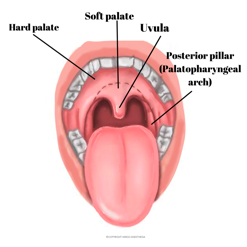
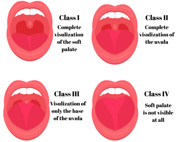

Mallipanti and Airway Assessment    body {font-family: 'Open Sans', sans-serif;}

### Mallipanti and Airway Assessment

Also called Mallampati score or Mallampati classification.  
  
The Mallampati score is a graded 4-level pictorial scale utilized to help predict difficult intubation before receiving general anesthesia.  
It can also be used to assess potential difficulties for bag-valve-mask ventilation and whether an oral pharyngeal airway may be required.  
  
**Basic anatomy:**

****

**How to assess:  
**The patient should be sitting upright with the head in a neutral position.  
Ask the patient to open their mouth and maximally stick out their tongue.

****

  
**According to the Mallampati scale:**

table.tableizer-table { font-size: 12px; border: 1px solid #CCC; font-family: Arial, Helvetica, sans-serif; } .tableizer-table td { padding: 4px; margin: 3px; border: 1px solid #CCC; } .tableizer-table th { background-color: #104E8B; color: #FFF; font-weight: bold; }

|  |   |
| --- | --- |
| **Class I** | Soft palate, uvula, and bilateral pillars are visible |
| **Class II** | Soft palate, upper part of the pillars and most of the uvula are visible |
| **Class III** | Only the soft palate and base of the uvula are visible |
| **Class IV** | Only hard palate is visible |

Among many studies, the sensitivity and specificity of the Mallampati score predicting difficult intubation vary widely.  
Thus, the Mallampati score should not be used alone for predicting a difficult airway.  
  
**Proper airway assessment should include the following:**

table.tableizer-table { font-size: 12px; border: 1px solid #CCC; font-family: Arial, Helvetica, sans-serif; } .tableizer-table td { padding: 4px; margin: 3px; border: 1px solid #CCC; } .tableizer-table th { background-color: #104E8B; color: #FFF; font-weight: bold; }

| Assess | Rationale |
| --- | --- |
| Previous difficult intubation | May have difficult intubation card |
| Mouth opening | Glottis exposure may be blocked by teeth  
Temporomandibular joint issues |
| Mallampati score | For probable difficult intubation |
| Thyromental distance < 60 mm | Glottis for be too anterior to visualize |
| Cervical-occipital extension | Associated with arthritis or cervical spine surgery.  
Difficult to align mouth with pharynx for glottic exposure |
| Cervical spine surgery | May have minimal cervical-occipital extension |
| Short thick muscular neck | Prone to soft tissue obstruction/OSA  
Difficult to extend neck  
Difficult intubation and/or mask ventilation |
| Dental caries, loose tooth/teeth  
Caps/bridges | Danger of aspiration |
| Prominent maxillary incisors | Teeth may block the view of the glottis |
| Hoarseness | Possible vocal cord dysfunction or airway mass |
| Tracheostomy scar | Possible tracheal stenosis |
| OSA or history of snoring |   |
| Pathology associated with difficult intubation | Goiter, Ludwig's angina, acute porphyria |
| Very large face | Difficult mask seal |

  
**History of Mallampati score:**  
\- It is named after the Indian anesthesiologist Seshagiri Mallampati.  
\- In 1971, he emigrated to the United States and began his training in anesthesiology at the Lahey Clinic in Boston, Massachusetts.  
\- Dr. Mallampati hypothesized that the size of the tongue was a significant factor in predicting difficult intubation since a large tongue would likely occlude the oropharynx.  
\- In 1985, he and his colleagues published a paper in the Journal of the Canadian Anesthesia Society that involved 210 patients and studied the correlation between decreased visualization of the soft palate, faucial pillars, and uvula and its association with the difficulty of intubation.  
\- It has since been slightly modified.  
  

Difficult airways: causation and identification; Chapter 7  
Core Topics in Airway Management 2nd edition ed. CH. 7, 2011  
Ian Calder and Adrian Pearce.  
  
Airway Assessment for Office Sedation/Anesthesia  
Anesthesia Progress 2015 Summer; 62(2): 74–80.  
Morton B. Rosenberg, DMD and James C. Phero, DMD  
  
Seshagiri Mallampati  
Wikipedia (accessed 01/2022)  
https://en.wikipedia.org/wiki/Seshagiri\_Mallampati