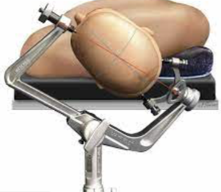

Mayfield Headholder     body {font-family: 'Open Sans', sans-serif;}

### Mayfield Headholder

The Mayfield Headholder is used to stabilize the head for craniotomies. It consists of a clamp with three sterile pins, which insert through the scalp into the outer surface of the skull.   
Tightening the pins is very painful and you should deepen the patient before the Mayfield is applied.

**Mayfield Pins and Propofol**: The application of Mayfield Pins is very stimulating. Most of us bolus with 50-100mg of Propofol just prior to pin insertion to prevent the BP and HR from skyrocketing. So have some extra Propofol available. If the patient is on a Remifentanil drip, consider a small bolus instead of the Propofol.  
Esmolol: I have seen **Esmolol** also given in addition to propofol.  
  
**Mayfield Pin Complications**  
Severe hypertension with application  
Over tightening- skull fracture  
Bleeding requiring suturing  
Laceration-pins not tight enough