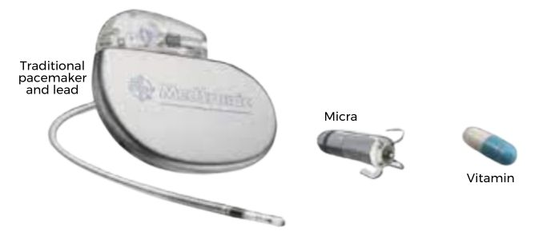
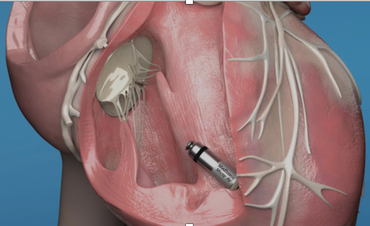

Micra Leadless Pacemaker and Pre-op Programming    body {font-family: 'Open Sans', sans-serif;}

### Micra Leadless Pacemaker and Pre-op Programming

Also known as MICRA TPS (Transcatheter Pacemaker System)  
  
\- The Micra TPS is a miniaturized leadless single-chamber right ventricular pacemaker.  
\- It is inserted directly into the right ventricular myocardium via a transcatheter approach.  
\- This new pacemaker technology is a promising long-term permanent cardiac pacing option for patients requiring only RV pacing.  
\- FDA approved for Class I and Class II bradycardia therapy in 2016.  
\- Has an estimated longevity of 12 years.

****

However, the Micra cannot be reprogrammed to an asynchronous mode with a magnet due to its intracardiac location.  
It must be reprogrammed preoperatively by a Medtronic representative before surgical procedures that may be potentially exposed to electromagnetic interference (EMI).  
**  
Reprogram to VOO (asynchronous) mode:  
**VOO mode can be used perioperatively in pacemaker-dependent patients to prevent EMI-induced inhibition of pacing therapy.  
  
**Medtronic contact info:**  
1-800- 551-5544, or Medtronicacademy.com  
**Model numbers:** MC2AVR1, MC2VR01, MC1AVR1, MC1VR01  
  
**About the MICRA pacemaker:  
Facts: Smallest pacemaker:** Micra is 93% smaller than conventional pacemakers, about the size of a large vitamin capsule.  
**Mass =** 1.75 grams  
**Volume** \= 0.8 cm 3  
**Length** \= 25.9 mm  
  
**Less invasive:** Unlike conventional pacemakers, the procedure requires no chest incision and does not require anesthesia services for insertion.  
It does not create a scar or bump under the skin.  
  
**Fewer restrictions:** The Micra design translates to fewer medical complications and post-implant activity restrictions for most patients.  
  
**Micra indications:**  
\- Symptomatic high-grade atrioventricular nodal block with or without atrial fibrillation, symptomatic bradycardia-tachycardia syndrome.  
\- Sick sinus syndrome.

****

**Pre-op recommendations when there is a concern for EMI:  
**\- As mentioned above, this pacemaker is not responsive to an external magnet like traditional pacemakers.\- Medtronic recommends considering preoperative asynchronous programming and restoring device parameters after the surgery.  
**  
In urgent cases where preoperative reprogramming is not possible, general procedures should be followed as outlined below:**  
\- Temporary pacing and defibrillation equipment in the operating room.  
\- Brief the surgeon about unique pacemaker and advice to use a bipolar electrocautery system or harmonic scalpel.  
\- If a bipolar electrocautery system is not available, position the return electrode patch such that the electrical current pathway does not pass within 15 cm (6 in) of the device.  
\- Use short, intermittent, and irregular bursts at the lowest clinically appropriate energy levels.  
**  
Pre-op  
Consider postoperative interrogation if the following occurred:**  
\- Monopolar electrocautery was used.  
\- The patient is hemodynamically unstable.  
\- After cardiothoracic surgery, radiofrequency ablation, or external cardioversion  
\- A cardiac electrophysiologist team needs to be contacted to reprogram the pacemaker to VOO (fixed ventricular pacing) mode.  
  
**The main pacing modes of the Micra TPS:**  
VVIR  
VVI  
  
**VOO (asynchronous) mode:  
**\- The VOO mode is rarely used in the presence of an intrinsic rhythm due to the risk of R-on-T phenomenon.\- However, the VOO mode can be used perioperatively in pacemaker-dependent patients to prevent electromagnetic interference-induced inhibition of pacing therapy.  
  
The Micra pacemaker has 63% fewer complications than conventional pacemakers.  
  
**Most common device-related complications:**  
\- Device dislodgement (1.7%)  
\- Cardiac perforation (1.3%)  
\- Elevated pacing thresholds requiring device repositioning (1.3%)  

Perioperative Management of the Micra Leadless Pacemaker  
Journal of Cardiothoracic and Vascular Anesthesia June 27, 2017  
Michael Essandoh, MD  
  
Anesthetic Consideration for Patients with Micra Leadless  
Annals of Cardiac Anaesthesia 2020 Oct-Dec; 23(4): 493–495  
Sathappan Karuppiah, Richard Prielipp, and Ratan K. Banik, MD, PhD  
  
Micra leadless pacemakers for bradycardia (slow heart rate)  
Medtronic (accessed 09/2024)  
https://tinyurl.com/5n7bmfsv  
  
Use of an ultrasonic scalpel in the open-heart reoperation of a patient with pacemaker.  
European Journal of Cardiothoracic Surgery. 2002;21:761–2  
Ozeren M, Doǧan OV, Düzgün C, Yücel E.  
  
Medtronic Micra MC1VR01 Clinician Manual. November. 2014  
  
Evaluation of surgical electromagnetic interference in leadless pacemakers.  
Heart Rhythm Case Rep. 2018;4:570–1.  
Gifford J, Saleem M.  
  
Medtronic. Medtronic Academy.  
Available at: medtronicacademy.com.  
Accessed: 9/2023  
  
Medtronic.com  
Accessed 09/2023