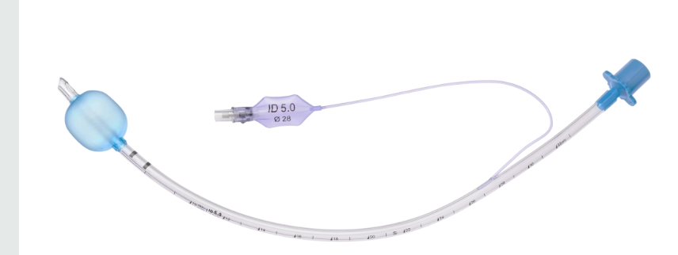

  Microlaryngoscopy Tube or MLT Tube section { margin-bottom: 20px; } h3, p { margin: 0px; padding: 0px; } img { width: 400px; height: auto; }

**Microlaryngoscopy tube or MLT Tube**

The nickname for MLT is "mighty long tube"!

The ENT surgeon prefers an extra-long and small-diameter ETT to facilitate the view of the airway for microlaryngoscopy procedures.

  

4.0-5.0-or 6.0-ID mm microlaryngeal tracheal (MLT) tube (Mallinckrodt Critical Care) is the same length as an adult tube, has a disproportionately large high volume low pressure cuff, and is stiffer and less prone to compression than a regular tracheal tube.

Sizes:

ID 4.0 mm

ID 5.0 mm

ID 6.0 mm (most common for adults)