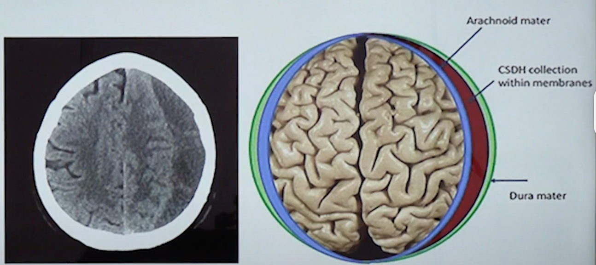

  Middle Meningeal Artery (MMA) Embolization section { margin-bottom: 20px; } table { border-collapse: collapse; } table, tr, th, td { border: 1px solid black; } h3, p, ol.custom-counter, li { margin: 0px; padding: 0px; } .text-red { color: red; } .text-black { color: black; } ul.custom-dash { list-style: none; padding-left: 0; margin: 0; } ul.custom-dash > li { display: flex; align-items: flex-start; } ul.custom-dash > li::before { content: "–"; margin-right: 0.5em; flex-shrink: 0; line-height: 1; } ul.custom-dash > li > \*:not(::before) { flex: 1; } ul.custom-dash > li.no-dash::before { content: ""; width: 1em; margin-right: 0.5em; flex-shrink: 0; } /\* Change the ol style \*/ ol.custom-counter { list-style: none; padding-left: 0; counter-reset: custom calc(var(--start, 1) - 1); } ol.custom-counter li { counter-increment: custom; margin-bottom: 5px; } ol.custom-counter li::before { content: counter(custom) ") "; } /\* This is just for this file \*/ ul.custom-bullet-arrow { list-style: none; padding-left: 0; margin: 0; } ul.custom-bullet-arrow > li { display: flex; align-items: flex-start; } ul.custom-bullet-arrow > li::before { content: "↑"; margin-right: 0.5em; flex-shrink: 0; } ul.custom-bullet-arrow > li.no-arrow::before { content: ""; width: 0.5em; margin-right: 0.5em; flex-shrink: 0; } ul.custom-bullet\_arrow ul { list-style-type: disc; padding-left: 1.5em; margin-top: 0.5em; } img.resized-200 { width: 200px; height: auto; } img.resized-400 { width: 400px; height: auto; } img.resized-600 { width: 600px; height: auto; } .mb-10px { margin-bottom: 10px; } .mb-20px { margin-bottom: 20px; } .mt-10px { margin-top: 10px; } .mt-20px { margin-top: 20px; } .reference-notes { font-size: 11px; } .text-indent-45px { text-indent: 45px; } .text-bold { font-weight: bold; }

### Middle Meningeal Artery (MMA) Embolization

-   MMA embolization is a minimally invasive percutaneous vascular procedure that blocks the blood flow to the MMA to treat Chronic Subdural Hematomas (CSDH).
-   This results in the reduction of inflammation and prevents the new growth or recurrence of blood vessels and collection on the brain's surface.

**MMA:** A small vessel that supplies the dura mater (inner lining of the skull).

**Procedure goal:** Block the blood supply to the abnormal, leaky chronic subdural hematoma "membranes," allowing the hematoma to absorb.

-   This vascular procedure offers a less invasive alternative to traditional surgery for the treatment of asymptomatic CSDH.
-   In some instances, the patient will remain intubated and transported to the operating room for a craniotomy (burr holes) to evacuate the existing hematoma.

Chronic Subdural Hematoma (CSDH) facts:

**Mortality rate:** As high as 13%

**Recurrence rates:** 15-20%, as high as 33% requiring treatment

**Traditional symptomatic treatment:** Burr holes, craniotomy

**Recurrence rates:** 15-20%, as high as 33% requiring treatment

-   Becoming more prevalent due to the increase in patients being anticoagulated
-   Expected to be the most prevalent neurosurgical condition by 2030

**Etiology of CSDH:** At the bottom of this page

Traditional symptomatic treatment:

-   Burr holes
-   Craniotomy
-   Subdural Evacuating Port System (SEPS, Medtronic)
-   Endoscopic assistance during craniotomy has been described (eg, Cai et al., 2019)
-   Subdural drain

Procedure-simplified:

The physician threads a microcatheter from either the right radial artery or groin and threads it up the MMA.

The physician then injects an embolic agent—such as glue, particles, or coils—to permanently close the artery.

Anesthesia management:

**Location:** Interventional Radiology (IR)

**Anesthesia:** MAC or general, physicians' preference

**MAC:** The patient must be cooperative and not move, especially during embolization to the MMA.

**General/ETT:** With muscle relaxation, you have a motionless patient with a secure airway.

**Ventilator tubing extension:** Yes, the anesthesia machine will be positioned further away from the patient.

**Note:** Due to IR ergonomics, you will NOT have easy access to the airway once the IR table is repositioned.

**Arterial line:** Common, but optional. It depends on who is drawing the ACTs and the patient's cardiac status.

You can better manage the patient's BP per the physician's request with an arterial line.

**IVs:** 2 good running IV's

**Eye protection:** Yes, usually Tegaderm

**Temp probe:** Axillary, esophageal, or a nasal probe will interfere with head imaging

Antihypertensive agent infusions

Nicardipine or NTG + 10cc diluted rescue syringe

**Pressor infusion:** Phenylephrine or norepinephrine + 10 cc diluted rescue syringe

**Note:** Many anesthesia providers prefer norepinephrine.

**Antiemetics:** Yes, nausea and especially retching should be avoided postoperatively.

**Emergence:** Consider reversing the neuromuscular block with sugammadex to avoid nausea.

**Extubate:** Check with the IR physician.

Possible complications:

-   Stroke
-   Blindness-unintended embolization of the orbital arteries
-   Seizures
-   Cardiovascular complications
-   Infections
-   Hematomas or pseudoaneurysms at the access site

Etiology of Chronic Subdural Hematoma:

-   Traumatic or spontaneous tearing of bridging veins between the dura and brain.
-   Inflammatory cells and fibroblasts migrate from dura to form a membrane that encapsulates the subdural collection.
-   Formation of a 2-3-layered subdural membrane, which is easily recognized in the operating room and on imaging.
-   Neovascularization with poorly developed endothelial cell junctions.
-   It is hypothesized that the neovascularization for rebleeding and growth may result in small leaks that cause the hematoma over time.
-   Anastomosis to the MMA has been demonstrated histologically.

Middle Meningeal Artery Embolization for Management of Chronic Subdural Hematoma

Radiographics, Vol. 44, No. 4 2024

Ángela H. Schmolling, Carlos Pérez-García, Carmen Trejo, Alfonso López-Frías, Tanaporn Jaroenngarmsamer, Santiago Rosati, Juan

Arrazola, and Manuel Moreu

Embolization of Chronic Subdural Hematomas:

An Emerging Treatment Technique

UCLA Health

Geoffry Colby, MD, And Jeremiah Johnson, MD

Accessed 09/2025

https://www.youtube.com/watch?v=-o4GvY60Vxo

Is Chronic Subdural Hemorrhage an Endovascular Disease?

Jared Knopman, MD FAANS

Weill/Cornell Medica College-NY Presbyterian Hospital New York, NY

Accessed 09/2025

https://www.youtube.com/watch?v=RV\_Lm9RO1WE