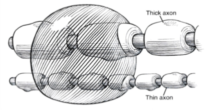

Minimum Blocking Concentration    body {font-family: 'Open Sans', sans-serif;}

### Minimum Blocking Concentration (AANA Lecture)

The concentration that halts impulse propagation

3 Nodes of Ranvier for myelinated Fibers or 5-6 mm on unmyelinated fibers.

****

AANA Workshop-Neuraxial Regional Anesthesia  
Clayton, Kasson, Osborne and Reese  
Sept, 9 2017