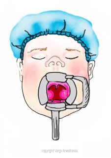
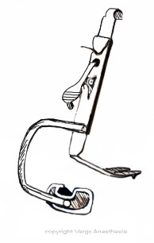

Mouth Gag Device   

### Mouth Gag Device

 

This is the device that ENT surgeons use to pry your patient’s mouth wide just prior to starting their procedure. It offers an excellent visualization of oropharyngeal structures, including the palatine tonsils.

During surgery, this device must be frequently released and reapplied. It applies intense pressure to the posterior 1/3 of the tongue, causing certain amount of disruption to its blood supply, thus leading to intense tongue pain postoperatively. Thus frequent release of the mouth gag during surgery reduces this type of pain to some extent.

**  
Mouth gag has 2 components:**  
The tongue blade  
The Mouth gag- has various names.

The mouth gag may be held in position by an M-shaped stand called as the jack or by a Draffins’ pod.

**Pre-op Precautions:  
**Does your patient have loose teeth or TMJ?When the gag device is applied, the loose teeth can easily be dislodged and possibly aspirated. For TMJ patients, the gag device can cause TM joint dislocation.  
You should alert the parents of the possible complications of the gag device so you are not falsely accused of gag device complications should they occur.

**Document an atraumatic intubation:  
**If your intubation went smooth and the teeth remained intact, always document it. If damage occurred, document that as well.

  
**Displacement of ETT:  
**Always know the ETT’s placement in centimeters in reference to the lips. When placed, the tracheal tube can be displaced in either direction from -10 to + 27mm. Most of the time, the ETT is displaced caudally towards the carina. Where you tape the ETT midline should also be a good indicator.

So watch your peak pressures and return volumes for a mainstem intubation. Don’t hesitate to inform the surgeon if you feel the ETT is displaced. It is easy for him to pull back the ETT.

**Other concerns or complications:  
**Popping of the jaw; or post op TMJ is rare with kids.Bleeding from hypertension when the BDG is deployed.  
TachycardiaETT herniation through the slot in the blade.  
Unilateral laryngeal spasm.  
Pneumothorax  
Unilateral pulmonary ventilation.  
Pneumo-mediastinum  
Tracheal mucosal trauma.  
Accidental extubation.  
Silent aspiration.

  
When the BDG is employed, it is VERY stimulating. We tend to deepen the patient with the inhalation agent rather than to treat the stimulation with narcotics.

**The devices vary depending on the brand. They consist of:**

A blade with a central groove for the ETT.

A gag for opening the mouth.

A suspension system to keep the mouth wide open.

**Concerns you need to be aware of with a Gag device: It may cause dental injuries in the presence of loose teeth.**

You may be blamed later for damaged teeth. If your intubation was atraumatic and the teeth remained intact, etc., then document it.

**Displacement of the ETT:  
**Always know where the ETT placement is in centimeters in reference to the lips. When applied, the tracheal tube can be displaced in either direction from -10 to + 27mm. Most of the time, the ETT is displaced caudally towards the carina.

So watch your peak pressures and return volumes for a mainstem intubation. Don’t hesitate to inform the surgeon if you feel the ETT is displaced. It is easy for him to pull back the ETT.

Br J Anaesth. 2010 Dec;105(6):863-6. doi: 10.1093/bja/aeq264. Epub 2010 Oct 6. **Safety implications of the Boyle-Davis mouth gag and tracheal tube position in tonsillectomy.** Fennessy BG1, O'Connor R, Cronin M, Fenton JE, Hughes JP.

.