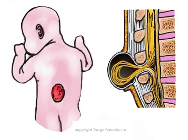

Myelomeningocele Review   

### Myelomeningocele Review

  
_Edited by Chris Baird CRNA, Charlotte, NC_

Exposed nerves and muscles may become infected, so prompt surgery is needed after birth.

Despite aggressive surgical and medical management 15-30% of neonates with MMC die within the first 5 year of life, majority of deaths are attributable to severe Chiari Malformation II.

Spina bifida is a type of neural tube defect (NTD).  
Myelomeningocele (MMC) is the most serious form of spina bifida.

**The three forms of spina bifida are:**

**1\. Spina Bifida Occulta** - (the mildest) Small gap in the spine, but no opening or sac protruding out of the back.

**2\. Meningocele** - Sac of cerebrospinal fluid (CSF) protruding through an opening in the baby’s back without the spinal cord, but within the sac (can sometimes contain spinal elements).

**3\. Myelomeningocele** - A sac of CSF comes through an opening in the baby’s back with part of the spinal cord and/or damaged nerves within the sac.  
  
Generally, when spina bifida is discussed, the healthcare team is referring to Myelomeningocele.

**Myelomeningocele Development:** Usually between 20 and 28 days gestation. The baby’s backbone, spinal cord and spinal canal do not form or close normally. This allows for a membrane covered sac to extend through an opening in the spine. This membrane sac contains CSF and meninges, which are tissues that protect the spinal cord.

Myelomeningoceles can impact the nervous system, bones, and muscles as well as the bladder and kidneys. The higher the myelomeningocele occurs in the spinal column, the greater loss of function occurs. There can be moderate to severe disabilities; ranging from problems affecting micturition, loss of feeling in the legs or feet or lower limb paralysis.

**Location**  
The lumbar region of the spine is the most common site for a myelomeningocele to form.  
However, it can also occur at any level; resulting in loss of motor and sensory function usually below the level of the lesion with concurrent bladder, bowel, and sexual dysfunction.  
High thoracic defects will result in a severe neurological deficits.

**Statistics**  
Occurs in 1-5 babies out of every 1,000 babies born in US.  
Females are slightly more likely to develop Myelomeningocele.

There is an increased incidence in Irish, British, Sikh, and Guatemalan populations.

Mothers with a child born with myelomeningocele have a 3-5% chance of delivering another baby with myelomeningocele in following births.

**Cause** - Unknown, but possibly genetic, or a deficiency of Folic Acid.

**Possible Prevention**  
\- Give Folic acid early in pregnancy. Folic acid helps the baby’s neural tube develop properly.

**Myelomeningocele Diagnosis** (a quadruple test)

1.  Blood tests that look for high alpha fetoprotein (AFP) help with diagnosis.
2.  Ultrasound
3.  Amniocentesis
4.  X-ray, CT scan or MRI

**Myelomeningocele Symptoms:**  
Membrane sac protruding from spine.  
Physical movement problems (paralysis or weakness) below level of myelomeningocele.  
Loss of sensation below myelomeningocele.  
Loss of bladder and bowel control.  
Twisted or abnormal legs and feet (example: clubfoot).  
Hydrocephalus - Most children with a myelomeningocele develop hydrocephalus.  
Brain formation problems (Chiaria 2 malformation).

**Most Common Associations with Myelomeningocele**  
Hydrocephalus  
Chiarai-II malformation  
Scoliosis  
Renal abnormality

**Other associated anomalies**  
Restrictive lung disease from scoliosis.  
Tethered cord  
Syringomyelia

**Surgery:** This is recommended within the first few days of life, if not performed intrauterine. Surgery is not without risks though. Many life-threatening issues are associated with myelomeningocele. These patients with hydrocephalus and Chiari-II malformation require special perioperative attention.

**Possible Surgical Complications  
**Post-op ventilation often necessary  
Infection  
CSF leak  
Pseudomeningocele

**More Notes**  
**For hydrocephalus:** A ventriculoperitoneal shunt (VP shunt) is required in 85-90% of these patients. Despite the shunting, some children will have permanent developmental deficits from the Chiari malformation.

**Arnold–Chiari II malformation:** is frequently present and includes a small posterior fossa, brain stem abnormalities, and hindbrain herniation (downward displacement of the medulla, cerebellum, and fourth ventricle into the spinal canal, resulting in hydrocephalus). These children may suffer from central hypoventilation/apnea, bradycardia, stridor, vocal cord dysfunction, swallowing difficulties and aspiration.

Intraoperatively, myelomeningocele is associated with cardiac and/or respiratory problems and can lead to cardiac arrest.

**During pregnancy there are prenatal tests to specifically check for spina bifida and other birth defects.**

**AFP** \- AFP stands for alpha-fetoprotein, which is a protein the unborn baby produces. This is a simple maternal blood test that measures how much AFP has passed into the mother’s bloodstream from the baby. A high level of AFP might mean that the baby has spina bifida. An AFP test might be part of a test called the “quadruple screen” that looks for neural tube defects and other issues.

**Ultrasound** \- An ultrasound is a type of picture of the baby. In some cases, the doctor can see if the baby has spina bifida or find other reasons why there might be a high level of AFP. Frequently, spina bifida can be diagnosed with this test.

**Amniocentesis -** Higher than average levels of AFP in the fluid might mean that the baby has spina bifida.

**After Delivery  
**Sometimes there is a hairy patch of skin or dimple on the baby’s back that is first seen after the baby is born. An X-ray, MRI, or CT, can be done to get a better view of the baby’s vertebrae.

Even so, with the right care, most children affected by spina bifida will be able to grow up to lead full and productive lives.

Exposed nerves and muscles may become infected, so prompt surgery is needed after birth.

Surgical repair of myelomeningocele may, at times, pose life-threatening complications. Associated anomalies can occur at any level resulting in loss of motor and sensory function below the level of lesion, along with bladder, bowel, and sexual dysfunction.

High thoracic defects will result in a severe neurological deficits.

**Associated Anomalies:**  
Nearly all infants born with a myelomeningocele have supraspinal neurologic manifestations of the disease process.

Arnold–Chiari II malformation is frequently present and includes a small posterior fossa, brain stem abnormalities, and hindbrain herniation (downward displacement of the medulla, cerebellum, and fourth ventricle into the spinal canal), resulting in hydrocephalus. Children with Chiari II malformation may suffer from central hypoventilation/apnea, bradycardia, stridor, vocal cord dysfunction, swallowing difficulties and aspiration.

Ventriculoperitoneal shunting is required in 85–90% of these children. And often, despite shunting, some children will have permanent developmental deficits from the Chiari malformation.

Children with Chiari II malformation may suffer from central hypoventilation/apnea, bradycardia, stridor, vocal cord dysfunction, swallowing difficulties and aspiration.  
  
**Other associated anomalies:**  
Scoliosis  
Restrictive lung disease from scoliosis.  
Renal anomalies.  
Tethered cord.  
Syringomyelia  
Supraspinal neurologic manifestations.

**References**  
http://www.openanesthesia.org/ABA:Myelomeningocele\_-\_Assoc\_anomalies  
  
**Kinsman SL, Johnston MV. Congenital anomalies of the central nervous system** . In: Kliegman RM, Behrman RE, Jenson HB, Stanton BF, eds. Nelson Textbook of Pediatrics. 19th ed. Philadelphia, PA: Saunders Elsevier; 2011:chap 585.  
  
Adzick NS et al. A randomized trial of prenatal versus postnatal repair of myelomeningocele. N Engl J Med. Mar 2011; 364(11):993\_1004.  
  
Facts (Centers for Disease Control and Prevention) Spina Bifida Facts. (2014, August 5). Retrieved January 31, 2015.  
http://www.cdc.gov/ncbddd/spinabifida/facts.html  
  
Foster, M., & Kolaski, K. (2014, May 9). Spina Bifida (C. Lorenzo, Ed.). Retrieved January 31, 2015, from http://emedicine.medscape.com/article/311113-overview  
  
Coleman, B., Langer, J., & Horii, S. (2014). The Diagnostic Features of Spina Bifida: The Role of Ultrasound. _0_(0). Retrieved January 31, 2015, from http://www.karger.com/Article/FullText/364806  
  
Adzick, N. (2010). Fetal myelomeningocele: Natural history, pathophysiology, and in-utero intervention. _Semin Fetal Neonatal Med.,_ _15_(1), 9-14. Retrieved January 31, 2015, from http://www.ncbi.nlm.nih.gov/pmc/articles/PMC3248827/pdf/nihms120454.pdf  
  
M. Memet Özek; Giuseppe Cinalli and Wirginia Maixner; Spina Bifida; 2008  
  
_National Institute of Neurological Disorders and Stroke_  
**http://www.ninds.nih.gov/disorders/spina\_bifida/detail\_spina\_bifida.htm**