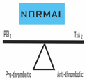
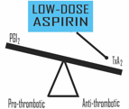

NSAIDs Review (simplified)    body {font-family: 'Open Sans', sans-serif;}

### NSAIDs Review (simplified)

Nonsteroidal anti-inflammatory drugs = (NSAIDs)  
NSAIDs are among the most frequently prescribed drugs in modern medicine.  
They are very effective in the alleviation of pain, fever, and inflammation.  
Aspirin was the original NSAID.  
Acetaminophen is also an NSAID.  
Today there are many non-aspirin NSAIDs.  
  
**Cyclooxygenase (COX)**  
Pain from INFLAMMATION involves the enzyme COX.  
COX is an enzyme that forms **prostanoids** (prostaglandins, prostacyclins, and thromboxanes) which are all responsible for the inflammatory response.  
Aspirin and non-aspirin NSAIDs inhibit COX to decrease pain, fever, and inflammation.  
  
**Generally, the inhibition of prostanoids leads to:**  
Analgesia  
Anti-inflammation  
Antipyretic effects  
Increased bleeding time  
Possible GI irritation and ulcers  
  
**GI Side Affects with NSAIDs  
**_Ulcers have been observed in 10-30% of patients on NSAIDs, and serious ulcer complications occur in 1-2% of patients (Conaghan, 2012; Seminerio et al, 2014)._  
  
**COX-1 and COX-2**  
In the 1990s it was discovered that there are two forms of COX: COX-1 and COX-2.  
COX-1 and COX-2 have similar but different roles.  
  
**Traditional nonselective NSAIDS  
**NSAIDs are commonly prescribed to treat many types of arthritis pain.  
Traditional NSAIDs like Motrin (ibuprofen), aspirin, and Aleve (naproxen) while effectively reducing inflammation and pain can cause GI irritation and bleeding.  
This is because they're non-selective, meaning they inhibit both COX-1 and COX-2.  
  
**About COX-1  
**COX-1 is more prevalent and present in most bodily tissues.  
In the GI tract, COX-1 maintains the normal lining of the stomach and intestines, protecting the stomach from digestive juices and ulcers.  
COX-1 is involved in kidney function (as is COX-2).  
COX-1 promotes platelet function via proper balance between PGI 2 and Thrombaxane A-2.  
COX-1 is associated with inflammation and pain, but much less than COX-2.  
  
**When COX-1 is inhibited by non-selective NSAIDS:**  
Increases in GI irritation and bleeding from the decrease in GI lining protection.  
Increases in bleeding time by inhibiting Thromboxane A-2, and thus less platelet aggregation.  
Decease in inflammation and pain.  
Decrease in GFR and renal function by blocking the production of autoregulatory renal prostaglandins PGI 2 and PGE 2.  
In healthy patients, the impact of autoregulatory renal prostaglandins on renal perfusion is limited.  
**Note:** PGI 2 and PGE 2 function primarily as vasodilators in the afferent arterioles.  
  
**Kidney Disease and NSAIDs (COX -1 and COX-2).**  
In patients with underlying kidney disease, renal function becomes dependent upon autoregulatory renal prostaglandins PGI 2 and PGE 2 formation.  
Inhibition of PGI 2 and PGE 2 formation in a compromised kidney may result in reduced GFR and acute kidney injury.  
(Patak et al, 1975; Catella-Lawson, 1999; Breyer et al 2001; Aronow et al, 2011).  
  
**NSAIDs are contraindicated with patients with renal impairment  
**In anesthesia, avoid administering NSAIDs to a patient with a creatinine (Cr) > 1.  
  
**Adverse renal events occur in 1-5% of patients taking NSAIDs.  
**2.5 million patients experience a NSAID-related nephrotoxic event annually.(Luciano & Perazella, 2015)  
  
**COX-2  
**Primarily found at sites of inflammation.  
Responsible for inflammation related pain (greater than COX-1)  
Involved in kidney function.  
Inhibits Thromboxane A-2 much LESS than COX-1.  
Note: Inhibition of COX-1 > COX-2 may lead to an imbalance between PGI 2 and thromboxane A-2, therefore resulting in increased platelet aggregation and thrombus.  
  
**A balance between PGI 2 and Thromboxane A-2 (TXA2) is important for homeostasis.**A natural balance between formation and release of PGI 2 and TXA2 in circulation is extremely important for the control of intra-arterial thrombi formation.  

****

  
**PGI 2 (prostacyclin):**  
Produced by vascular endothelium and inhibits platelet activation.  
Potent vasodilator, especially potent in coronary circulation.  
Repels the platelets from the inner vessel walls (intima).  
  
**Thromboxane A2 (TXA2)** ( _Does the opposite of PGI 2 )  
_When PGI 2 is decreased, the platelets stick to the endothelium and generate TXA2.  
TXA2 is a potent vasoconstrictor and induces platelet aggregation.  
  
**The administration of aspirin and non-aspirin NSIADS results in a PGI 2 \> TXA2  
**_Nonselective NSAIDS and Aspirin are considered “antiplatelet” drugs.”_PGI 2 \> TXAs results in less platelet aggregation, thus increasing bleeding time.  
Aspirin and non-aspirin NSAIDs inhibit platelet cyclooxygenase, thereby blocking the formation of thromboxane A2.  
These drugs produce a systemic bleeding tendency by impairing thromboxane-dependent platelet aggregation, consequently prolonging the bleeding time.  
Many surgeons request anesthesia providers **NOT** administer Toradol to their surgical patients in fear of increased bleeding time and hematomas.  

****

**  
“Irreversible” verses “Reversible” platelet inhibition**  
**Irreversible:** Meaning the platelet is inhibited for its entire circulating life-span.  
**Reversible:** Platelet is NOT inhibited for its entire life-span.  
**Aspirin** “ **irreversibly”** blocks platelet cyclooxygenase, therefore, its actions persist for the circulating lifetime of the platelet.  
The average life span of circulating platelets is 8-9 days.  
_This is why aspirin has become the cornerstone of secondary prevention of thrombotic cardiovascular events._  
**Non-aspirin NSAIDs “reversibly”** inhibit platelet cyclooxygenase and, therefore, the duration of their action on platelets depends on specific drug dose, serum level, and half-life.  
**Non-aspirin NSAIDS:** Motrin (ibuprofen) and Aleve (naproxen) are common over the counter NSAIDs.  
While effective, they can cause GI irritation and bleeding problems.  
  
**The goal to develop an NSAID with NO GI effects**  
Since COX-1 and COX-2 are both inhibited with nonselective NSAIDS, creating a selective NSAID COX-2 inhibitor (not inhibiting COX-1) would decrease GI irritation and bleeding.  
  
**Selective COX-2 Inhibitors have a higher incidence of cardiovascular toxicity**  
Truly selective COX-2 inhibitors have been shown to have no effect on gastric mucosal prostaglandin synthesis, resulting in less GI side effects  
Unfortunately, cardiovascular risks and complications including stroke, MI, and death have been reported with selective COX-2 inhibitors.  
**  
Two Selective COX-2 inhibitors were taken off the market  
**Rofecoxib (Vioxx)  
Valdecoxib (Bextra)Selective COX-2 inhibitor **Rofecoxib (Vioxx ®)** was once a very popular OTC NSAID.  
It was taken off the market due to mounting evidence of significant cardiovascular toxicity (Drazen, 2005).  
  
Selective COX-2 inhibitor **Valdecoxib (Bextra®)** was found to increase the risk of heart attack, stroke, and  serious, sometimes fatal, skin reaction.  
**  
Selective COX-2 Inhibitors and the imbalance of PGI 2 and TXA2**  
Vioxx (rofecoxib), and Bextra (valdecoxib) results in an imbalance of  
“PGI 2 being less than TXA2.”  
This occurs through altering the normal production balance of **PGI 2** vs **TXA2** by way of different cell types in the cardiovascular system.  
A greater TXA2 may lead to vasoconstriction and increased platelet aggregation, resulting in MI and stroke.  
  
**Safe Selective COX-2 Inhibitors  
Celecoxib (Celebrex ®)** is currently the ONLY FDA approved selective COX-2 inhibitor available in the US.  
  
**Celecoxib (Celebrex ®)** has a 10-20 fold selectivity for COX-2 over COX-1.  
**Meloxicam (Mobic, Mobicox) a drug used for rheumatoid arthritis** does **NOT** interfere with platelet function or thromboxane 2 levels.  
  
**Etoricoxib (Arcoxia ®)** is another Selective COX 2 Inhibitor with ~106 fold selectivity for COX-2 over COX-1 that is **NOT** yet available in United States.  
Celebrex is the only over the counter COX-2 inhibitor that remains on the market in the United States.  
Due to the withdrawal of Vioxx, the FDA scrutinized all NSAIDs and added warnings about cardiovascular risks to the prescribing instructions and/or drug labels.  
Diclofenic (Voltarin) and celecoxib (Celecoxib) are prescription only.  
  
Two other COX-2 inhibitors, Arcoxia (etoricoxib) and Prexige (lumiracoxib) are prescribed in other countries, but have been rejected by the FDA.  
Prexige was removed from the market in Australia and Canada due to related liver complications.  
  
**Ketorolac (Toradol),** an NSAID most commonly used in a hospital setting, is classified as a non-selective NSAID. However, Toradol is arguably very selective for COX-1 (which may increase GI irritation and bleeding times).******

  
Caldolor (Ibuprofen) IV** inhibits COX-1 300x less than Toradol.  
Caldolor is expensive, but favored over Toradol perioperatively.  
  
**Non-selective COX Inhibitors**  
Ibuprofen  
Naproxen  
These are the two most commonly used over the counter drugs.  
  
**Nonselective NSAIDS Side Effects:**  
Dose related inhibition of platelet aggregation.  
GI bleeding  
Renal dysfunction  
Altered bone healing  
Hypertension  
Bronchospasm  

****

  
_Tulane School of Medicine_  
  
**The American Heart Association recommendation with NSAIDS:  
**NSAIDs should be used at their lowest effective dose.  
  
**NSAIDs should be avoided in patients with cardiovascular risk factors:**  
Hypertension  
Hypercholesterolemia  
Angina  
Edema  
Recent cardiac bypass surgery  
A history of myocardial infarction or other CV events.  
  
**More NSAID Notes**  
**Arachidonic Acid**  
Arachidonic acid is metabolized by COX-1 and COX-2 to intermediate prostaglandins (PGG 2 , then PGH 2 ).  
These are then converted to other prostaglandins, which are mediators of pain, inflammation, and fever, as well as being gastro-protective.  
Therefore, when an NSAID inhibits COX-1 and COX 2 (mostly COX 2), it inhibits the  metabolism of arachidonic acid and the prostaglandins (that are mediators for pain and  inflammation).  
  
**Prostaglandins have other functions:  
**Regulate the constriction of the uterus.  
Affect constriction and relaxation of blood vessels.  
Involved in the aggregation of blood platelets.  
  
**In the stomach, COX-1 mediated production of prostaglandins PGE 2 & PGI 2 plays an important role in:**  
Production of bicarbonate.  
Production of mucus  
Regulation of normal blood flow  
  
**Prostaglandins PGE 2 & PGI 2** help to protect the cells lining the wall of the stomach from the erosive effects of stomach acid (stomach fluid has a normal pH of 1.5-3.5).  
When COX-1 is inhibited by nonselective NSAIDS, the stomach becomes prone to ulcers and bleeding with associated pain.  
(Wallace, 2008; Wikipedia:Gastric acid)  
  
On April 7, 2005, Pfizer withdrew Bextra from the U.S. market per the recommendations of the FDA. The FDA cited an increased risk of heart attack, stroke, and serious, sometimes fatal, skin reaction. This was a result of recent attention to prescription NSAIDs, such as Merck's Vioxx.  
Other reported side effects were angina and Stevens–Johnson syndrome.  
  

Elevation of cardiovascular risk by non-steroidal anti-inlfammatory drugs.  
Trends Cardiovasc Med March 12.  
Anwar A et al (2015):  
  
Aronow WS et al (2011): ACCF/AHA 2011 Expert Consensus Document on Hypertension in the Elderly. Circulation. 123:2434-2506. doi: 10.1161/CIR.0b013e31821daaf6.  
  
Rationale, design, and governance of Prospective Randomized Evaluation of Celecoxib Integrated Safety versus Ibuprofen Or Naproxen (PRECISION), a cardiovascular end point trial of nonsteroidal antiinflammatory agents in patients with arthritis.  
Am Heart J 157(4):606-612. doi:10.1016/j.ahj.2008.12.014.  
Becker MC et al (2009):  
  
Cyclooxygenase-2 selective inhibitors and the kidney.  
Curr Opin Crit Care 7:393–400.  
Breyer MD et al (2001):  
  
Barash, Stoelting, Cullen, Calahan, Stock, Ortega and Sharar; Clinical Anesthesia Fundamentals ; 2015  
  
The coxibs, selective inhibitors of cyclooxygenase-2._N. Engl. J. Med._ 345, 433–442 (2001).  
FitzGerald GA, Patrono C.  
  
**Cyclooxygenase-selective inhibition of prostanoid formation** : transducing biochemical selectivity into clinical read-outs.  
_J. Clin. Invest._ 108(1), 7–13 (2001).  
Patrono C, Patrignani P, García Rodríguez LA.  
  
**"Defining the COX Inhibitor Selectivity of NSAIDs: Implications for Understanding Toxicity."**  
Web MD LLC. Retrieved 17 February 2013.  
Knights, Kathleen.  
  
"INHIBIT ORS OF CYCLOOXYGENASES: MECHANISMS, SELECTIVITY AND USES" (PDF).  
Journal of Physiology and Pharmacology. Retrieved 16 March 2014.  
  
Anticoagulation 3rd Edition  
_Regional Anesthesia and Pain Medicine_ :  
January/February 2010 - Volume 35 - Issue 1 - pp 64-101  
doi: 10.1097/AAP.0b013e3181c15c70  
  
Asra Practice Advisory  
British Journal of Anaesthesia 111 (S1): i96–i113 (2013) doi:10.1093/bja/aet401  
http://bja.oxfordjournals.org/content/111/suppl\_1/i96.full.pdf+html  
  
Regional anaesthesia in the patient receiving antithrombotic and antiplatelet therapy  
http://bja.oxfordjournals.org/content/107/suppl\_1/i96.full#ref-4  
  
T.T. Horlocker  
Department of Anesthesiology, Mayo Clinic, Rochester, MN 55905, USA  
  
Horlocker TT, Wedel DJ, Benzon H, et al. Regional anesthesia in the anticoagulated patient: defining the risks (the second ASRA Consensus Conference on Neuraxial Anesthesia and Anticoagulation). Reg Anesth Pain Med 2003;28:172-97  
  
Clinical Anesthesia Fundamentals; 2015  
Barash, Cullen, Stoelting, Cahalan, Stock, Ortega and Sharar  
  
Rheumatology (Oxford) (2002) 41 (4): 458-461.  
Platelet function is inhibited by non‐selective non‐steroidal anti‐inflammatory drugs but not by cyclo‐oxygenase‐2‐selective inhibitors in patients with rheumatoid arthritis  
  
E. A. J. Knijff‐Dutmer; E. M. Kalsbeek‐Batenburg; J. Koerts and M. A. F. J. van de Laar  
Major Side Effects of NSAIDS & COX-2 Selective InhibitorsTulane School of Medicinehttp://tmedweb.tulane.edu/pharmwiki/doku.php/nsaid\_side\_effects  
Acta Biol Med Ger. 1978;37(5-6):715-23.  
A possible role of thromboxane A2 (TXA2) and prostacyclin (PGI2) in circulation.  
Gryglewski RJ, Dembínska-Kieć A, Korbut R.  
https://www.ncbi.nlm.nih.gov/pubmed/369254  
  
COX-1 and COX-2 inhibitors.  
Best Practice & Research Clinical Gastroenterology. 2001 Oct;15(5):801-20.  
Hawkey CJ