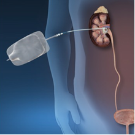

Percutaneous Nephrostomy Tube Insertion    body {font-family: 'Open Sans', sans-serif;}

### Percutaneous Nephrostomy Tube Insertion

Nephrostomy tube insertion involves creating an opening into the kidney to maintain temporary or permanent urinary drainage through a thin catheter.  
\- Nephrostomy procedures are usually performed by an interventional radiologist in the radiology department.  
\- It requires ultrasound guidance, CT fluoroscopy, or image intensifier.  
\- Most of the time, anesthesia is not required.

****

\- The procedure involves perforating the skin, using a guide-wire, passing a thin catheter through the body wall and renal parenchyma, and positioning the tip in the renal pelvis or a calyx where the urine collects.  
  
**The function of nephrostomy tube:  
**\- Provide urinary drainage when the ureter is obstructed and unable to relieve the obstruction via cystoscopic retrograde access.  
\- This permits the kidney to function optimally and protects it from further damage.  
\- Without another way for urine to drain, back pressure would rise within the urinary system, dilating the kidney and possibly resulting in hydronephrosis.  
  
**Possible Indications:**  
\- Acute or chronic upper urinary tract obstruction in which access to the kidney is impossible from the lower urinary tract via the ureter.  
\- For nephrolithotomy to remove staghorn calculi and large or lower-pole kidney stones.  
\- Renal pelvis disorders (e.g., UPJ obstruction, horseshoe kidneys, ureter duplex, ureter fissures, double renal collecting systems).  
  
**The nephrostomy tube is also used to gain access to the upper urinary tract for the following antegrade endourologic procedures:**  
\- Nephrolithotomy  
\- Intracorporeal lithotripsy  
\- Chemical stone dissolution  
\- Antegrade radiologic studies of the ureter.  
\- Double-J stent placement  
  
**Nephrostomy tube insertion for nephrolithotomy:**  
\- A nephrostomy tube is often inserted as a source of entry for a urologist to perform a nephrolithotomy procedure in the main operating room immediately following the nephrostomy tube insertion.  
\- This means the patients will need transported form radiology to a main operating room.  
\- In this scenario, it is more convenient to perform general anesthesia/ETT for this procedure (rather than MAC) and transport the patient intubated to the main operating room.  
\- Upon arrival, the intubated patient is already asleep and needs to be connected to the anesthesia machine.  
\- Communication between radiology and the main operating room is essential since the operating room staff should have the OR room available to immediately follow the tube insertion.  
\- Consider administrating an amnestic medication to prevent awareness prior to the transport.  
\- In many instances, the anesthesia provider resumes care and manages both cases.  
  
**Pre-op labs:**  
CBC, BMP and coags  
Elevated creatinine is common.  
  
**Anesthetic:** Usually, MAC  
**General/ETT:** When a nephrolithotomy is scheduled following the procedure.  
**Position:** Lateral or prone  
**Duration:** 15-60 minutes  
**EBL:** Minimal  
**IV Access:** 20G or 22G is acceptable  
  
**Possible Complications:  
**\- Hemorrhage\- Septicemia  
\- Polyurea  
\- Pleuritis  
\- Pleural effusion  
  
**More Notes:**  
\- The most common cause of blockage necessitating a nephrostomy tube is cancer, especially ovarian cancer and colon cancer.  
\- Nephrostomies may also be required to treat pyonephrosis, hydronephrosis, and kidney stones.  
  

Nephrostomy  
Stefan H Hautmann, MD,  
Medscape (accessed 02/2022)  
https://emedicine.medscape.com/article/445893-overview  
  
Jaffe, Richard A.  _Anesthesiologist's Manual of Surgical Procedures_ . Philadelphia, Pa.: Lippincott  
Williams & Wilkins, 2009.  
  
Kaplan, Steven A., Alan W. Partin, and Anthony Atala. _Minimally Invasive Procedures in Urology_ . New  
York: Dekker, 2005.  
  
Macksey, Lynn Fitzgerald.  _Surgical Procedures and Anesthetic Implications: A Handbook for Nursing  
Practice_ . Sudbury, MA: Jones & Bartlett Learning, 2011.   
  
McAninch, Jack W., Tom F. Lue, and Donald R. Smith. _Smith and Tanagho's General Urology / Editors, Jack W. McAninch, Thomas F. Lue_ . New York: McGraw-Hill Professional, 2013.