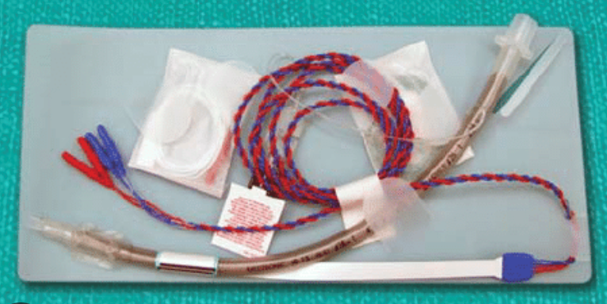
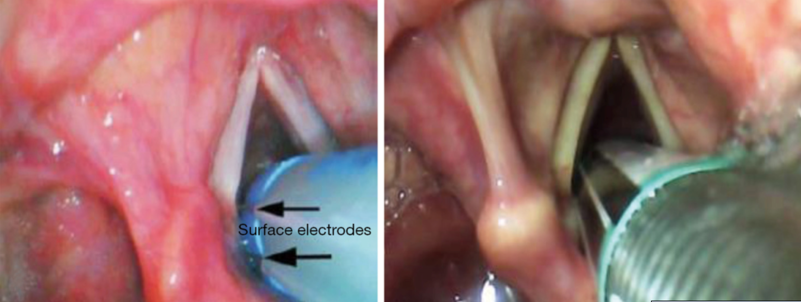

  NIM ETT section { margin-bottom: 20px; } table { border-collapse: collapse; } table, tr, th, td { border: 1px solid black; } th, td { padding: 0px 8px 0px 8px; text-align: left; vertical-align: top; } h3, p, ol.custom-counter, li { margin: 0px; padding: 0px; } .text-red { color: red; } .text-black { color: black; } ul.custom-dash { list-style: none; padding-left: 0; margin: 0; } ul.custom-dash > li { display: flex; align-items: flex-start; } ul.custom-dash > li::before { content: "–"; margin-right: 0.5em; flex-shrink: 0; line-height: 1; } ul.custom-dash > li > \*:not(::before) { flex: 1; } ul.custom-dash > li.no-dash::before { content: ""; width: 1em; margin-right: 0.5em; flex-shrink: 0; } /\* Change the ol style \*/ ol.custom-counter { list-style: none; padding-left: 0; counter-reset: custom calc(var(--start, 1) - 1); } ol.custom-counter li { counter-increment: custom; margin-bottom: 5px; } ol.custom-counter li::before { content: counter(custom) ") "; } /\* This is just for this file \*/ ul.custom-bullet-arrow { list-style: none; padding-left: 0; margin: 0; } ul.custom-bullet-arrow > li { display: flex; align-items: flex-start; } ul.custom-bullet-arrow > li::before { content: "↑"; margin-right: 0.5em; flex-shrink: 0; } ul.custom-bullet-arrow > li.no-arrow::before { content: ""; width: 0.5em; margin-right: 0.5em; flex-shrink: 0; } ul.custom-bullet\_arrow ul { list-style-type: disc; padding-left: 1.5em; margin-top: 0.5em; } img.resized-200 { width: 200px; height: auto; } img.resized-400 { width: 400px; height: auto; } img.resized-600 { width: 600px; height: auto; } .mb-10px { margin-bottom: 10px; } .mb-20px { margin-bottom: 20px; } .mt-10px { margin-top: 10px; } .mt-20px { margin-top: 20px; } .reference-notes { font-size: 11px; } .additional-notes { font-size: 13px; } .text-indent-45px { text-indent: 45px; } .text-bold { font-weight: bold; } .text-italic { font-style: italic; } .text-center { text-align: center; } .border { border: 1px solid black } .padding-notes { padding: 0px 5px; }

### NIM ETT

(NIM EMG Endotracheal Tubes)

-   The NIMS (Neural Integrity Monitor System) endotracheal tube is used for surgical procedures in the head and neck, where there is a high risk of damaging motor nerves, especially those controlling the vocal cords.
-   The ETT contains built-in electrodes that provide real-time feedback on the nerve function via electromyography (EMG).
-   If the surgeon's instruments get close enough to the nerve, the NIMS will alarm.

The NIM EMG endotracheal tube offers intraoperative recurrent laryngeal nerve (RLN) monitoring for the following procedures:

Thyroidectomy and parathyroidectomy:

These are the most common procedures using an NIM ETT.

The tube monitors the RLN, which is located near the thyroid and parathyroid glands and controls the vocal cords.

It helps the surgeons to identify, locate, and protect the nerve, especially during repeat surgeries or when anatomy is distorted.

**Hypoglossal nerve stimulator implantation (Inspire):** To monitor the vagus and RLN.

Rare, but has also been documented for:

Carotid Endarterectomy

Cricopharyngeal myotomy

Excision of Zenker's Diverticulum

Hemithyroidectomy

Neck biopsy

Neck dissection

Parathyroidectomy

Partial laryngectomy

Substernal goiter

Acoustic tumor removals

Proper placement with intubation:

Unfortunately, the NIM ETT has to be correctly placed to prevent nerve injury.

Malpositioning of the endotracheal surface electrodes can result in inadequate intraoperative neuromonitoring (IONM) and increase the risk of recurrent laryngeal nerve injury.

How to properly place a NIM ETT:

First, you will need to identify the stainless-steel surface electrode wires (2 total) running down opposite sides of the tube.

You will see either a blue or white band wrapped around the ETT just above the cuff

(A white tube has a blue band, and a blue tube has a white band).

You only need to know two insertion facts:

The band above the cuff should be directly between the cords.

Those two wires (on the band) should be in the 3 and 9 o'clock position in contact with the vocal cords.

It helps to have the wires already in that position while inserting the tube.

Use a GlideScope and a witness to verify proper ETT placement.

Despite proper placement of the NIM ETT, some surgeons complain that it is still not in the correct place.

Below is a solution.

The best way to appease the surgeon and assure proper placement of the NIM Tube:

Have the surgeon present on induction.

Properly position the head, including the shoulder roll, before intubation under the surgeon's approval.

Perform a GlideScope intubation and let the surgeon approve the placement before you secure the tube.

**Note:** If you insert a shoulder roll or make any head adjustments after the NIM ETT is secured, this may cause the tube to move away from its optimal position, located at the level of the cords.

Related Nerve Monitoring Products by Metronic

www.medtronic.com

Chu, Lu, Tsai, Kuo, Chen, Lee, and Chiang. Optimal depth of NIM EMG endotracheal tube for intraoperative neuromonitoring of the recurrent laryngeal nerve during thyroidectomy. World J Surg. 2008 Sep;32(9):1935-9.