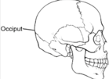

Occiput Presentations Summary    body {font-family: 'Open Sans', sans-serif;}

### Occiput Presentations Summary

**Cephalic presentation (head presentation** or **head-first presentation)** is a situation at childbirth where the fetus is in a longitudinal lie and the head enters the pelvis first.  
  
Occiput the posterior portion of the head or skull.

****

The most common form of cephalic presentation is the VERTEX presentation where the occiput is the leading part (the part that first enters the birth canal).  
All other presentations are abnormal (malpresentations) which are either more difficult to deliver or not deliverable without a C-section.  
  
The terminology is based on the five boney plates that make up the fetal head and the position of the _anterior and posterior fontanels_ during a vaginal exam.  
  
**Occiput Anterior (OA)** Is what we want! OA is the most favorable position for the baby to be in.**OA** indicates that the baby is coming down the birth canal, head down with the posterior of the head coming under the pelvic bone and the baby’s face is facing the mother’s sacrum. Some baby’s heads may be either slightly ROA (right occiput anterior) or LOA (left occiput anterior) or their entire body may be slightly ascynclitic (the entire body may be slightly right or left leaning). Moms with OA progress well.  
  
OA = Occiput Anterior (head down, facing mom’s back); good  
OP = Occiput Posterior (head down, facing mom’s front); not good  
OL = Occiput Lateral (head down, facing mom’s side).  
L or R written in front of these indicates which side of the mom’s body the baby is lying on.  
  
**Occiput Posterior is what we DON’T want.  
**Moms with the fetus in OP position progress slower and hurt more.  
Around 75% fetuses at term that are OP (occiput posterior) will require delivery by cesarean section because of labor dystocia (literature varies).  
  
Occiput posterior positions, including direct OP, LOP (Left Occiput Posterior) and ROP (Right Occiput Posterior) are positions favored by certain shapes of the pelvic.  
Babies can deliver in the posterior position, but the pelvis needs to be large enough and it usually takes longer.  
  
Forceps are often used to deliver babies in this position, but there is controversy whether the fetus should be delivered in the posterior position, or rotated with the forceps to the anterior position. Posterior presentations carry a higher incidence of assisted delivery, cesarean birth, anal sphincter injury, augmented labor and prolonged labors.  
  
**Posterior position is more painful for the mom.  
**When the baby is in a posterior position, the bony part of the head is pressed against the bony part of the pelvis. The pressure of the contractions pushes the head into the pelvis and can cause tremendous back pain. Some women feel the pressure even between contractions.  
Few women expect to feel their contractions as mostly a back ache.  
Because the posterior position puts bone near bone, it is more difficult for the baby to fit into the pelvis.  
  
Posterior babies generally require longer labors, and if the baby persists in a posterior position, second stage may be longer than average as well. This can be fatiguing for a woman.  
**Occiput posterior (OP) position is not good.**  
Occiput posterior (OP) position is the most common fetal malposition. It is important because it is associated with labor abnormalities that may lead to adverse maternal and neonatal consequences.

Cucco UP: Face presentation. Am J Obstet Gynecol 94: 1085, 1966  
http://www.uptodate.com/contents/occiput-posterior-position/abstract/1