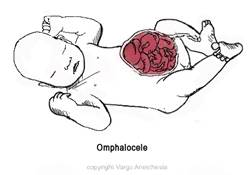

Omphalocele (Exomphalos)   

### Omphalocele (Exomphalos) Review

  
_By Dina Velocci CRNA_  
_Exomphalos literally translated from the Greek means ~‘~ outside the navel._

__Gastroschisis vs Omphalocele  
Omphalocele has a sac and is often associated with anomalies.  
Remember Omphalocele –“sealed (sac) with anomalies.”  
Gastroschisis- has no sac with few associated anomalies

**Omphalocele** results from a failure of the gut to migrate into the abdominal cavity at about the 10th week of gestation. Omphalocele is more than twice as likely as gastroschisis to be associated with other congenital anomalies, and more than half of all babies with omphalocele have another congenital condition. The two most common associated syndromes are pentalogy of Cantrell and Beckwith-Wiedemann syndrome.

**An omphalocele always has a sac**  
Ten percent of the sacs rupture, which can lead to infection/peritonitis. The umbilical cord arises from the apex of the sac.  
The sac of a small omphalocele contains only an intestinal loop, while the sac of a large (giant) omphalocele may contain intestinal loops, liver, spleen and bladder. The sac provides some protection, therefore the loss of fluids and heat is significantly less than in gastroschisis. These cases are not considered to be a surgical emergency, therefore an evaluation for associated congenital abnormalities and medical intervention and optimization should be accomplished before surgical intervention is undertaken.

The CDC estimates that each year about 775 babies in the United States are born with an omphalocele. Omphalocele occurs in 1 in 3,200 to 1 in 10,000 babies delivered. The condition is more common in males than in females.  

Overall death rates range from 25% to 60% in reports from various institutions, but death is often due to associated conditions. Most infants with Cantrell’s pentalogy die as a result of heart and lung failure and infection.

According to the CDC,, women who consume alcohol or are heavy smokers during pregnancy are more likely to have a baby born with omphalocele. Maternal obesity and the use of certain medications during pregnancy (e.g. selective serotonin-reuptake inhibitors) can increase the risk of omphalocele.

**How is an omphalocele detected?**  
Omphalocele is commonly recognized during a prenatal ultrasound. Polyhydramnios is often present. Screening may be triggered by an elevated alpha-fetoprotein (AFP), and an amniocentesis may be ordered to evaluate for chromosomal abnormalities. Fetal echocardiogram and MRI may be required to evaluate heart and lung function.

**Medical Facility**  
Early detection of the omphalocele allows for counseling, delivery planning and referral to a high-risk delivery center.

The fetus with an omphalocele is relatively well shielded from trauma and complications within the womb. After birth, however, the exposed intestines and/or liver have to be protected from direct trauma and infection. Because of this, it is recommended that deliveries take place in a hospital equipped with a Level III NICU as well as a specialized team of neonatal surgeons. Many babies with omphalocele are premature.

**Mode of Delivery**  
Vaginal delivery is appropriate in most cases, although giant omphaloceles with exposed liver tissue may require cesarean section.

**After Delivery**  
Neonates with intact omphaloceles are usually in no distress unless associated pulmonary hypoplasia is present. At birth, the insertion of an orogastric tube to remove any swallowed air and to prevent distention of the intestines. This will also enhance the placement of organs back into the abdomen.

The baby should be carefully examined to detect any associated problems, such as Beckwith-Wiedemann syndrome, chromosomal abnormalities, congenital heart disease, or any other associated malformations.

Maintenance IV fluids are started. The omphalocele sac is covered with a non-adherent dressing, such as Xeroform and Kerlix, and covered with Saran wrap to preserve body heat and moisture.

Prophylactic antibiotics may be given preoperatively if an associated intestinal anomaly is suspected.

**\*\*Infant must be kept in a heated environment\*\* (loss of heat is profound)**

**EMBRYOLOGY**

Prior to the 10th week of gestation, the intestine of the fetus is herniated into the umbilical stalk. At 10-12 weeks of gestation, the intestine retracts into the abdomen. If this retraction fails to occur, omphalocele may result.  
  
Omphalocele by itself is easily treatable, and children can live a normal life.

Unfortunately, Omphalocele is often associated with other major congenital anomalies, upon which prognosis depends.

**Chromosomal Anomalies:**  
Around 30%, most common are  
Trisomy 13 (Patau syndrome)  
Trisomy 18 (Edward's syndrome)  
Trisomy 21(Downs Syndrome)

**  
Beckwith-Weidemann Syndrome**  
Rare condition resulting from the abnormal regulation of genes in a particular region of chromosome 11. Many infants with this condition are born with:  
  
Omphalocele  
Macroglossia - large tongue  
Gigantism- due to excess human growth hormone  
Visceromegaly - enlargement of internal organs  
Pancreatic hyperplasia leads to **hypoglycemia** in 50% of patients  
Polycythemia with associated hyper viscosity

**Thoraco-Abdominal Syndrome (Pentalogy of Cantrel)**  
Five characteristic findings:  
Omphalocele  
Anterior diaphragmatic hernia  
Sternal cleft-hole in the sternum  
Ectopia cordis-heart outside the chest  
Intracardiac defect - either a ventricular septal defect or a diverticulum of the left ventricle  
_Most infants (around 75%) with Cantrell’s pentalogy die as a result of heart and lung failure and infection._

**Urinary tract defects** - **_Cloacal extrophy_ and anal atresia**  
**Neurological defects** - caudal anomalies- meningomyelocele

**Skeletal defects -** limb malformations  
**Dental malocclusion**  
These infants also have an increased incidence of cancer of the kidneys, liver, and adrenal glands.

**Is the malformation BELOW or ABOVE the umbilicus?**

**ABOVE** the umbilicus may involve other defects involving the diaphragm, sternum, and heart, including pentalogy of Cantrell

**BELOW** the umbilicus there may be other defects affecting the bladder, rectum, and lower spinal cord

**Lower Midline Syndrome** -opening of the pelvic organs (bladder, rectum, uterus) outside of the abdomen and lack of development of the colon, vagina, and anus. Usually requires bladder and genitalia reconstruction. It may be difficult to distinguish gender from external genitalia, due to a very short penis in boys, and sex assignment must be considered carefully at an early stage.  
Bladder or cloacal extrophy.  
Pelvic bones malformationsSpinal cord and abnormal development of the lower backbone.  
  
**NOTE: Surgical Repair of Omphaloceles  
**Should wait until cardiopulmonary defects, if present, are repaired

**Omphalocele classified by size**  
The smaller the defect, the better the outcome.  
An omphalocele defect may vary from **<4cm (small) to >10cm (giant).**  
A small to medium omphalocele can be reduced right away. The reduction involves the surgeon pushing the organs through the hole and into the abdominal cavity.  
A giant omphalocele cannot be immediately reduced due to the discrepancy between the limited capacity of the under developed abdominal cavity and the larger volume of the herniated organs. Primary closure is unlikely for moderate to large defects and should be abandoned if measurement of intragastric or visceral pressure is > 20 cm H2O, if peak airway pressure increases, and if central venous pressure increases by more than 4 cmH2 O.

**Small Omphaloceles**  
**Small Omphaloceles (< 4 cm -gulf ball size)**  
These are easily repaired.  
If the infant is stable (depending on associated anomalies) the surgical procedure is straightforward and done in the first few day of life the abdominal contents are placed into the abdomen. Some surgeons will leave the sac intact and repairing the fascia and skin over it. Most surgeons excise the sac and do a complete intra-abdominal exploration. The sac is sharply removed at the skin fascia edge and careful ligation of the umbilical vessels. Then there is closure of the muscle and skin of the abdominal wall.

**Surgical Repair of Medium-Sized Defects**  
Medium-sized defects are managed by careful removal of the sac with ligation of the umbilical vessels. The surgeon will manually use his hand to stretch abdominal cavity to enlarge it. The liver and then the bowel are reduced (placed) into the abdomen. The abdominal muscle and fascia may or may not be closed. If there is not enough slack to close the abdominal muscle and fascia, the abdominal wall is closed surgically with a plastic patch made of Gore-Tex. There remains a ventral hernia, which can be repaired 6-12 months later.

**Surgical Repair of Giant Omphalocele (>14cm-grapefruit size)**  
Initial closure of the omphalocele is usually not possible because of the discrepancy between the smaller abdominal cavity versus the volume of the herniated organs. Attempting to reduce the omphalocele can obstruct the bowel, compress major blood vessels and restrict ventilation. Many infants with a giant omphalocele are already mechanically ventilated from a narrow thoracic cage deformity and hypoplastic lung.

**  
Giant Omphaloceles consists of two main options**  
1\. Surgically reducing the organs-in stages using a silo  
2\. “Paint and Wait” (P&W)- Non-Operative

**Surgical Reduction (staged approach)-older method**  
The sac is covered with a special synthetic material, which is then stitched in place creating a silo. Gradually, the organs are squeezed through the silo into the abdominal cavity over a period of 3 to 10 days in the NICU, with the help of gravity. When the organs are returned to the abdominal cavity, the silo is removed. The infant is then taken to surgery for the surgeon to close the abdominal wall. Many time, only the skin can be closed (not abdominal muscle), leaving the infant with a ventral hernia. Alternatively, Gore-Tex may be used to close the hole. A pediatric plastic surgeon will likely do the final closure of the skin in order to minimize scarring and fabricate a normal umbilicus.

**“Paint and Wait”**  
Involves the application of Silvadene or Flamazine cream to toughen the sac. The parents are taught how to apply the creams and perform dressing changes and the baby is sent home. The sac becomes epithelialized (skin growing over the sac) and joins the surround abdominal skin. Surgery to close the ventral hernia is postponed for 6-12 months.

**What if the Omphalopcele Sac Ruptures**  
10% of omphaloceles rupture. This is concerning due to the risk of infection/peritonitis and loss of insensible fluid. These patients require anitibiotics and significant fluid resuscitation. The remaining sac and its contents may be covered temporarily with a biologic dressing. Many times the sac may be repaired until further surgery. A baby with a ruptured omphalocele is treated the same way as a baby with gastroschisis.

**References**  
Ashcraft, Keith W. _Pediatric surgery._ W. B. Saunders Company, 2000.  
Alwan S, Reefhuis J, Rasmussen SA, Olney RS, Friedman JM, & the National Birth Defects Prevention Study. Use of Selective Serotonin-Reuptake Inhibitors in Pregnancy and the Risk of Birth Defects. N Engl J Med, 2007;356:2684-92.  
Barisic, I. et al. "Evaluation of Prenatal Ultrasound Diagnosis of Fetal Abdominal Wall Defects by 19 European Registries." _Ultrasound Obstet Gynecol_ 18 (October 2001): 309–16.  
Bird TM, Robbins JM, Druschel C, Cleves MA, Yang S, Hobbs CA, & the National Birth Defects Prevention Study . Demographic and environmental risk factors for gastroschisis and omphalocele in the National Birth Defects Prevention Study. J Pediatr Surg, 2009;44:1546-1551.  
Ein SH, Langer JC. Delayed management of giant omphalocele using silver sulfadiazine cream: an 18-year experience. _J Pediatr Surg_. 2012;47(3):494-500.  
Gross RE. A new method for surgical treatment of large omphaloceles. _Surgery._ 1948;24(2):277-92  
Parker SE, Mai CT, Canfield MA, Rickard R, Wang Y, Meyer RE, et al; for the National Birth Defects Prevention Network. Updated national birth prevalence estimates for selected birth defects in the United States, 2004-2006. Birth Defects Res A Clin Mol Teratol. 2010;88(12):1008-16.  
Pillitteri, Adele. _Maternal & Child Nursing: Care of the childbearing & childrearing family._ 3rd edition. Lippincott, 1999.  
Saxena, A. and G.H. Willital. "Omphalocele: Clinical Review and Surgical Experience Using Dura Patch Grafts." _Hernia_ 6 (July 2002): 73–8  
Stoll C, Alembik Y, Dott B, Roth MP. Omphalocele and gastroschisis and associated malformations. Am J Med Genet A. 2008 May 15;146A(10):1280-5.  
Waller DK, Shaw GM, Rasmussen SA, Hobbs CA, Canfield MA, Siega-Riz AM, Gallaway MS, Correa A, & the National Birth Defects Prevention Study. Prepregnancy obesity as a risk factor for structural birth defects. Arch Pediatr Adolesc Med, 2007;161(8):745-50.