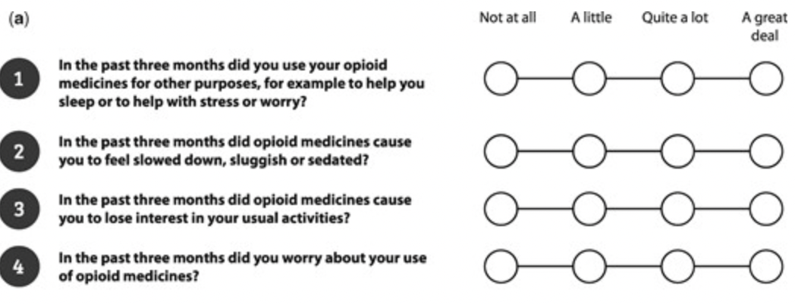
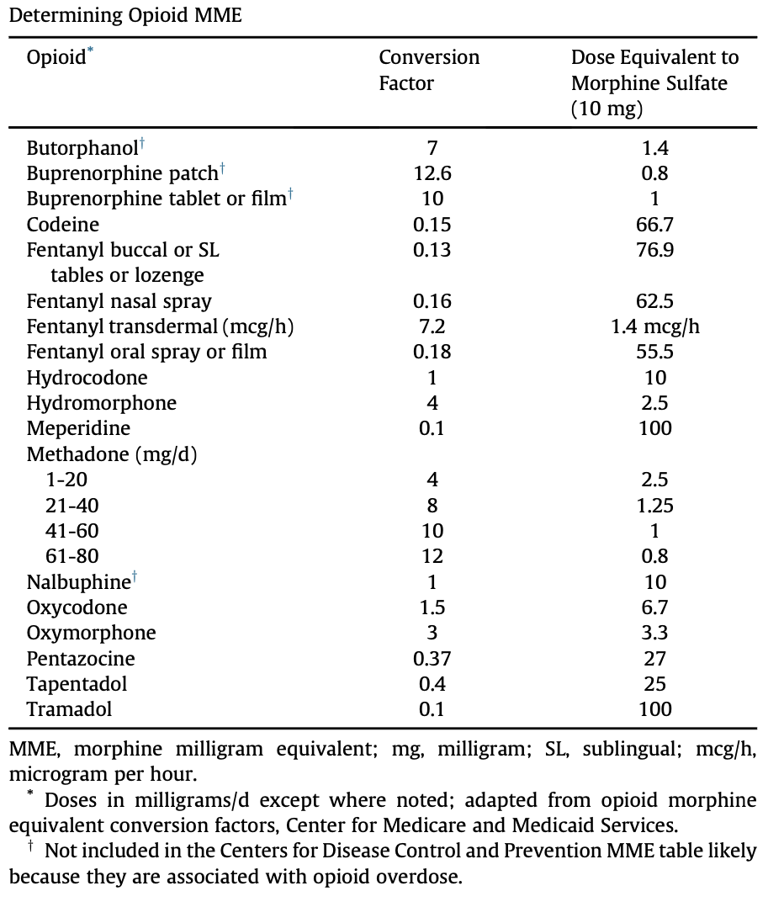

Opioid Use Disorder (OUD) Preoperative Screening   body {font-family: 'Open Sans', sans-serif; padding-left: 10px;}

### Opioid Use Disorder (OUD) Preoperative Screening

**Preoperative Considerations:**  
  
**OUD Screening Tools** (four-item screening tool for prescription OUD)

-   Stigma significantly underreports this condition in the preoperative period
-   Proper identification is crucial to plan appropriate intraoperative strategy
-   OWLS Tool to identify prescription opioid abuse

****

-   COMM (Current Opioid Misuse Measure) to identify opioid use disorder

**Calculation of daily MED for Opioid Rotation:**

-   Determine dose of current opioid consumption to aid with opioid rotation intra- and post-op:
-   First, calculate 24-hr current daily opioid dose (dose/frequency)
-   Convert this dose to morphine equivalent dose (MED) with equianalgesic table below
-   Select new opioid from different class and determine the MED of new opioid.
-   Multiply the MED by the conversion factor of desired opioids to obtain daily opioid dose.
-   Decrease this dose by 25-50% for the starting dose (due to incomplete cross-tolerance)
-   Then divide this daily dose by the desired frequency of administration (depends on duration of action and patient factors)

****

**  
Assess for the comorbidities/sequela Associated with OUD:**

-   HTN
-   Dilated cardiomyopathy
-   GERD, reduced gastric motility → Aspiration risk
-   Anxiety/depression caution for concomitant drug abuse
-   Other: Difficult IV access, risk of infectious disease (hepatitis, HIV)
-   Increased hospital stays and adverse outcomes

  
  

Education for Perioperative Anesthetic Management of Opioid Use Disorder  
By Rachel Pelletier, Keri Mulhern and Elizabeth Lucaj  
Florida Gulf Coast University  
  
Coluzzi, F., Bifulco, F., Cuomo, A., Dauri, M., Leonardi, C., Melotti, R. M., Natoli, S., Romualdi, P., Savoia, G., & Corcione, A. (2017).  
The challenge of perioperative pain management in opioid-tolerant patients.  
_Therapeutics and Clinical Risk Management_ , _13_ , 1163–1173.  
https://doi.org/10.2147/TCRM.S141332  
  
Doi, K., Shimoda, R., & Gibbons, G. (2014).  
Improving pain management in orthopedic surgical patients with opioid tolerance.  
_Nursing Clinics of North America_ , _49_ (3), 415–429.  
https://doi.org/10.1016/j.cnur.2014.05.015  
  
Picco, L., Middleton, M., Bruno, R., Kowalski, M., & Nielsen, S. (2020).  
Validation of the OWLS, a Screening Tool for Measuring Prescription Opioid Use Disorder in Primary Care. _Pain Medicine_ , _21_ (11), 2757–2764.  
https://doi.org/10.1093/pm/pnaa275  
  
American Society of Addiction Medicine. (2020).  
The ASAM national practice guideline for the treatment of opioid use disorder: 2020 focused update. _Journal of Addiction Medicine_ , _14_ (2S), 1–91.  
https://doi.org/10.1097/ADM.0000000000000633  
  
Hyland, S. J., Brockhaus, K. K., Vincent, W. R., Spence, N. Z., Lucki, M. M., Howkins, M. J., & Cleary, R. K. (2021).  
Perioperative pain management and opioid stewardship: A practical guide. _Healthcare_ , _9_ (3), 1–56.  
https://doi.org/10.3390/healthcare9030333  
  
Macintyre, P. E., Roberts, L. J., & Huxtable, C. A. (2020).  
Management of opioid-tolerant patients with acute pain: Approaching the challenges. _Drugs_ , _80_ (1), 9–21.  
https://doi.org/10.1007/s40265-019-01236-4  
  
Sibrack, J., & Hammer, R. (2022).  
Methocarbamol. _StatPearls Publishing_ . Retrieved February 18, 2023, from  
https://www.ncbi.nlm.nih.gov/books/NBK565868/  
  
Aroke, E. N., McMullan, S. P., Woodfin, K. O., Richey, R., Doss, J., & Wilbanks, B. A. (2020).  
A practical approach to acute postoperative pain management in chronic pain patients.  
_Journal of PeriAnesthesia Nursing_ , _35_ (6), 564–573.  
https://doi.org/10.1016/j.jopan.2020.03.002