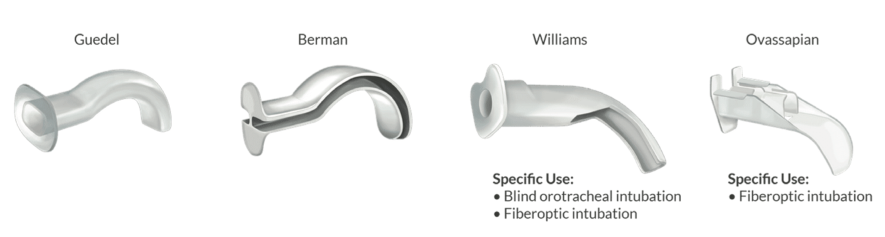

Oropharyngeal Airways (OPA)    body {font-family: 'Open Sans', sans-serif;}

### Oropharyngeal Airways (OPA)

In anesthesia, OPAs are most commonly used after induction and emergence.An OPA is an airway adjunct used to maintain or open the airway by displacing the tongue from the posterior wall of the pharynx, treating or preventing upper airway obstruction.  
Perioperatively, this becomes common with induction and emergence to anesthesia as the patient is unconscious.  
**There are several types, including:**  
Guedel  
Berman  
Williams  
Ovassapian

****

**Some OPAs have a hole in the middle.  
**The Williams and Ovassapian airways have large openings (holes) for fiberoptic scope and endotracheal tube to facilitate oral fiberoptic intubation.  
  
**Four parts of an OPA:**  
Flange  
Body  
Tip,  
Channel - to allow for the passage of air and suction.  
  
**OPA ranges:** **40-110 mm**  
**110 mm:** Large adult male  
**100 mm:** Adult male  
**90 mm:** Adult female  
**80 mm:** Small adult female  
  
**When to avoid using an OPA:**  
Intact upper airway reflexes.  
If the patient can cough, they still have a gag reflex  
Foreign body airway obstruction  
Nasal fracture  
Actively bleeding nose  
  
**Possible adverse effects and complications of an OPA with intact upper airways:  
**Coughing  
Gagging  
Vomiting  
Biting  
Laryngospasm  
  
Withdrawing the OPA is the primary treatment.  
In some instances, the patient may benefit from deepening the anesthetic.  
In the setting of laryngospasm, the patient may benefit from CPAP, application of firm pressure at the laryngospasm notch (otherwise known as Larson’s maneuver), or a small dose of succinylcholine.  
**  
Possible Iatrogenic injury from OPAs:**  
Dental damage  
Pinching the lips or tongue  
Ischemia and tissue necrosis (extreme cases)  
  
Airway obstruction can still occur from an oversized OPA as it could displace the epiglottis towards the glottic opening.  

Oropharyngeal Airway  
StatPearls, July, 2023 (accessed 02/2024)  
Danny Castro; Lori A. Freeman.  
https://www.ncbi.nlm.nih.gov/books/NBK470198/