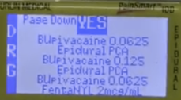
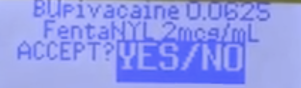
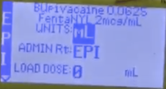

PCEA Pump Set Up with Images    body {font-family: 'Open Sans', sans-serif;}

### PCEA Pump Set Up with Images

  

_Warning: there are a variety of epidural pumps, but they basically work the same.  
PCEA (Patient Controlled Epidural Analgesia)_

PCEA pumps routinely require special tubing.  
Each pump is encased in a hard plastic case/lockbox and has a key for securing the epidural solutions.  
When programming the pump, first plug it in (the nurses routinely unplugs the pumps after deliveries).  
  
**1 hour total:** 16 mL maximum volume the patient can receive in one hour.  
Hourly infusion rate + (possible total demand and lockout volume-as seen above)  
  
**Entering the orders below:**  
**Standard Pump  
_PCEA (Patient Controlled Epidural Anesthesia) pumps vary._**  
Turn the **power on** : It may run a self-test first.  
**"Library"** may appear **:** Press "yes" to proceed (for multiple choice options).Then you may see the options "Repeat Rx" or "New Program" (choose "New Program).  
(You can use the up or down arrow buttons on the machine to scroll selections)  
Scroll down to " New Program" and push the "YES" button.  
(when the "New Program" is highlighted)  
"Code" You need to enter the Pump Code" before you can proceed.  
After "Code" entry, you will have some options to choose:  
  
**Example:** "CONT Epidural"  
"Epidural PCA"  
"Regional CONT"  
  
In this case, you select "Epidural PCA"  
The Epidural Pump should already have a variety of local anesthetics with and without narcotics to choose from.

****

As you can see, the bottom one "Bupivacaine 0.0625 Fentanyl 2mcg/mL" is already there. So scroll down with the arrow button and select "YES"  
After you select it, it may want to double check.

****

Hit "YES" button.  
  
Now it may ask you if you want to erase the previous orders-usually from the previous patient.

****

Since this is a new patient with new settings, press "YES"  
  
Now below you are ready to program.

****

In the order above, there is no loading dose, so first you need to press "YES" on the selections above (if you agree) in order to move down to the next selections. Since there is no loading dose" order, also press "Yes" to "0"  
  
Now you will see the "BAG VOL" flashing on top row and you know you have a "250" mL bag. You need to change it to around "230" mLs so the pump will alert you before the bag runs dry and give you time to replace it. Just like our IV pumps.  
So press "NO" to the 250 mL and enter 230 mL and press "Yes" to advance to "Basal Rate"

****

Change the flashing "Basal Rate" from "5" mL/hr to "8" mL/hr

****

"Pt Bolus" is the same as "Demand." That is the volume the pump will bolus when the patient hits the pain pump button.

****

"BOLUS INT" is same as "Lockout"

****

"# BOLS/hr

****

This shows you that the maximum amount of boluses permitted in one hour is 4.  
A bolus interval of 15 minutes makes it correct. You need to always check.  
If the lockout is 10 minutes, the "#BOLS/hr" will be 6.  
  
Program may ask you if you are done and you press "YES"  
  
At this point, you are ready to "PRIME" your tubing. Remember to unplug your epidural tubing. Press the "PRIME" button. On some pumps, the button reads "PRIME BOLUS."  
The "PRIME" button is usually on the bottom below the number buttons.

****

It may ask you to enter the "Pump Code." Enter the code.  
**Press and Hold** in the PRIME button until the tubing is primed and you see no air bubbles.  
**NOTE:** Always label the tubing with a red "Epidural" sticker label."  
Secure the IV bag within the pump and closing it should lock and seal the IV back preventing the tampering of others.  
Connect the tubing to the patient's epidural tubing. Always alcohol the connections because any infection may cause serious complications.  
Press the "RUN" button to start the infusion.  
Explain to the patient that she should press the patient‐controlled analgesia button as often as she likes to get a little extra medicine. Explain that the pump is programmed and will not deliver too much medicine or permit an overdose (that is, it will deliver the bolus only every 10 or 15 minutes.  
Several studies have demonstrated broader, improved spread of the epidural solutions when the patient uses the PCEA button; faster boluses are thought to be superior to a continuous slow infusion without the intermittent boluses.