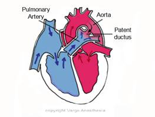

PDA Pre and Post-Ductal SaO2   

### PDA Pre and Post-Ductal SaO2

PDA (Patent Ductus Arteriosus)

****

**Pre and Post Ductal Pulse Oximetry**  
**Pre-ductal:** usually right hand or right ear  
**Post-ductal:** both feet

**Note:** With normal physiology, the left hand can also be considered Pre-ductal. However, this is not true in the presence of complex or ductus dependent congenital heart defects and some kids with persistent pulmonary hypertension (PPHTN).

Place oximetry probes on the right hand and either foot sites to assess a right to left shunt at the ductus arteriosus level. When the SaO2 at the feet is >10% lower than the SaO2 on the right hand, this is indicative of PPHTN. This is considered extreme.

The SaO2 from the upper limbs (mostly right hand) is Pre-ductal.  
The SaO2 from the lower extremity (feet) is Post-ductal.  
Normally they should be the same.  
If there is a difference of >5% SaO2 between Pre-ductal and Post-ductal, a right to left shunt is occurring.  
This means that some deoxygenated blood from the main pulmonary artery (PA) is entering the aorta and mixing with oxygenated aortic blood (right to left shunt) and lowering the overall SaO2 in the blood going to the torso and lower extremities.

For a right to left shunt to happen, the pressure in the PA must be greater than the pressure in the aorta. This is a sign of pulmonary hypertension.

Some right to left shunt may be severe enough cause cyanosis. We refer to these shunts as “Cyanotic.”

The right to left shunt is occurring through the Ductus Arteriosus. When the ductus arteriosus is still open (patent) we refer to it as a “Patent Ductus Arteriosus (PDA).”

**When the Pre-ductal SaO2 is less than Post-Ductal SaO2**  
When cyanosis is present in the upper extremities and not the lower extremities, this is reverse cyanosis.  
This can be from aortic coarctation or interruption with concurrent transposition of the great arteries.

Pulse oximetry in the newborn: Is the left hand pre- or post-ductal?  
Christoph Rüegger\*, Hans Ulrich Bucher and Romaine Arlettaz Mieth  
Rüegger _et al. BMC Pediatrics_ 2010, **10**:35  
http://www.biomedcentral.com/1471-2431/10/35