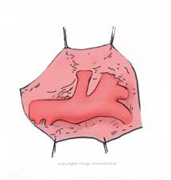
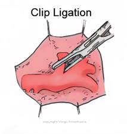

PDA (Patent Ductus Arteriosus) Repair Anesthesia   

### PDA (Patent Ductus Arteriosus) Repair Anesthesia

  
_Edited by Kristen Hiscox, CRNA_

There are two forms of surgical repair for a PDA: the traditional surgical approach, which entails a thoracotomy (or alternatively, thoracoscopy), and an intravascular catheter closure. The one below is the surgical thoracotomy.

The surgeon simply ligates or clips the duct.  
Don’t be worried; this procedure is actually a very simple case from an anesthesia prospective. Most of these procedures are done at the bedside in the NICU.

 

The patient is usually already intubated, and will need to be positioned in the right lateral position with the left arm over the head. The case should be completed in 30-45 minutes without any blood loss.

All PDAs should be closed because of the risk of bacterial endocarditis. Over time, the increased pulmonary blood flow precipitates pulmonary vascular obstructive disease, which becomes fatal. Closure of the ductus does not reverse the preexisting pulmonary vascular disease.

**Operative Procedure**

A small transverse incision (left postero-lateral thoracotomy) is made just below the left scapula.  
The surgeon will delicately enter through the 3rd interspace of the ribs.  
After carefully entering the pleural space, a small rib retractor is applied to make room since the incision is small. The surgeon can now visualize the left lung and gently sweep the lung (upper and lower lobe) out of the way with a malleable retractor.  
Note: _We do not need to collapse the lung, it is simply moved out of the way for this open procedure.  
  
_Now the surgeon should have a very clear view of the duct. The surgeon still needs to open up the parietal pleura, which is on top of and beneath the duct. Care is taken not to penetrate the visceral pleura or an air leak will develop requiring a chest tube. The vagus and recurrent laryngeal nerves are identified and avoided.  
After freely isolating the duct, the surgeon will ligate it with a vascular clip.  
Neonates > 1kg may be triple ligated and not clipped.

The surgeon lets the left lung return to its normal position, removes the retractor and closes the incision.

**Indications for the procedure:** Patent Ductus Arteriosus  
  
**Pre-op Assessment  
**Your patient may be on TPN. We usually keep it running.  
You will feel very strong femoral pulses.  
The patient will have a widened pulse pressure.  
You will be able to auscultate a murmur over the left sternal border.  
You can expect that the patient will already be intubated, have IV access, and being well managed by Neonatologists and Nurse Practitioners.

**Pre-op: What to prepare  
**Many of these procedures are done from the bedside in the neonatal unit and the neonate’s weight is usually 1-2kg. You will need your transport anesthesia cart with a few meds already drawn up.

Draw up your meds with a 1cc syringe.  
**  
I usually draw up:**  
Atropine  
Rocuronium  
Fentanyl or morphine  
Albumin available - for hypotension  
Normal saline flush syringes with extension tubing  
Note: Never use heparinized syringes unless instructed to do so by the NICU team.  
Always double-check the concentration.

**Is there blood available?**  
Always make sure. Imagine a small 500-gram neonate that only has a total blood volume of 40mLs (90-100cc/kg). For low birth weight babies, 1 unit of blood should be available.

**Pulse ox sensor:**  
**Preductal:** Upper extremity or ear lobe. This displays the blood flow to the heart and retinas.  
**Postductal:** Lower extremities. Usually lower than preductal. Keep Sao2 around 85-95%.

**Why we monitor both:**  
We monitor pre and post-ductal saturation to confirm the proper ligation of the PDA. Though it is very rare, there is a possibility of the left pulmonary artery or aorta being inadvertently clamped. They all look similar.  
**If the pulmonary artery is accidentally clamped** : There will be an immediate decrease in Sao2 and ETCO2  
**If the aorta is accidentally clamped** **:** There will be an immediate decrease in lower extremity pulses and postductal Sao2.  
**Esophageal stethoscope:** Not used much anymore, but can also be used to confirm proper ligation when the murmur immediately disappears**.**  

**Anesthetic:** The anesthetic will be a TIVA if performed in the NICU (there is no gas machine there) or General with ETT if in the operating room.  
If the neonate is not already intubated, we usually administer atropine .01-.02 mg/kg prior to induction to prevent bradycardia.

**Induction:** Inhalation agents decrease SVR and decrease the problematic left to right shunting.  
**Airway issues:** Usually intubated. (If you intubate, treat the gums like teeth. Too much pressure on the gums may prevent future tooth growth).  
**FIO2:** Keep it as low as possible. We want to limit the risk of retinopathy of prematurity (ROP), which may result in blindness. This used to be called “retrolental fibroplasia.”  
**Ventilation:** You may have to take the neonate off the ventilator and manually take over with a neonatal ambu bag if it becomes difficult to ventilate after the surgeon moves the left lung out of the way.**Regional:** Intercostal nerve blocks at the end of the procedure are effective in controlling post-operative pain and can be done by the surgeon under direct vision before the chest is closed.

**Induction:** Fentanyl – in the NICU  
**IV Access:** Usually already has access  
**Hydration:** The neonate should already be adequately hydrated.

Use the 4:2:1 method for fluid management.  
Albumin dose for mild hypotension: 10cc/kg is recommended (<10kg wt)  
Albumin-more effective with its oncotic pull than crystalloids (<10kg wt)  
Crystalloid Bolus dose for mild hypotension: 5-10cc/kg (<10kg wt)  
Crystalloid Bolus dose for mild hypotension: 20cc/kg (>10kg wt)  
Crystalloid Bolus (emergency) for severe hypotension (20-50cc)

**Replacement of Insensible Fluid Loss (reference)**  
Minimally invasive (inguinal, laparoscopic) 0-2 cc/kg/hr  
Mildly invasive (ureteral reimplantation) 2-4 cc/kg/hr  
Moderately invasive (simple bowel cases) 4-8 cc/kg/hr  
Significantly invasive (NEC) >10 cc/kg/hr  
**3rd Spacing:** 10mL/kg/h is standard for 3rd space fluid loss with an open belly case.

**EBV (reference)  
Premature:** 90-100cc/kg**Newborn:** 80-90cc/kg**3mo-1 year:** 70-80cc/kg**1-4 years:** 70cc/kg  
**Adult:** 55-60cc/kg

**Arterial line -** The infant may still have a UA (umbilical/uterine artery) line. An arterial line is generally not necessary. However, the BP cuff should be on the lower extremity if there is no A-line.

**Central line** : Sometimes

**Nitrous:** Optional**Muscle Relaxation:** If the surgeon requests it**Position** : Right lateral position with the left arm over the head  
**Duration:** 30-60 minutes  
**Age Range:** Neonate-usually premature  
**Weight:** Usually 1-2 kg  
**EBL:** Minimal  
**Hydration:** Should already be adequately hydrated  
Albumin dose for mild hypotension: 10cc/kg is recommended

**EBV** : Premature infant is 90-100cc/kg. Term newborn is 80-90cc/kg.

**Replacement of Insensible Fluid Loss- minimal (** 0-2 cc/kg/hr)**Blood Bolus dose:** 10-20cc/kg if needed.  
**Foley Catheter:** Sometimes

**Emergence:** Most patients are already intubated, so they remain intubated.

**Possible Complications  
**Bradycardia with manipulation of the ductusBradycardia (Vagal reflex) caused by lung traction Compression of the left pulmonary artery with lung retraction Hypoxemia/hypercarbia due to lung retraction

Vocal cord paralysis (injury to recurrent laryngeal nerve)  
Damage to vagus nerve  
Massive hemorrhage  
Air embolism  
(Left Ventricular) LV overload can occur post-correction  
Inadvertent ligation of either the aorta or the left pulmonary artery, both of which may be similar in size to the ductus in the neonate.  
Chylothorax  
Pneumothorax  
Atelectasis,  
Recurrence of patency  
Inadvertent ligation of the pulmonary artery or descending aorta.  
  
**Contraindications  
**Severe pulmonary vascular disease  
  
Does the patient have any associated cardiac anomalies?  
_Premature closure of the ductus without the concurrent repair of the cardiac anomalies below are contraindicated and may be fatal._  
Aortic valve atresia  
Mitral valve atresia with hypoplastic left ventricle  
Pulmonary artery hypoplasia  
Pulmonary atresia  
Severe coarctation of the aorta  
Tricuspid atresia  
Transposition of the great arteries

**Complications of UNTREATED PDA:**  
Bacterial endocarditis  
Late CHF (Congestive Heart Failure)  
Development of pulmonary vascular obstructive disease.  
  
**Quick Basic Drug References  
****Propofol:** 2.5-3.5mg/kg IV  
**Succinylcholine:** <1 year: 3.0mg/kg  
\>1 year: 1.0-2.0mg/kg  
IM: 4-6mg/kg  
**Rocuronium:** <1 year: 0.25-0.5mg/kg  
1 year: 0.5-1.2mg/kg  
\>1 year: 0.5-1.3mg/kg  
**Vecuronium:** <1 year :0.05-0.1mg/kg  
\>1 year: 0.1mg/kg  
**Neostigmine:** 0.05-0.07mg/kg  
**Robinul:** 0.01mg/kg  
**Fentanyl:** 1-2mcg/kg  
**Morphine:** 0.05-0.15 mg/kg/dose IV q2-4h prn**Ofirmev:** \>2 years: 15mg/kg  
**Not FDA approved for < 2 years, but many still administer at 15mg/kg  
Toradol:** \>2 years: 0.5mg/kg  
**Precedex** (Emergence)**:** Slow push 0.5mcg/kg  
**Zofran:** 100mcg/kg (max 4mg)  
**Decadron:** 0.2-0.5mg/kg  
**Ancef:** 25mg/kg Q6h  
**Ampicillin:** 25-100mg/kg (max per day 100-400mg/kg)  
**Gentamycin:** 2-2.5 mg/kg/dose q8h (Max dose 80 mg)  
**Ceftriaxone (rocephin):** 50-75mg/kg  
**Clindamycin (cleocin):** 15-25mg/kg  
**Invanz** (ertapenem): (3 month -12 years): 15mg/kg  
**Vancomycin:** 10mg/kg slow IV

Macksey, Lynn Fitzgerald. _Surgical Procedures and Anesthetic Implications: A Handbook for Nursing Practice_. Sudbury, MA: Jones & Bartlett Learning, 2011  
  
Lake CL. Pediatric Cardiac Anesthesia. 2nd Ed. Norwalk. Appletton & Lange. 1993: 363.

Kaplan J. Cardiac Anesthesia. 4th Ed. Philadelphia. WB Saunders. 1999: 807.

Stehling L. Commons problems in Pediatric Anesthesia. 2nd Ed. St. Louis. Mosby. 1992: 49.

Mason LJ. Pitfalls and problems in Pediatric Anesthesia. IARS 2002 Review Course Lectures. Supplement to Anesthesia & Analgesia. March 2002: 73.

Gregory A. G. Pediatric Anesthesia. 4th Ed. New York. Churchill-Livingstone 2002.